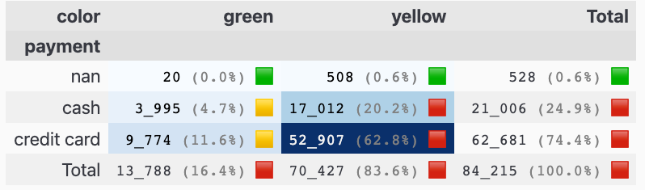
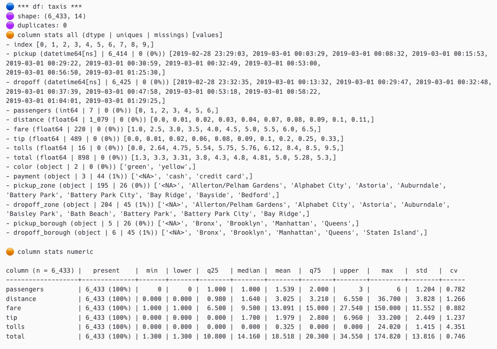
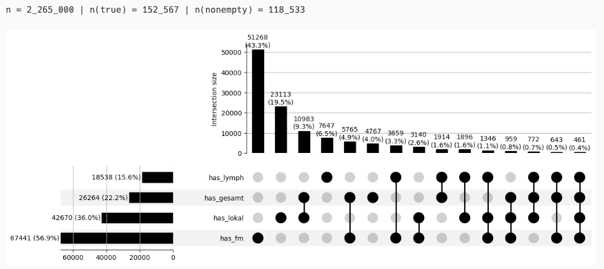
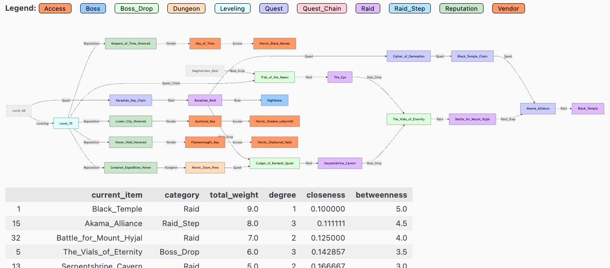
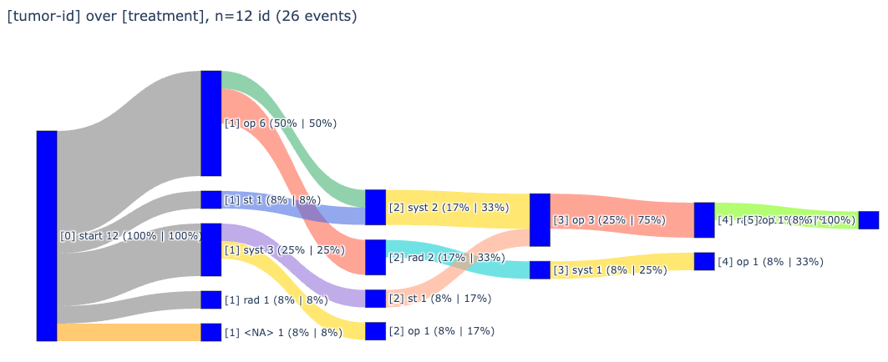
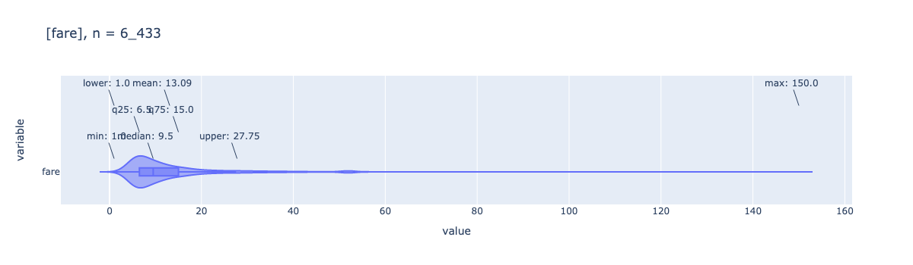
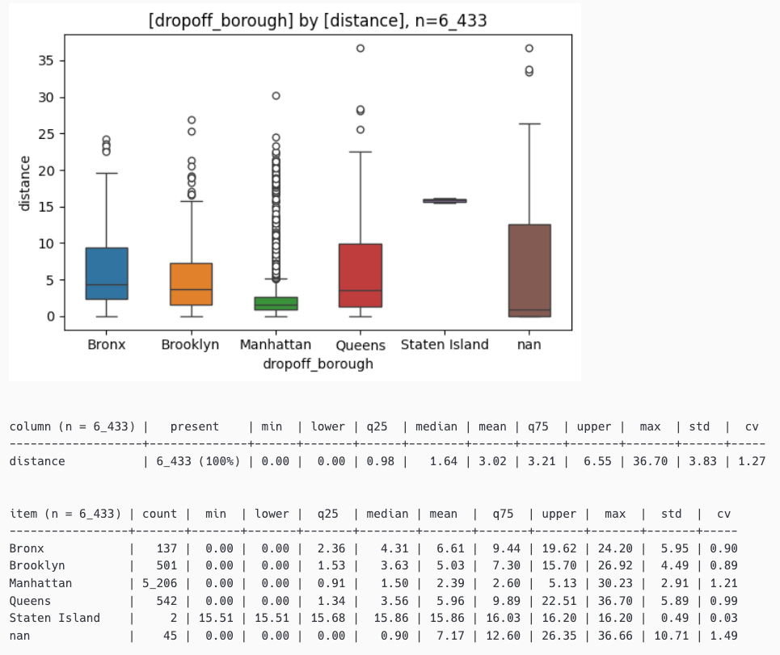

# pandas-plots
<a id="markdown-pandas-plots" name="pandas-plots"></a>

a comprehensive python package for enhanced **data visualization** and **analysis** with pandas dataframes. provides a high-level api for creating beautiful tables, plots, venn diagrams, and utility functions with minimal code.

[](https://pypi.org/project/pandas-plots/) [](https://github.com/smeisegeier/pandas-plots) [](https://github.com/smeisegeier/pandas-plots/blob/main/LICENSE) [![Python Versions](https://img.shields.io/badge/python-3.10_|_3.11_|_3.12_|_3.13-blue.svg?logo=data:image/svg+xml;base64,PHN2ZyB4bWxucz0iaHR0cDovL3d3dy53My5vcmcvMjAwMC9zdmciIHZpZXdCb3g9IjAgMCAxMDAgMTAwIj4KICA8ZGVmcz4KICAgIDxsaW5lYXJHcmFkaWVudCBpZD0icHlZZWxsb3ciIGdyYWRpZW50VHJhbnNmb3JtPSJyb3RhdGUoNDUpIj4KICAgICAgPHN0b3Agc3RvcC1jb2xvcj0iI2ZlNSIgb2Zmc2V0PSIwLjYiLz4KICAgICAgPHN0b3Agc3RvcC1jb2xvcj0iI2RhMSIgb2Zmc2V0PSIxIi8+CiAgICA8L2xpbmVhckdyYWRpZW50PgogICAgPGxpbmVhckdyYWRpZW50IGlkPSJweUJsdWUiIGdyYWRpZW50VHJhbnNmb3JtPSJyb3RhdGUoNDUpIj4KICAgICAgPHN0b3Agc3RvcC1jb2xvcj0iIzY5ZiIgb2Zmc2V0PSIwLjQiLz4KICAgICAgPHN0b3Agc3RvcC1jb2xvcj0iIzQ2OCIgb2Zmc2V0PSIxIi8+CiAgICA8L2xpbmVhckdyYWRpZW50PgogIDwvZGVmcz4KCiAgPHBhdGggZD0iTTI3LDE2YzAtNyw5LTEzLDI0LTEzYzE1LDAsMjMsNiwyMywxM2wwLDIyYzAsNy01LDEyLTExLDEybC0yNCwwYy04LDAtMTQsNi0xNCwxNWwwLDEwbC05LDBjLTgsMC0xMy05LTEzLTI0YzAtMTQsNS0yMywxMy0yM2wzNSwwbDAtM2wtMjQsMGwwLTlsMCwweiBNODgsNTB2MSIgZmlsbD0idXJsKCNweUJsdWUpIi8+CiAgPHBhdGggZD0iTTc0LDg3YzAsNy04LDEzLTIzLDEzYy0xNSwwLTI0LTYtMjQtMTNsMC0yMmMwLTcsNi0xMiwxMi0xMmwyNCwwYzgsMCwxNC03LDE0LTE1bDAtMTBsOSwwYzcsMCwxMyw5LDEzLDIzYzAsMTUtNiwyNC0xMywyNGwtMzUsMGwwLDNsMjMsMGwwLDlsMCwweiBNMTQwLDUwdjEiIGZpbGw9InVybCgjcHlZZWxsb3cpIi8+CgogIDxjaXJjbGUgcj0iNCIgY3g9IjY0IiBjeT0iODgiIGZpbGw9IiNGRkYiLz4KICA8Y2lyY2xlIHI9IjQiIGN4PSIzNyIgY3k9IjE1IiBmaWxsPSIjRkZGIi8+Cjwvc3ZnPgo=)](https://www.python.org/downloads/)

<!-- TOC -->

- [pandas-plots](#pandas-plots)
    - [🚀 features](#%F0%9F%9A%80-features)
    - [📦 installation](#%F0%9F%93%A6-installation)
    - [🛠️ usage](#%F0%9F%9B%A0%EF%B8%8F-usage)
        - [quick start](#quick-start)
        - [examples](#examples)
            - [styled table](#styled-table)
            - [table description](#table-description)
            - [upset plot](#upset-plot)
            - [uml graph](#uml-graph)
            - [set filter](#set-filter)
            - [sankey diagram](#sankey-diagram)
            - [box plot with violin overlay](#box-plot-with-violin-overlay)
            - [box plot with statistics](#box-plot-with-statistics)
            - [venn diagrams](#venn-diagrams)
    - [📚 api reference](#%F0%9F%93%9A-api-reference)
        - [table utilities tbl](#table-utilities-tbl)
        - [plotting functions pls](#plotting-functions-pls)
        - [venn diagrams ven](#venn-diagrams-ven)
        - [helper functions hlp](#helper-functions-hlp)
    - [⚙️ configuration](#%E2%9A%99%EF%B8%8F-configuration)
        - [environment settings](#environment-settings)
    - [🧩 prerequisites](#%F0%9F%A7%A9-prerequisites)
    - [🤝 contributing](#%F0%9F%A4%9D-contributing)
    - [📄 license](#%F0%9F%93%84-license)
    - [🏷️ tags](#%F0%9F%8F%B7%EF%B8%8F-tags)

<!-- /TOC -->

## 🚀 features
<a id="markdown-%F0%9F%9A%80-features" name="%F0%9F%9A%80-features"></a>

- **table utilities** (`tbl`): enhanced table display and description functions
- **plotting functions** (`pls`): comprehensive visualization tools with plotly
- **venn diagrams** (`ven`): easy-to-create venn diagrams for set analysis
- **helper functions** (`hlp`): utility functions for common data operations

## 📦 installation
<a id="markdown-%F0%9F%93%A6-installation" name="%F0%9F%93%A6-installation"></a>

```bash
# using uv (recommended)
uv add -U pandas-plots

# using pip
pip install pandas-plots -U
```

## 🛠️ usage
<a id="markdown-%F0%9F%9B%A0%EF%B8%8F-usage" name="%F0%9F%9B%A0%EF%B8%8F-usage"></a>

```python
from pandas_plots import tbl, pls, ven, hlp

# for public examples: load sample dataset from seaborn
import seaborn as sb
df = sb.load_dataset('taxis')
```

## examples
<a id="markdown-examples" name="examples"></a>

<!-- <br> -->

### styled table
<a id="markdown-styled-table" name="styled-table"></a>

```python
tbl.pivot_df(
    df[["color", "payment", "fare"]],
    total_mode="sum",
    total_axis="xy",
    data_bar_axis=None,
    total_exclude=True,
    pct_axis="xy",
    precision=0,
    heatmap_axis="xy",
    kpi_mode="rag_abs",
    kpi_rag_list=[1000, 10000],
    swap=True,
    font_size_td=12,
    font_size_th=14,
)
```



<br>

### table description
<a id="markdown-table-description" name="table-description"></a>

```python
tbl.describe_df(
    df,
    caption="taxis",
    top_n_uniques=10,
    top_n_chars_in_columns=10,
    top_n_chars_in_index=15,
)
```



<br>

### upset plot
<a id="markdown-upset-plot" name="upset-plot"></a>

```python
pls.plot_upset(
    df_upset,
    include_false_subsets=False,
    orientation="horizontal",
)
```



<br>

### uml graph
<a id="markdown-uml-graph" name="uml-graph"></a>

```python
metrics = pls.plot_uml_graph()
```



<br>

### set filter
<a id="markdown-set-filter" name="set-filter"></a>

```python
filter = hlp.get_duckdb_filter_n(
    con,
    "from Tumor",
    FILTERS,
    # distinct_metric="z_pat_id",
)
```

```
counts: rows
---
n = 3_241_401                                     (100.0%) ██████████████████████████████
└ [2020-2023.07]:                   n = 2_633_644  (81.3%) ░░░░░░████████████████████████
└ [not z_is_dco]:                   n = 2_547_636  (78.6%) ░░░░░░░███████████████████████
└ [keine M1]:                       n = 2_305_215  (71.1%) ░░░░░░░░░█████████████████████
└ [keine Verstorbenen < 180 Tage]:  n = 2_132_064  (65.8%) ░░░░░░░░░░░███████████████████
└ [lympho- und mesoendokr. Tumore]:    n = 27_653   (0.9%) ░░░░░░░░░░░░░░░░░░░░░░░░░░░░░░
```

<br>

### sankey diagram
<a id="markdown-sankey-diagram" name="sankey-diagram"></a>

```python
_ = pls.plot_sankey(width=1000)
```



<br>

### box plot with violin overlay
<a id="markdown-box-plot-with-violin-overlay" name="box-plot-with-violin-overlay"></a>

```python
_ = pls.plot_box(df['fare'], height=400, violin=true)
```


<br>

### box plot with statistics
<a id="markdown-box-plot-with-statistics" name="box-plot-with-statistics"></a>

```python
_ = pls.plot_boxes_large(df[["dropoff_borough","distance"]])
```



<br>

### venn diagrams
<a id="markdown-venn-diagrams" name="venn-diagrams"></a>

```python
# show venn diagram for 3 sets
set_a = {'ford','ferrari','mercedes', 'bmw'}
set_b = {'opel','bmw','bentley','audi'}
set_c = {'ferrari','bmw','chrysler','renault','peugeot','fiat'}

_df, _details = ven.show_venn3(
    title="taxis",
    a_set=set_a,
    a_label="cars1",
    b_set=set_b,
    b_label="cars2",
    c_set=set_c,
    c_label="cars3",
    verbose=0,
    size=8,
)
```


<br>

## 📚 api reference
<a id="markdown-%F0%9F%93%9A-api-reference" name="%F0%9F%93%9A-api-reference"></a>

### table utilities (tbl)
<a id="markdown-table-utilities-tbl" name="table-utilities-tbl"></a>

| function | description |
|----------|-------------|
| `show_num_df()` | displays a table as styled version with additional information |
| `describe_df()` | alternative version of pandas `describe()` function |
| `descr_db()` | short description for a `duckdb` relation |
| `pivot_df()` | gets a pivot table of a 3 column dataframe (or 2 columns if no weights are given) |
| `print_summary()` | shows statistics for a pandas dataframe or series |

### plotting functions (pls)
<a id="markdown-plotting-functions-pls" name="plotting-functions-pls"></a>

| function | description |
|----------|-------------|
| `plot_box()` | auto annotated boxplot w/ violin option |
| `plot_boxes()` | multiple boxplots (annotation is experimental) |
| `plot_stacked_bars()` | shortcut to stacked bars |
| `plot_bars()` | standardized bar plot for categorical column with confidence intervals |
| `plot_histogram()` | histogram for one or more numerical columns |
| `plot_joints()` | joint plot for exactly two numerical columns |
| `plot_quadrants()` | quickly shows a 2x2 heatmap |
| `plot_facet_stacked_bars()` | stacked bars for a facet value as subplots |
| `plot_sankey()` | generates a sankey diagram |
| `plot_pie()` | generates a pie chart |
| `plot_box_large()` | for large datasets using seaborn |
| `plot_boxes_large()` | for large datasets using seaborn |
| `plot_histogram_large()` | for large datasets using seaborn |
| `plot_upset()` | generates an upset plot based on upsetplot |
| `plot_uml_graph()` | generates a uml graph based on mermaid for structured data |

### venn diagrams (ven)
<a id="markdown-venn-diagrams-ven" name="venn-diagrams-ven"></a>

| function | description |
|----------|-------------|
| `show_venn2()` | displays a venn diagram for 2 sets |
| `show_venn3()` | displays a venn diagram for 3 sets |

### helper functions (hlp)
<a id="markdown-helper-functions-hlp" name="helper-functions-hlp"></a>

| function | description |
|----------|-------------|
| `to_series()` | converts a dataframe to a series |
| `mean_confidence_interval()` | calculates mean and confidence interval for a series |
| `wrap_text()` | formats strings or lists to a given width |
| `replace_delimiter_outside_quotes()` | replaces delimiters only outside of quotes in csv imports |
| `create_barcode_from_url()` | creates a barcode from a given url |
| `add_datetime_col()` | adds a datetime column to a dataframe (chainable) |
| `show_package_version()` | prints version of a list of packages |
| `get_os()` | helps identify and ensure operating system at runtime |
| `add_bitmask_label()` | adds a column that resolves a bitmask column into human-readable labels |
| `find_cols()` | finds all columns in a list that contain any of the given stubs |
| `add_measures_to_pyg_config()` | adds measures to a pygwalker config file |
| `get_tum_details()` | prints details of a specific tumor (requires connection to clinical cancer data) |
| `get_duckdb_filter_n()` | print rowcounts for cascading filters in duckdb with ansi bars |
| `print_filter()` | print filter as markdown sql codeblock |

## ⚙️ configuration
<a id="markdown-%E2%9A%99%EF%B8%8F-configuration" name="%E2%9A%99%EF%B8%8F-configuration"></a>

### environment settings
<a id="markdown-environment-settings" name="environment-settings"></a>

```python
# * set theme: light / dark
# * this will affect all plots
os.environ['THEME'] = 'light'

# * set renderer: svg / png for static images, '' for interactive plots
# * note: only static images will be rendered in markdown
os.environ['RENDERER'] = 'svg'
```

## 🧩 prerequisites
<a id="markdown-%F0%9F%A7%A9-prerequisites" name="%F0%9F%A7%A9-prerequisites"></a>

- **python 3.10+**: compatible with python versions 3.10 - 3.13
- **[uv](https://github.com/astral-sh/uv/)**: uv is recommended for package management

## 🤝 contributing
<a id="markdown-%F0%9F%A4%9D-contributing" name="%F0%9F%A4%9D-contributing"></a>

contributions are welcome! please feel free to submit a pull request. for major changes, please open an issue first to discuss what you would like to change.

## 📄 license
<a id="markdown-%F0%9F%93%84-license" name="%F0%9F%93%84-license"></a>

this project is licensed under the **MIT** license - see the [license](license) file for details.

## 🏷️ tags
<a id="markdown-%F0%9F%8F%B7%EF%B8%8F-tags" name="%F0%9F%8F%B7%EF%B8%8F-tags"></a>

#pandas #visualizations #statistics #data-science #data-analysis #python