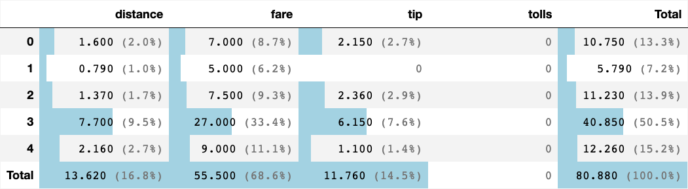
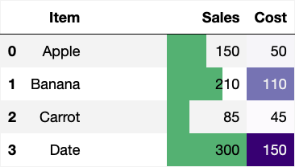

# test area

### load

    🐍 3.12.9 | 📦 matplotlib_venn: 0.11.10 | 📦 dataframe_image: 0.2.6 | 📦 plotly: 6.2.0 | 📦 kaleido: 1.0.0 | 📦 seaborn: 0.13.2 | 📦 pandas: 2.3.1 | 📦 numpy: 1.26.4 | 📦 duckdb: 1.3.2 | 📦 pandas-plots: 0.20.7 | 📦 connection-helper: 0.13.1
    True

    

    

## xdd

    

    

## lol
- xd
  - xdd
- lolez
  - rofl

- **Filter**
  - `z_icd10`: C50, D05
  - `z_sex`: w
  - `z_dy`: 2020 - 2023

- **Metriken**
  - es werden **Tumore** gezählt, jede 1:n Information (z.B. Behandlungen) gibt es nur einmal pro Tumor

 

    🗄️ taxis	4, 3
    	("Item, Sales, Cost")
    ┌─────────┬───────┬───────┐
    │  Item   │ Sales │ Cost  │
    │ varchar │ int64 │ int64 │
    ├─────────┼───────┼───────┤
    │ Apple   │   150 │    50 │
    │ Banana  │   210 │   110 │
    │ Carrot  │    85 │    45 │
    └─────────┴───────┴───────┘
    

    ┌─────────────────────────────────────────────────────────────────────────────────────────────────────────────────────────────────────┬─────────┐
    │                                                                 ops                                                                 │ cnt_ops │
    │                                                               varchar                                                               │  int32  │
    ├─────────────────────────────────────────────────────────────────────────────────────────────────────────────────────────────────────┼─────────┤
    │ NULL                                                                                                                                │  165429 │
    │ 5-401.11 - Exzision einzelner Lymphknoten und Lymphgefäße: Axillär: Mit Radionuklidmarkierung (Sentinel-Lymphonodektomie)           │  135826 │
    │ 5-573.40 - Transurethrale Inzision, Exzision, Destruktion und Resektion von (erkranktem) Gewebe der Harnblase: Resektion: Nicht f…  │   94266 │
    │ 5-987.0 - Anwendung eines OP-Roboters: Komplexer OP-Roboter                                                                         │   82761 │
    │ 5-870.a1 - Partielle (brusterhaltende) Exzision der Mamma und Destruktion von Mammagewebe: Partielle Resektion: Defektdeckung dur…  │   65040 │
    │ 5-870.a2 - Partielle (brusterhaltende) Exzision der Mamma und Destruktion von Mammagewebe: Partielle Resektion: Defektdeckung dur…  │   52410 │
    │ 5-984 - Mikrochirurgische Technik                                                                                                   │   47640 │
    │ 5-604.52 - Radikale Prostatovesikulektomie: Laparoskopisch, gefäß- und nervenerhaltend: Mit regionaler Lymphadenektomie             │   39369 │
    │ 5-895.14 - Radikale und ausgedehnte Exzision von erkranktem Gewebe an Haut und Unterhaut: Ohne primären Wundverschluss, histograp…  │   35085 │
    │ 5-573.41 - Transurethrale Inzision, Exzision, Destruktion und Resektion von (erkranktem) Gewebe der Harnblase: Resektion: Fluores…  │   34869 │
    ├─────────────────────────────────────────────────────────────────────────────────────────────────────────────────────────────────────┴─────────┤
    │ 10 rows                                                                                                                             2 columns │
    └───────────────────────────────────────────────────────────────────────────────────────────────────────────────────────────────────────────────┘
    
    ┌────────────────────────────────────────────────────────────────────────────────────────────────────────────────────────────────────────────────────────┬─────────┐
    │                                                                          ops                                                                           │ cnt_ops │
    │                                                                        varchar                                                                         │  int32  │
    ├────────────────────────────────────────────────────────────────────────────────────────────────────────────────────────────────────────────────────────┼─────────┤
    │ NULL                                                                                                                                                   │  165429 │
    │ 5-401.11 - Exzision einzelner Lymphknoten und Lymphgefäße: Axillär: Mit Radionuklidmarkierung (Sentinel-Lymphonodektomie)                              │  135826 │
    │ 5-573.40 - Transurethrale Inzision, Exzision, Destruktion und Resektion von (erkranktem) Gewebe der Harnblase: Resektion: Nicht fluoreszenzgestützt    │   94266 │
    │ 5-987.0 - Anwendung eines OP-Roboters: Komplexer OP-Roboter                                                                                            │   82761 │
    │ 5-870.a1 - Partielle (brusterhaltende) Exzision der Mamma und Destruktion von Mammagewebe: Partielle Resektion: Defektdeckung durch Mobilisation und A │   65040 │
    │ 5-870.a2 - Partielle (brusterhaltende) Exzision der Mamma und Destruktion von Mammagewebe: Partielle Resektion: Defektdeckung durch Mobilisation und A │   52410 │
    │ 5-984 - Mikrochirurgische Technik                                                                                                                      │   47640 │
    │ 5-604.52 - Radikale Prostatovesikulektomie: Laparoskopisch, gefäß- und nervenerhaltend: Mit regionaler Lymphadenektomie                                │   39369 │
    │ 5-895.14 - Radikale und ausgedehnte Exzision von erkranktem Gewebe an Haut und Unterhaut: Ohne primären Wundverschluss, histographisch kontrolliert (m │   35085 │
    │ 5-573.41 - Transurethrale Inzision, Exzision, Destruktion und Resektion von (erkranktem) Gewebe der Harnblase: Resektion: Fluoreszenzgestützt mit Hexa │   34869 │
    ├────────────────────────────────────────────────────────────────────────────────────────────────────────────────────────────────────────────────────────┴─────────┤
    │ 10 rows                                                                                                                                                2 columns │
    └──────────────────────────────────────────────────────────────────────────────────────────────────────────────────────────────────────────────────────────────────┘
    

