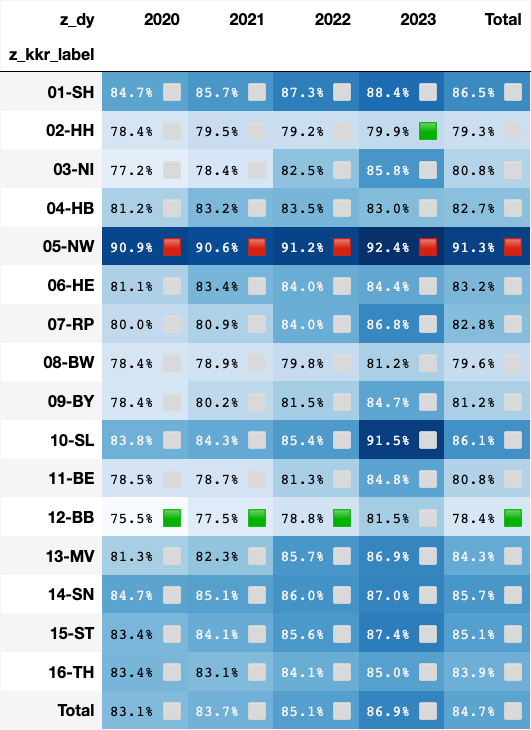

# <a id='toc1_'></a>[test area](#toc0_)

**Table of contents**<a id='toc0_'></a>    
- [test area](#toc1_)    
    - [load](#toc1_1_1_)    
    - [data](#toc1_1_2_)    
      - [sub data](#toc1_1_2_1_)    
  - [back](#toc1_2_)    

<!-- vscode-jupyter-toc-config
	numbering=false
	anchor=true
	flat=false
	minLevel=1
	maxLevel=6
	/vscode-jupyter-toc-config -->
<!-- THIS CELL WILL BE REPLACED ON TOC UPDATE. DO NOT WRITE YOUR TEXT IN THIS CELL -->


<br>

### <a id='toc1_1_1_'></a>[load](#toc0_)

    🐍 3.12.8 | 📦 matplotlib_venn: 0.11.10 | 📦 dataframe_image: 0.2.7 | 📦 plotly: 6.2.0 | 📦 kaleido: 1.0.0 | 📦 seaborn: 0.13.2 | 📦 pandas: 2.3.3 | 📦 numpy: 1.26.4 | 📦 duckdb: 1.3.2 | 📦 pandas-plots: 1.4.0


<br>

### <a id='toc1_1_2_'></a>[data](#toc0_)


```
    🗄️ gleason	226_994, 7
    	("z_icd10, z_kkr_label, z_sex, ScoreErgebnis, GradPrimaer, GradSekundaer, AnlassGleasonScore")
```


```
    ┌─────────┬─────────────┬─────────┬───────────────┬─────────────┬───────────────┬────────────────────┐
    │ z_icd10 │ z_kkr_label │  z_sex  │ ScoreErgebnis │ GradPrimaer │ GradSekundaer │ AnlassGleasonScore │
    ├─────────┼─────────────┼─────────┼───────────────┼─────────────┼───────────────┼────────────────────┤
    │ C61     │ 07-RP       │ M       │ NULL          │ NULL        │ NULL          │ NULL               │
    │ C61     │ 05-NW       │ M       │ NULL          │ NULL        │ NULL          │ NULL               │
    │ C61     │ 05-NW       │ M       │ NULL          │ NULL        │ NULL          │ NULL               │
    └─────────┴─────────────┴─────────┴───────────────┴─────────────┴───────────────┴────────────────────┘
```


```
┌─────────┬─────────────┬─────────┬───────────────┬─────────────┬───────────────┬────────────────────┐
│ z_icd10 │ z_kkr_label │  z_sex  │ ScoreErgebnis │ GradPrimaer │ GradSekundaer │ AnlassGleasonScore │
│ C61     │ 05-NW       │ M       │ NULL          │ NULL        │ NULL          │ NULL               │
└─────────┴─────────────┴─────────┴───────────────┴─────────────┴───────────────┴────────────────────┘
```

    lol


```
┌──┬──────────┬───────────┬───────────┬───────────────────┬────────────────────┐
│k │ same_kkr │ same_file │ cnt_cases │ max_cases_in_dupl │ AnlassGleasonScore │
│9 │ true     │ false     │         4 │                 2 │ NULL               │
└──┴──────────┴───────────┴───────────┴───────────────────┴────────────────────┘
```

    lol


<br>

#### <a id='toc1_1_2_1_'></a>[sub data](#toc0_)

## <a id='toc1_2_'></a>[back](#toc0_)



    

