# <a id='toc1_'></a>[test area](#toc0_)

**Table of contents**<a id='toc0_'></a>    
- [test area](#toc1_)    
    - [load](#toc1_1_1_)    
  - [pls](#toc1_2_)    
    - [bars](#toc1_2_1_)    
    - [histo](#toc1_2_2_)    
    - [box](#toc1_2_3_)    
    - [pie](#toc1_2_4_)    
    - [join](#toc1_2_5_)    
    - [sankey](#toc1_2_6_)    
  - [tbl](#toc1_3_)    
    - [print_summary()](#toc1_3_1_)    
    - [describe_df()](#toc1_3_2_)    
    - [descr_db()](#toc1_3_3_)    
  - [show num](#toc1_4_)    
  - [venn](#toc1_5_)    
  - [hlp](#toc1_6_)    

<!-- vscode-jupyter-toc-config
	numbering=false
	anchor=true
	flat=false
	minLevel=1
	maxLevel=6
	/vscode-jupyter-toc-config -->
<!-- THIS CELL WILL BE REPLACED ON TOC UPDATE. DO NOT WRITE YOUR TEXT IN THIS CELL -->

### <a id='toc1_1_1_'></a>[load](#toc0_)

    🐍 3.12.9 | 📦 matplotlib_venn: 0.11.10 | 📦 dataframe_image: 0.2.7 | 📦 plotly: 6.2.0 | 📦 kaleido: 1.0.0 | 📦 seaborn: 0.13.2 | 📦 pandas: 2.3.1 | 📦 numpy: 1.26.4 | 📦 duckdb: 1.3.2 | 📦 pandas-plots: 0.23.1 | 📦 connection-helper: 0.13.1


```python
    counts: rows
    ---
    n = 3_241_401                                     (100.0%) ██████████████████████████████
    └ [2020-2023.07]:                   n = 2_633_644  (81.3%) ░░░░░░████████████████████████
    └ [not z_is_dco]:                   n = 2_547_636  (78.6%) ░░░░░░░███████████████████████
    └ [keine M1]:                       n = 2_305_215  (71.1%) ░░░░░░░░░█████████████████████
    └ [keine Verstorbenen < 180 Tage]:  n = 2_132_064  (65.8%) ░░░░░░░░░░░███████████████████
    └ [lympho- und mesoendokr. Tumore]:    n = 27_653   (0.9%) ░░░░░░░░░░░░░░░░░░░░░░░░░░░░░░
```


```python
    # filter
    Diagnosedatum between '2020-01-01' and '2023-06-30'
    and not z_is_dco
    and ifnull(z_m_pc_1,'') <> '1'
    and ifnull(z_period_diag_death_day,181) >= 180
    and z_icd10 in ('C91.0', 'C92.0', 'C83.3', 'C82.4')
```

    🗄️ db	2_265_000, 4
    	("has_gesamt, has_lokal, has_lymph, has_fm")

```python
    ┌────────────┬───────────┬───────────┬─────────┐
    │ has_gesamt │ has_lokal │ has_lymph │ has_fm  │
    │  boolean   │  boolean  │  boolean  │ boolean │
    ├────────────┼───────────┼───────────┼─────────┤
    │ false      │ false     │ false     │ false   │
    │ false      │ NULL      │ NULL      │ NULL    │
    │ false      │ false     │ false     │ false   │
    └────────────┴───────────┴───────────┴─────────┘
```

    n = 2_265_000 | n(true) = 152_567 | n(nonempty) = 118_533


    

    


## <a id='toc1_2_'></a>[pls](#toc0_)

### <a id='toc1_2_1_'></a>[bars](#toc0_)


    
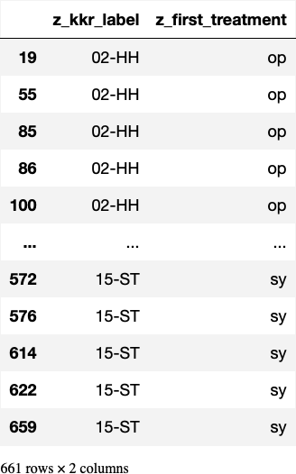
    


    
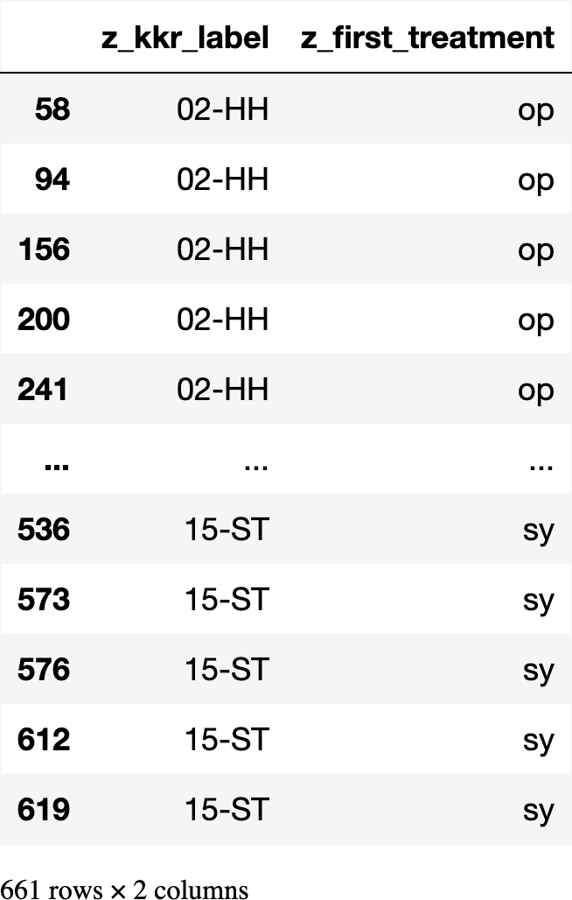
    


    z_dy            int64
    tu             object
    z_kkr_label    object
    cnt             int64
    dtype: object


    
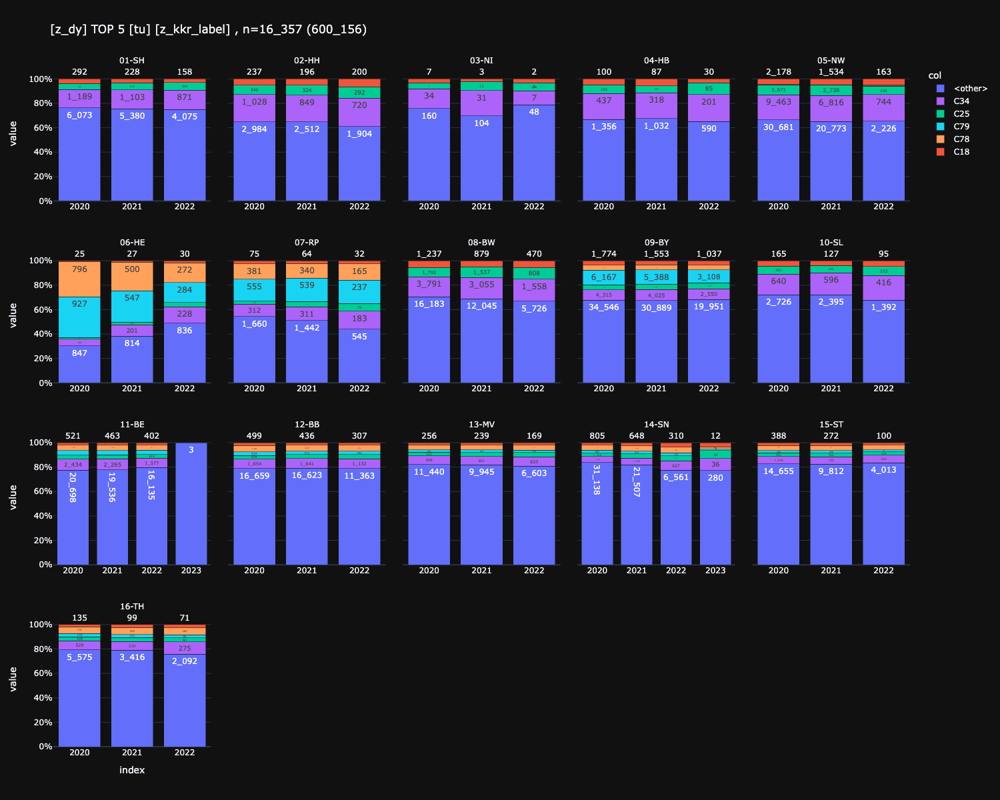
    


### <a id='toc1_2_2_'></a>[histo](#toc0_)


    
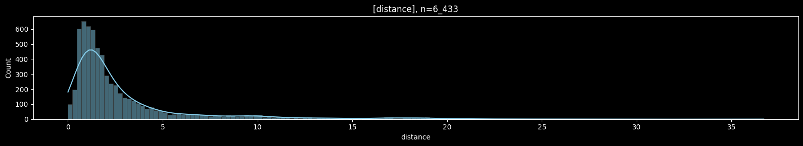
    


    
    column (n = 6_433) |   present    |  min  | lower |  q25  | median | mean  |  q75  | upper |  max   |  std  |  cv  
    -------------------+--------------+-------+-------+-------+--------+-------+-------+-------+--------+-------+------
    distance           | 6_433 (100%) | 0.000 | 0.000 | 0.980 |  1.640 | 3.025 | 3.210 | 6.550 | 36.700 | 3.828 | 1.266
    


### <a id='toc1_2_3_'></a>[box](#toc0_)


    

    


    
    column (n = 45) |  present  |  min  | lower |  q25  | median | mean  |  q75   | upper  |  max   |  std   |  cv  
    ----------------+-----------+-------+-------+-------+--------+-------+--------+--------+--------+--------+------
    distance        | 45 (100%) | 0.000 | 0.000 | 0.000 |  0.900 | 7.171 | 12.600 | 26.350 | 36.660 | 10.708 | 1.493
    


         dropoff_borough  distance
    0          Manhattan      1.60
    1          Manhattan      0.79
    2          Manhattan      1.37
    3          Manhattan      7.70
    4          Manhattan      2.16
    ...              ...       ...
    6428       Manhattan      0.75
    6429           Bronx     18.74
    6430        Brooklyn      4.14
    6431        Brooklyn      1.12
    6432        Brooklyn      3.85
    
    [6433 rows x 2 columns]


    
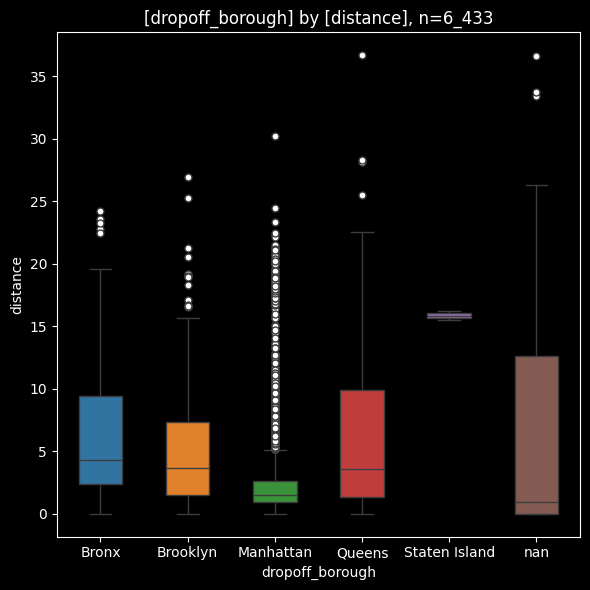
    


    
    column (n = 6_433) |   present    | min  | lower | q25  | median | mean | q75  | upper |  max  | std  |  cv 
    -------------------+--------------+------+-------+------+--------+------+------+-------+-------+------+-----
    distance           | 6_433 (100%) | 0.00 |  0.00 | 0.98 |   1.64 | 3.02 | 3.21 |  6.55 | 36.70 | 3.83 | 1.27
    
    
    item (n = 6_433) | count |  min  | lower |  q25  | median | mean  |  q75  | upper |  max  |  std  |  cv 
    -----------------+-------+-------+-------+-------+--------+-------+-------+-------+-------+-------+-----
    Bronx            |   137 |  0.00 |  0.00 |  2.36 |   4.31 |  6.61 |  9.44 | 19.62 | 24.20 |  5.95 | 0.90
    Brooklyn         |   501 |  0.00 |  0.00 |  1.53 |   3.63 |  5.03 |  7.30 | 15.70 | 26.92 |  4.49 | 0.89
    Manhattan        | 5_206 |  0.00 |  0.00 |  0.91 |   1.50 |  2.39 |  2.60 |  5.13 | 30.23 |  2.91 | 1.21
    Queens           |   542 |  0.00 |  0.00 |  1.34 |   3.56 |  5.96 |  9.89 | 22.51 | 36.70 |  5.89 | 0.99
    Staten Island    |     2 | 15.51 | 15.51 | 15.68 |  15.86 | 15.86 | 16.03 | 16.20 | 16.20 |  0.49 | 0.03
    nan              |    45 |  0.00 |  0.00 |  0.00 |   0.90 |  7.17 | 12.60 | 26.35 | 36.66 | 10.71 | 1.49
    


### <a id='toc1_2_4_'></a>[pie](#toc0_)


    
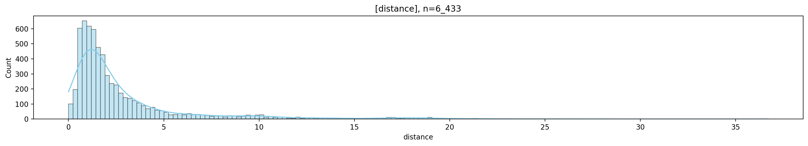
    


### <a id='toc1_2_5_'></a>[join](#toc0_)


    
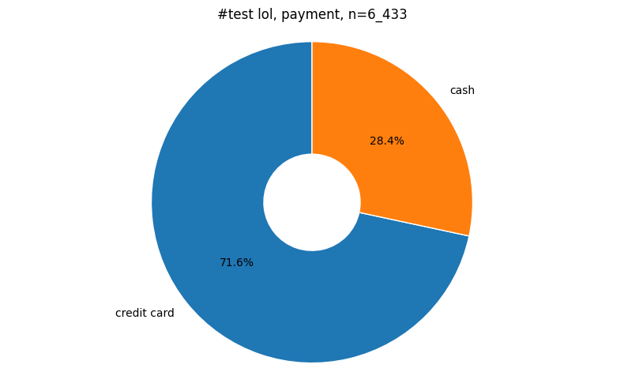
    


### <a id='toc1_2_6_'></a>[sankey](#toc0_)

    --- Using demo data (data_demo) ---
       tumor-id diagnosis date treatment
    0         1     2020-01-01        op
    1         1     2021-02-01      syst
    2         1     2022-03-01        op
    3         1     2023-04-01       rad
    4         1     2024-05-01        op
    5         2     2010-01-01      syst
    6         2     2011-02-01        st
    7         2     2012-03-01        op
    8         2     2013-04-01       rad
    9         3     2015-01-01        op
    10        3     2016-02-01       rad
    11        3     2017-03-01      syst
    12        3     2018-04-01        op
    13        4     2005-01-01        st
    14        4     2006-02-01      syst
    15        4     2007-03-01        op
    16        5     2019-01-01        op
    17        5     2020-02-01       rad
    18        6     2021-01-01      syst
    19        6     2022-02-01        op
    20        7                         
    21        7                         
    22        8     2025-01-01        op
    23        9     2025-02-01        op
    24       10     2025-03-01      syst
    25       11     2025-04-01       rad
    26       12     2025-05-01        op
    -----------------------------------


## <a id='toc1_3_'></a>[tbl](#toc0_)

### <a id='toc1_3_1_'></a>[print_summary()](#toc0_)

    
    column (n = 6_433) |   present    |  min  | lower |  q25   | median |  mean  |  q75   | upper  |   max   |  std   |  cv   |     sum     | skew  | kurto 
    -------------------+--------------+-------+-------+--------+--------+--------+--------+--------+---------+--------+-------+-------------+-------+-------
    passengers         | 6_433 (100%) |     0 |     0 |  1.000 |  1.000 |  1.539 |  2.000 |      3 |       6 |  1.204 | 0.782 |       9_902 | 2.359 |  4.881
    distance           | 6_433 (100%) | 0.000 | 0.000 |  0.980 |  1.640 |  3.025 |  3.210 |  6.550 |  36.700 |  3.828 | 1.266 |  19_457.360 | 3.008 | 11.135
    fare               | 6_433 (100%) | 1.000 | 1.000 |  6.500 |  9.500 | 13.091 | 15.000 | 27.540 | 150.000 | 11.552 | 0.882 |  84_214.870 | 3.217 | 17.649
    tip                | 6_433 (100%) | 0.000 | 0.000 |  0.000 |  1.700 |  1.979 |  2.800 |  6.960 |  33.200 |  2.449 | 1.237 |  12_732.320 | 2.665 | 12.740
    tolls              | 6_433 (100%) | 0.000 | 0.000 |  0.000 |  0.000 |  0.325 |  0.000 |  0.000 |  24.020 |  1.415 | 4.351 |   2_092.480 | 5.074 | 35.442
    total              | 6_433 (100%) | 1.300 | 1.300 | 10.800 | 14.160 | 18.518 | 20.300 | 34.550 | 174.820 | 13.816 | 0.746 | 119_124.970 | 3.093 | 15.053
    


### <a id='toc1_3_2_'></a>[describe_df()](#toc0_)


    
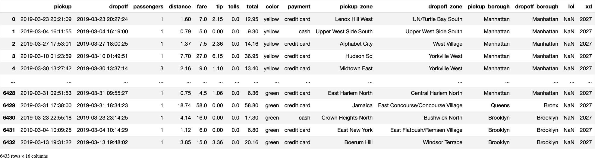
    


    🔵 *** df: <unknown> ***  
    🟣 shape: (6_433, 16)
    🟣 duplicates: 0  
    🟠 column stats all (dtype | uniques | missings) [values]  
    - index [0, 1, 2, 3, 4, 5, 6, 7, 8, 9,]  
    - pickup (datetime64[ns] | 6_414 | 0 (0%)) [2019-02-28 23:29:03, 2019-03-01 00:03:29, 2019-03-01 00:08:32, 2019-03-01 00:15:53,  
    2019-03-01 00:29:22, 2019-03-01 00:30:59, 2019-03-01 00:32:49, 2019-03-01 00:53:00,  
    2019-03-01 00:56:50, 2019-03-01 01:25:30,]  
    - dropoff (datetime64[ns] | 6_425 | 0 (0%)) [2019-02-28 23:32:35, 2019-03-01 00:13:32, 2019-03-01 00:29:47, 2019-03-01 00:32:48,  
    2019-03-01 00:37:39, 2019-03-01 00:47:58, 2019-03-01 00:53:18, 2019-03-01 00:58:22,  
    2019-03-01 01:04:01, 2019-03-01 01:29:25,]  
    - passengers (int64 | 7 | 0 (0%)) [0, 1, 2, 3, 4, 5, 6,]  
    - distance (float64 | 1_079 | 0 (0%)) [0.0, 0.01, 0.02, 0.03, 0.04, 0.07, 0.08, 0.09, 0.1, 0.11,]  
    - fare (float64 | 220 | 0 (0%)) [1.0, 2.5, 3.0, 3.5, 4.0, 4.5, 5.0, 5.5, 6.0, 6.5,]  
    - tip (float64 | 489 | 0 (0%)) [0.0, 0.01, 0.02, 0.06, 0.08, 0.09, 0.1, 0.2, 0.25, 0.33,]  
    - tolls (float64 | 16 | 0 (0%)) [0.0, 2.64, 4.75, 5.54, 5.75, 5.76, 6.12, 8.4, 8.5, 9.5,]  
    - total (float64 | 898 | 0 (0%)) [1.3, 3.3, 3.31, 3.8, 4.3, 4.8, 4.81, 5.0, 5.28, 5.3,]  
    - color (object | 2 | 0 (0%)) ['green', 'yellow',]  
    - payment (object | 3 | 44 (1%)) ['<NA>', 'cash', 'credit card',]  
    - pickup_zone (object | 195 | 26 (0%)) ['<NA>', 'Allerton/Pelham Gardens', 'Alphabet City', 'Astoria', 'Auburndale',  
    'Battery Park', 'Battery Park City', 'Bay Ridge', 'Bayside', 'Bedford',]  
    - dropoff_zone (object | 204 | 45 (1%)) ['<NA>', 'Allerton/Pelham Gardens', 'Alphabet City', 'Astoria', 'Auburndale',  
    'Baisley Park', 'Bath Beach', 'Battery Park', 'Battery Park City', 'Bay Ridge',]  
    - pickup_borough (object | 5 | 26 (0%)) ['<NA>', 'Bronx', 'Brooklyn', 'Manhattan', 'Queens',]  
    - dropoff_borough (object | 6 | 45 (1%)) ['<NA>', 'Bronx', 'Brooklyn', 'Manhattan', 'Queens', 'Staten Island',]  
    - lol (float64 | 1 | 6_433 (100%)) [nan,]  
    - xd (int64 | 1 | 0 (0%)) [2027,]  
    
    🟠 column stats numeric  
    
    column (n = 6_433) |   present    |  min  | lower |    q25    |  median   |   mean    |    q75    | upper  |   max   |  std   |  cv  
    -------------------+--------------+-------+-------+-----------+-----------+-----------+-----------+--------+---------+--------+------
    passengers         | 6_433 (100%) |     0 |     0 |     1.000 |     1.000 |     1.539 |     2.000 |      3 |       6 |  1.204 | 0.782
    distance           | 6_433 (100%) | 0.000 | 0.000 |     0.980 |     1.640 |     3.025 |     3.210 |  6.550 |  36.700 |  3.828 | 1.266
    fare               | 6_433 (100%) | 1.000 | 1.000 |     6.500 |     9.500 |    13.091 |    15.000 | 27.540 | 150.000 | 11.552 | 0.882
    tip                | 6_433 (100%) | 0.000 | 0.000 |     0.000 |     1.700 |     1.979 |     2.800 |  6.960 |  33.200 |  2.449 | 1.237
    tolls              | 6_433 (100%) | 0.000 | 0.000 |     0.000 |     0.000 |     0.325 |     0.000 |  0.000 |  24.020 |  1.415 | 4.351
    total              | 6_433 (100%) | 1.300 | 1.300 |    10.800 |    14.160 |    18.518 |    20.300 | 34.550 | 174.820 | 13.816 | 0.746
    lol                |       0 (0%) |   N/A |   N/A |       N/A |       N/A |       N/A |       N/A |    N/A |     N/A |    N/A |   N/A
    xd                 | 6_433 (100%) | 2_027 | 2_027 | 2_027.000 | 2_027.000 | 2_027.000 | 2_027.000 |  2_027 |   2_027 |  0.000 |   N/A
    


    

    


    🔵 *** df: <unknown> ***  
    🟣 shape: (1_000, 105)
    🟣 duplicates: 0  
    🟠 column stats all (dtype | uniques | missings) [values]  
    - index [0, 1, 2, 3, 4,]  
    - oBDS_RKIPatientTumorId (object | 1_000 | 0 (0%)) ['00427dbf-4acf-468e-9b5c-8f5f5a7cf1d3', '00e61412-981d-4b2f-b330-6a32e8632f08',  
    '00eb0411-b445-43cd-8991-4b799ec7873a', '00ee3e10-2024-4ded-9c7a-d0e606d19767',  
    '0101ebfe-14d4-4974-9edc-0c04a1c8de43',]  
    - oBDS_RKIPatientId (object | 886 | 0 (0%)) ['0058eed9-bc0b-44d7-9c82-ddafed8a39ea', '00ba939d-6368-493d-a652-87e58e7055fd',  
    '00d3b142-9bea-4a5c-9cad-2d2bf10b7039', '00dffb20-2962-4f9e-ada5-6bc200e58473',  
    '00e4c2f0-9c3c-431a-9f13-28010120c376',]  
    - Diagnosedatum (datetime64[us] | 115 | 0 (0%)) [1900-04-01 00:00:00, 1997-11-15 00:00:00, 1998-05-15 00:00:00, 1998-12-15 00:00:00,  
    2000-12-15 00:00:00,]  
    - Diagnosedatum_Genauigkeit (object | 3 | 0 (0%)) ['M', 'T', 'V',]  
    - Inzidenzort (object | 287 | 0 (0%)) ['01001', '01002', '01003', '01051', '01053',]  
    - Diagnose_ICD10_Code (object | 201 | 0 (0%)) ['C01', 'C02.1', 'C03.0', 'C03.1', 'C04.0',]  
    - Diagnose_ICD10_Version (object | 13 | 20 (2%)) ['102013GM', '102014GM', '102015GM', '102016GM', '102017GM',]  
    - Topographie_Code (object | 181 | 0 (0%)) ['C01.9', 'C02.1', 'C03.0', 'C03.1', 'C04.0',]  
    - Topographie_Version (object | 4 | 26 (3%)) ['31', '32', '33', '<NA>',]  
    - Diagnosesicherung (object | 7 | 0 (0%)) ['0', '1', '2', '5', '6',]  
    - TNM_Auflage_c (object | 4 | 493 (49%)) ['6', '7', '8', '<NA>',]  
    - y_Symbol_c (object | 1 | 1_000 (100%)) ['<NA>',]  
    - r_Symbol_c (object | 1 | 1_000 (100%)) ['<NA>',]  
    - a_Symbol_c (object | 1 | 1_000 (100%)) ['<NA>',]  
    - m_Symbol_c (object | 3 | 987 (99%)) ['7', '<NA>', 'm',]  
    - c_p_u_Praefix_T_c (object | 4 | 749 (75%)) ['<NA>', 'c', 'p', 'u',]  
    - T_c (object | 24 | 717 (72%)) ['1', '1a', '1b', '1b1', '1c',]  
    - c_p_u_Praefix_N_c (object | 3 | 730 (73%)) ['<NA>', 'c', 'p',]  
    - N_c (object | 12 | 700 (70%)) ['0', '1', '1a', '1b', '1c',]  
    - c_p_u_Praefix_M_c (object | 3 | 714 (71%)) ['<NA>', 'c', 'p',]  
    - M_c (object | 10 | 683 (68%)) ['0', '1', '1A', '1B', '1C',]  
    - L_c (object | 4 | 884 (88%)) ['<NA>', 'L0', 'L1', 'LX',]  
    - V_c (object | 4 | 914 (91%)) ['<NA>', 'V0', 'V1', 'VX',]  
    - Pn_c (object | 4 | 897 (90%)) ['<NA>', 'Pn0', 'Pn1', 'PnX',]  
    - S_c (object | 2 | 988 (99%)) ['<NA>', 'SX',]  
    - UICC_Stadium_c (object | 19 | 863 (86%)) ['0', '0a', '<NA>', 'I', 'IA',]  
    - TNM_Auflage_p (object | 4 | 333 (33%)) ['6', '7', '8', '<NA>',]  
    - y_Symbol_p (object | 2 | 989 (99%)) ['<NA>', 'y',]  
    - r_Symbol_p (object | 1 | 1_000 (100%)) ['<NA>',]  
    - a_Symbol_p (object | 1 | 1_000 (100%)) ['<NA>',]  
    - m_Symbol_p (object | 4 | 986 (99%)) ['2', '3', '<NA>', 'm',]  
    - c_p_u_Praefix_T_p (object | 2 | 515 (52%)) ['<NA>', 'p',]  
    - T_p (object | 29 | 514 (51%)) ['0', '1', '1(2)', '1C', '1C3',]  
    - c_p_u_Praefix_N_p (object | 3 | 700 (70%)) ['<NA>', 'c', 'p',]  
    - N_p (object | 20 | 635 (64%)) ['0', '0(0/18)', '0(0/2)', '0(0/2sn)', '0(sn)',]  
    - c_p_u_Praefix_M_p (object | 3 | 771 (77%)) ['<NA>', 'c', 'p',]  
    - M_p (object | 7 | 694 (69%)) ['0', '1', '1a', '1b', '1c',]  
    - L_p (object | 4 | 814 (81%)) ['<NA>', 'L0', 'L1', 'LX',]  
    - V_p (object | 5 | 819 (82%)) ['<NA>', 'V0', 'V1', 'V2', 'VX',]  
    - Pn_p (object | 4 | 862 (86%)) ['<NA>', 'Pn0', 'Pn1', 'PnX',]  
    - S_p (object | 3 | 988 (99%)) ['<NA>', 'S1', 'SX',]  
    - UICC_Stadium_p (object | 21 | 784 (78%)) ['0', '0a', '<NA>', 'I', 'IA',]  
    - Grading (object | 11 | 0 (0%)) ['0', '1', '2', '3', '4',]  
    - LK_befallen (Int32 | 13 | 829 (83%)) [0, 1, 2, 3, 4,]  
    - LK_untersucht (Int32 | 44 | 804 (80%)) [0, 1, 2, 3, 4,]  
    - Morphologie_Code (object | 153 | 0 (0%)) ['8000/1', '8000/3', '8010/2', '8010/3', '8010/6',]  
    - Morphologie_Version (object | 4 | 25 (2%)) ['31', '32', '33', '<NA>',]  
    - Praetherapeutischer_Menopausenstatus (object | 1 | 1_000 (100%)) ['<NA>',]  
    - HormonrezeptorStatus_Oestrogen (object | 1 | 1_000 (100%)) ['<NA>',]  
    - HormonrezeptorStatus_Progesteron (object | 1 | 1_000 (100%)) ['<NA>',]  
    - Her2neuStatus (object | 1 | 1_000 (100%)) ['<NA>',]  
    - TumorgroesseInvasiv (Int32 | 1 | 1_000 (100%)) [<NA>,]  
    - TumorgroesseDCIS (Int32 | 1 | 1_000 (100%)) [<NA>,]  
    - RASMutation (object | 1 | 1_000 (100%)) ['<NA>',]  
    - RektumAbstandAnokutanlinie (Int32 | 1 | 1_000 (100%)) [<NA>,]  
    - GradPrimaer (object | 1 | 1_000 (100%)) ['<NA>',]  
    - GradSekundaer (object | 1 | 1_000 (100%)) ['<NA>',]  
    - ScoreErgebnis (object | 1 | 1_000 (100%)) ['<NA>',]  
    - AnlassGleasonScore (object | 1 | 1_000 (100%)) ['<NA>',]  
    - PSA (float32 | 1 | 1_000 (100%)) [nan,]  
    - DatumPSA (datetime64[us] | 1 | 1_000 (100%)) [NaT,]  
    - DatumPSA_Genauigkeit (object | 1 | 1_000 (100%)) ['<NA>',]  
    - Tumordicke (float32 | 1 | 1_000 (100%)) [nan,]  
    - LDH (Int32 | 1 | 1_000 (100%)) [<NA>,]  
    - Ulzeration (object | 1 | 1_000 (100%)) ['<NA>',]  
    - Seitenlokalisation (object | 6 | 0 (0%)) ['B', 'L', 'M', 'R', 'T',]  
    - DCN (object | 2 | 0 (0%)) ['J', 'N',]  
    - Anzahl_Tage_Diagnose_Tod (Int32 | 225 | 707 (71%)) [0, 2, 4, 6, 7,]  
    - z_tum_id (object | 1_000 | 0 (0%)) ['00427dbf-4acf-468e-9b5c-8f5f5a7cf1d3', '00e61412-981d-4b2f-b330-6a32e8632f08',  
    '00eb0411-b445-43cd-8991-4b799ec7873a', '00ee3e10-2024-4ded-9c7a-d0e606d19767',  
    '0101ebfe-14d4-4974-9edc-0c04a1c8de43',]  
    - z_kkr (int8 | 16 | 0 (0%)) [1, 2, 3, 4, 5,]  
    - z_pat_id (object | 886 | 0 (0%)) ['0058eed9-bc0b-44d7-9c82-ddafed8a39ea', '00ba939d-6368-493d-a652-87e58e7055fd',  
    '00d3b142-9bea-4a5c-9cad-2d2bf10b7039', '00dffb20-2962-4f9e-ada5-6bc200e58473',  
    '00e4c2f0-9c3c-431a-9f13-28010120c376',]  
    - z_kkr_label (object | 16 | 0 (0%)) ['01-SH', '02-HH', '03-NI', '04-HB', '05-NW',]  
    - z_dy (int16 | 27 | 0 (0%)) [1900, 1997, 1998, 2000, 2001,]  
    - z_age (float64 | 490 | 0 (0%)) [-55.08, -39.67, 2.75, 19.33, 19.67,]  
    - z_ag05 (object | 17 | 2 (0%)) ['<NA>', 'a00b04', 'a15b19', 'a20b24', 'a25b29',]  
    - z_icd10 (object | 194 | 0 (0%)) ['C01', 'C02.1', 'C03.0', 'C03.1', 'C04.0',]  
    - z_icd10_3d (object | 76 | 0 (0%)) ['C01', 'C02', 'C03', 'C04', 'C05',]  
    - z_t_c_0 (object | 21 | 717 (72%)) ['1', '1a', '1b', '1b1', '1c',]  
    - z_t_c_1 (object | 8 | 717 (72%)) ['1', '2', '3', '4', '<NA>',]  
    - z_t_p_0 (object | 23 | 514 (51%)) ['0', '1', '1a', '1a1', '1b',]  
    - z_t_p_1 (object | 9 | 514 (51%)) ['0', '1', '2', '3', '4',]  
    - z_n_c_0 (object | 12 | 700 (70%)) ['0', '1', '1a', '1b', '1c',]  
    - z_n_c_1 (object | 6 | 700 (70%)) ['0', '1', '2', '3', '<NA>',]  
    - z_n_p_0 (object | 16 | 635 (64%)) ['0', '0(sn)', '1', '1a', '1a(sn)',]  
    - z_n_p_1 (object | 6 | 635 (64%)) ['0', '1', '2', '3', '<NA>',]  
    - z_m_c_0 (object | 6 | 686 (69%)) ['0', '1', '1a', '1b', '1c',]  
    - z_m_c_1 (object | 3 | 686 (69%)) ['0', '1', '<NA>',]  
    - z_m_p_0 (object | 6 | 701 (70%)) ['0', '1', '1a', '1b', '1c',]  
    - z_m_p_1 (object | 3 | 701 (70%)) ['0', '1', '<NA>',]  
    - z_m_pc_1 (object | 3 | 468 (47%)) ['0', '1', '<NA>',]  
    - z_is_dco (bool | 2 | 0 (0%)) [False, True,]  
    - z_last_tum_status (object | 10 | 755 (76%)) ['<NA>', 'B - klinische Besserung des Zustandes', 'D - divergentes Geschehen',  
    'K - keine Änderung', 'P - Progression',]  
    - z_tum_op_count (int16 | 6 | 0 (0%)) [0, 1, 2, 3, 4,]  
    - z_tum_st_count (int16 | 3 | 0 (0%)) [0, 1, 2,]  
    - z_tum_sy_count (int16 | 6 | 0 (0%)) [0, 1, 2, 3, 4,]  
    - z_tum_fo_count (int16 | 14 | 0 (0%)) [0, 1, 2, 3, 4,]  
    - z_first_treatment (object | 4 | 502 (50%)) ['<NA>', 'op', 'st', 'sy',]  
    - z_first_treatment_after_days (Int32 | 121 | 502 (50%)) [0, 1, 2, 3, 4,]  
    - z_event_order (object | 76 | 454 (45%)) ['<NA>', 'fo', 'fo-op', 'fo-op-fo', 'fo-op-fo-sy',]  
    - z_events (object | 16 | 0 (0%)) ['-', 'fo', 'op', 'op|fo', 'op|st',]  
    - z_class_hpv (object | 4 | 982 (98%)) ['<NA>', 'N', 'P', 'U',]  
    - z_tum_order (int8 | 31 | 0 (0%)) [1, 2, 3, 4, 5,]  
    - z_sex (object | 2 | 0 (0%)) ['M', 'W',]  
    - z_period_diag_death_day (Int32 | 229 | 700 (70%)) [0, 2, 4, 6, 7,]  
    - z_period_diag_psa_day (Int32 | 1 | 1_000 (100%)) [<NA>,]  
    
    🟠 column stats numeric  
    
    column (n = 1_000)           |   present    |   min   | lower  |    q25    |  median   |   mean    |    q75    | upper  |   max   |    std    |  cv  
    -----------------------------+--------------+---------+--------+-----------+-----------+-----------+-----------+--------+---------+-----------+------
    LK_befallen                  |    171 (17%) |       0 |      0 |     0.000 |     0.000 |     1.064 |     1.000 |      2 |      27 |     3.068 | 2.883
    LK_untersucht                |    196 (19%) |       0 |      0 |     0.000 |    12.000 |    13.337 |    20.250 |     45 |      80 |    13.506 | 1.013
    TumorgroesseInvasiv          |       0 (0%) |     N/A |    N/A |       N/A |       N/A |       N/A |       N/A |    N/A |     N/A |       N/A |   N/A
    TumorgroesseDCIS             |       0 (0%) |     N/A |    N/A |       N/A |       N/A |       N/A |       N/A |    N/A |     N/A |       N/A |   N/A
    RektumAbstandAnokutanlinie   |       0 (0%) |     N/A |    N/A |       N/A |       N/A |       N/A |       N/A |    N/A |     N/A |       N/A |   N/A
    PSA                          |       0 (0%) |     N/A |    N/A |       N/A |       N/A |       N/A |       N/A |    N/A |     N/A |       N/A |   N/A
    Tumordicke                   |       0 (0%) |     N/A |    N/A |       N/A |       N/A |       N/A |       N/A |    N/A |     N/A |       N/A |   N/A
    LDH                          |       0 (0%) |     N/A |    N/A |       N/A |       N/A |       N/A |       N/A |    N/A |     N/A |       N/A |   N/A
    Anzahl_Tage_Diagnose_Tod     |    293 (29%) |       0 |      0 |    55.000 |   261.000 |   701.014 |   720.000 |  1_552 |   8_399 | 1_254.369 | 1.789
    z_kkr                        | 1_000 (100%) |       1 |      1 |     5.000 |     7.000 |     7.926 |    12.000 |     16 |      16 |     4.335 | 0.547
    z_dy                         | 1_000 (100%) |    1900 |   2017 | 2_020.000 | 2_021.000 | 2_020.463 | 2_022.000 |   2024 |    2024 |     6.198 | 0.003
    z_age                        | 1_000 (100%) | -55.080 | 32.420 |    60.310 |    70.670 |    68.287 |    79.250 | 97.920 | 123.580 |    15.605 | 0.229
    z_tum_op_count               | 1_000 (100%) |       0 |      0 |     0.000 |     0.000 |     0.469 |     1.000 |      2 |       5 |     0.715 | 1.525
    z_tum_st_count               | 1_000 (100%) |       0 |      0 |     0.000 |     0.000 |     0.102 |     0.000 |      0 |       2 |     0.334 | 3.277
    z_tum_sy_count               | 1_000 (100%) |       0 |      0 |     0.000 |     0.000 |     0.272 |     0.000 |      0 |       5 |     0.647 | 2.378
    z_tum_fo_count               | 1_000 (100%) |       0 |      0 |     0.000 |     0.000 |     0.616 |     0.000 |      0 |      16 |     1.652 | 2.682
    z_first_treatment_after_days |    498 (49%) |       0 |      0 |     0.000 |    12.500 |    39.552 |    36.750 |     91 |   1_091 |    95.339 | 2.410
    z_tum_order                  | 1_000 (100%) |       1 |      1 |     1.000 |     1.000 |     1.850 |     1.000 |      1 |      45 |     4.293 | 2.320
    z_period_diag_death_day      |    300 (30%) |       0 |      0 |    52.750 |   260.000 |   685.807 |   687.000 |  1_552 |   8_399 | 1_242.187 | 1.811
    z_period_diag_psa_day        |       0 (0%) |     N/A |    N/A |       N/A |       N/A |       N/A |       N/A |    N/A |     N/A |       N/A |   N/A
    


    
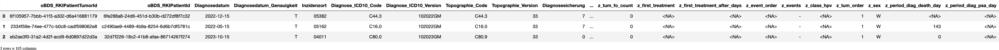
    


### <a id='toc1_3_3_'></a>[descr_db()](#toc0_)

    🗄️ delay	1_724, 3
    	("z_kkr_label, z_first_treatment_after_days, z_first_treatment")

```python
    ┌─────────────┬──────────────────────────────┬───────────────────┐
    │ z_kkr_label │ z_first_treatment_after_days │ z_first_treatment │
    │   varchar   │            int32             │      varchar      │
    ├─────────────┼──────────────────────────────┼───────────────────┤
    │ 12-BB       │                           22 │ sy                │
    │ 05-NW       │                           27 │ sy                │
    │ 08-BW       │                           61 │ sy                │
    └─────────────┴──────────────────────────────┴───────────────────┘
```

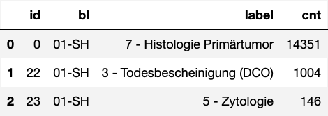
    


    🔵 *** df: taxis ***  
    🟣 shape: (6_433, 4)
    🟣 duplicates: 4_803  
    🟠 column stats all (dtype | uniques | missings) [values]  
    - index [0, 1, 2, 3, 4,]  
    - color (object | 2 | 0 (0%)) ['green', 'yellow',]  
    - payment (object | 3 | 44 (1%)) ['<NA>', 'cash', 'credit card',]  
    - pickup_borough (object | 5 | 26 (0%)) ['<NA>', 'Bronx', 'Brooklyn', 'Manhattan', 'Queens',]  
    - total (float64 | 898 | 0 (0%)) [1.3, 3.3, 3.31, 3.8, 4.3,]  
    
    🟠 column stats numeric  
    
    column (n = 6_433) |   present    |  min  | lower |  q25   | median |  mean  |  q75   | upper  |   max   |  std   |  cv  
    -------------------+--------------+-------+-------+--------+--------+--------+--------+--------+---------+--------+------
    total              | 6_433 (100%) | 1.300 | 1.300 | 10.800 | 14.160 | 18.518 | 20.300 | 34.550 | 174.820 | 13.816 | 0.746
    


    

    


    🗄️ taxis	6_433, 16
    	("pickup, dropoff, passengers, distance, fare, tip, tolls, total, color, payment, pickup_zone, dropoff_zone, pickup_borough, dropoff_borough, lol, xd")

```python
    ┌─────────────────────┬─────────────────────┬────────────┬──────────┬────────┬────────┬────────┬────────┬─────────┬─────────────┬───────────────────────┬───────────────────────┬────────────────┬─────────────────┬────────┬───────┐
    │       pickup        │       dropoff       │ passengers │ distance │  fare  │  tip   │ tolls  │ total  │  color  │   payment   │      pickup_zone      │     dropoff_zone      │ pickup_borough │ dropoff_borough │  lol   │  xd   │
    │    timestamp_ns     │    timestamp_ns     │   int64    │  double  │ double │ double │ double │ double │ varchar │   varchar   │        varchar        │        varchar        │    varchar     │     varchar     │ double │ int64 │
    ├─────────────────────┼─────────────────────┼────────────┼──────────┼────────┼────────┼────────┼────────┼─────────┼─────────────┼───────────────────────┼───────────────────────┼────────────────┼─────────────────┼────────┼───────┤
    │ 2019-03-23 20:21:09 │ 2019-03-23 20:27:24 │          1 │      1.6 │    7.0 │   2.15 │    0.0 │  12.95 │ yellow  │ credit card │ Lenox Hill West       │ UN/Turtle Bay South   │ Manhattan      │ Manhattan       │   NULL │  2027 │
    │ 2019-03-04 16:11:55 │ 2019-03-04 16:19:00 │          1 │     0.79 │    5.0 │    0.0 │    0.0 │    9.3 │ yellow  │ cash        │ Upper West Side South │ Upper West Side South │ Manhattan      │ Manhattan       │   NULL │  2027 │
    │ 2019-03-27 17:53:01 │ 2019-03-27 18:00:25 │          1 │     1.37 │    7.5 │   2.36 │    0.0 │  14.16 │ yellow  │ credit card │ Alphabet City         │ West Village          │ Manhattan      │ Manhattan       │   NULL │  2027 │
    └─────────────────────┴─────────────────────┴────────────┴──────────┴────────┴────────┴────────┴────────┴─────────┴─────────────┴───────────────────────┴───────────────────────┴────────────────┴─────────────────┴────────┴───────┘
```

## <a id='toc1_4_'></a>[show num](#toc0_)


    
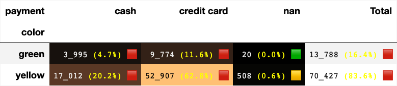
    


    

    


    
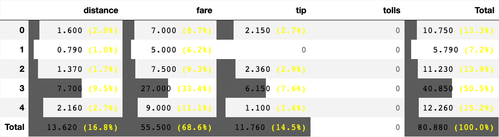
    


    
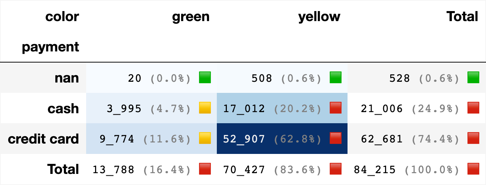
    


    
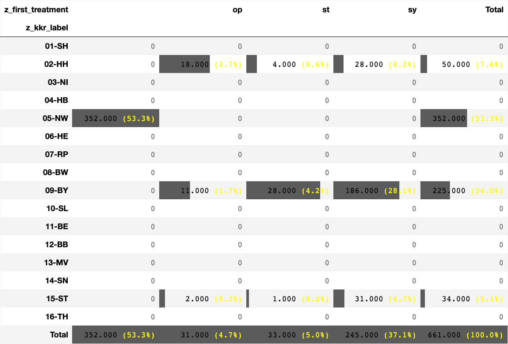
    


## <a id='toc1_5_'></a>[venn](#toc0_)

    ab --> cars1 | cars2 --> len: 7


    
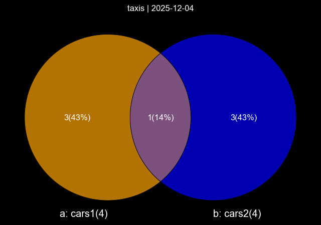
    


    abc --> cars1 | cars2 | cars3 --> len: 11
    ab --> cars1 | cars2 --> len: 7
    ac --> cars1 | cars3 --> len: 8
    bc --> cars2 | cars3 --> len: 9


    
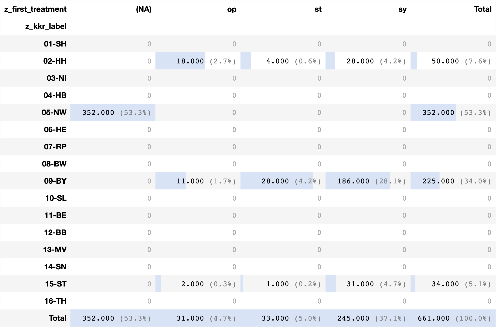
    


## <a id='toc1_6_'></a>[hlp](#toc0_)

    ## 📊 Sample Data & Explanation
    ---
    ### Original Sample DataFrame
    This data represents various measurements (like 'Distance') grouped by a category ('Borough').
    The goal is to restructure the data so that the 'Distance' values for each 'Borough' are in separate, comparable columns.
      Borough  Distance  ID
    Manhattan       1.5 101
       Queens       5.1 102
    Manhattan       0.8 103
        Bronx       3.2 104
       Queens       2.5 105
    Manhattan       1.4 106
        Bronx       7.8 107
       Queens       4.0 108
    
    
    ### Sparse Pivoted DataFrame
    The data has been **pivoted**:
    * The non-numeric column **'Borough'** is used to create the new column names ('Bronx', 'Manhattan', 'Queens').
    * The numeric column **'Distance'** provides the values for the new columns.
    * A new index (**'Distance_sequence'**) is created to align the measurements within each 'Borough' group, allowing comparison of the 1st, 2nd, 3rd, etc., measurement across boroughs.
    * `NaN` values appear where a borough has fewer measurements than others.
    Borough            Bronx  Manhattan  Queens
    Distance_sequence                          
    0                    3.2        1.5     5.1
    1                    7.8        0.8     2.5
    2                    NaN        1.4     4.0
    
    **Summary Statistics:**
               count      mean       std  min   25%  50%   75%  max
    Borough                                                        
    Bronx        2.0  5.500000  3.252691  3.2  4.35  5.5  6.65  7.8
    Manhattan    3.0  1.233333  0.378594  0.8  1.10  1.4  1.45  1.5
    Queens       3.0  3.866667  1.305118  2.5  3.25  4.0  4.55  5.1


    
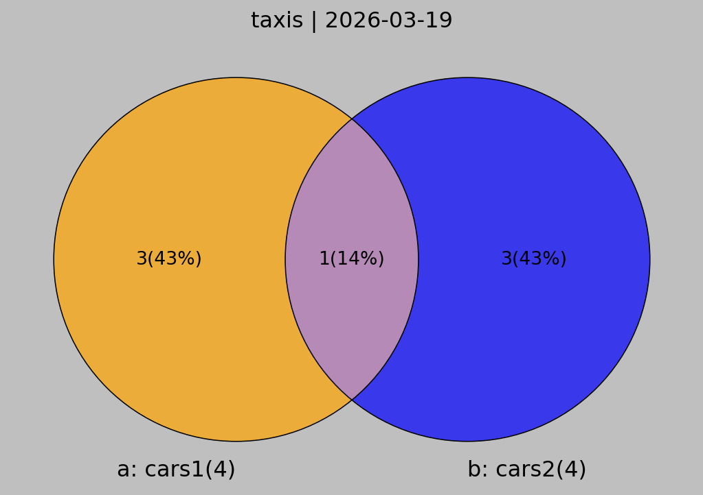
    


```python
    ┌────────────────────────────────────────────────────────────────────────────────────────────────────────────┬─────────┐
    │                                                    ops                                                     │ cnt_ops │
    │                                                  varchar                                                   │  int32  │
    ├────────────────────────────────────────────────────────────────────────────────────────────────────────────┼─────────┤
    │ NULL                                                                                                       │  165429 │
    │ 5-401.11 - Exzision einzelner Lymphknoten und Lymphgefäße: Axillär: Mit Radionuklidmarkierung (Sentinel-…  │  135826 │
    │ 5-573.40 - Transurethrale Inzision, Exzision, Destruktion und Resektion von (erkranktem) Gewebe der Harn…  │   94266 │
    │ 5-987.0 - Anwendung eines OP-Roboters: Komplexer OP-Roboter                                                │   82761 │
    │ 5-870.a1 - Partielle (brusterhaltende) Exzision der Mamma und Destruktion von Mammagewebe: Partielle Res…  │   65040 │
    │ 5-870.a2 - Partielle (brusterhaltende) Exzision der Mamma und Destruktion von Mammagewebe: Partielle Res…  │   52410 │
    │ 5-984 - Mikrochirurgische Technik                                                                          │   47640 │
    │ 5-604.52 - Radikale Prostatovesikulektomie: Laparoskopisch, gefäß- und nervenerhaltend: Mit regionaler L…  │   39369 │
    │ 5-895.14 - Radikale und ausgedehnte Exzision von erkranktem Gewebe an Haut und Unterhaut: Ohne primären …  │   35085 │
    │ 5-573.41 - Transurethrale Inzision, Exzision, Destruktion und Resektion von (erkranktem) Gewebe der Harn…  │   34869 │
    ├────────────────────────────────────────────────────────────────────────────────────────────────────────────┴─────────┤
    │ 10 rows                                                                                                    2 columns │
    └──────────────────────────────────────────────────────────────────────────────────────────────────────────────────────┘
```


```python
    ┌──────────────────────────────────────────────────────────────────────────────────────────────────────┬─────────┐
    │                                                 ops                                                  │ cnt_ops │
    │                                               varchar                                                │  int32  │
    ├──────────────────────────────────────────────────────────────────────────────────────────────────────┼─────────┤
    │ NULL                                                                                                 │  165429 │
    │ 5-401.11 - Exzision einzelner Lymphknoten und Lymphgefäße: Axillär: Mit Radionuklidmarkierung (Senti │  135826 │
    │ 5-573.40 - Transurethrale Inzision, Exzision, Destruktion und Resektion von (erkranktem) Gewebe der  │   94266 │
    │ 5-987.0 - Anwendung eines OP-Roboters: Komplexer OP-Roboter                                          │   82761 │
    │ 5-870.a1 - Partielle (brusterhaltende) Exzision der Mamma und Destruktion von Mammagewebe: Partielle │   65040 │
    │ 5-870.a2 - Partielle (brusterhaltende) Exzision der Mamma und Destruktion von Mammagewebe: Partielle │   52410 │
    │ 5-984 - Mikrochirurgische Technik                                                                    │   47640 │
    │ 5-604.52 - Radikale Prostatovesikulektomie: Laparoskopisch, gefäß- und nervenerhaltend: Mit regional │   39369 │
    │ 5-895.14 - Radikale und ausgedehnte Exzision von erkranktem Gewebe an Haut und Unterhaut: Ohne primä │   35085 │
    │ 5-573.41 - Transurethrale Inzision, Exzision, Destruktion und Resektion von (erkranktem) Gewebe der  │   34869 │
    ├──────────────────────────────────────────────────────────────────────────────────────────────────────┴─────────┤
    │ 10 rows                                                                                              2 columns │
    └────────────────────────────────────────────────────────────────────────────────────────────────────────────────┘
```

    0      2019-03-23 20:21:09
    1      2019-03-04 16:11:55
    2      2019-03-27 17:53:01
    3      2019-03-10 01:23:59
    4      2019-03-30 13:27:42
                   ...        
    6428   2019-03-31 09:51:53
    6429   2019-03-31 17:38:00
    6430   2019-03-23 22:55:18
    6431   2019-03-04 10:09:25
    6432   2019-03-13 19:31:22
    Name: pickup, Length: 6433, dtype: datetime64[ns]


    tum_id: d90eb5e3-2791-420e-9682-69a8e9dfff9a
    
    pat

```python
    ┌──────────────────────────────────────┬─────────┬────────┬─────────┬────────────┬──────────────┬──────────────────────────┬───────────────────┬───────────────────────────────┐
    │               z_pat_id               │  z_sex  │ z_age  │ z_ag05  │ Verstorben │ Geburtsdatum │ Geburtsdatum_Genauigkeit │ Datum_Vitalstatus │ Datum_Vitalstatus_Genauigkeit │
    │               varchar                │ varchar │ double │ varchar │  varchar   │     date     │         varchar          │       date        │            varchar            │
    ├──────────────────────────────────────┼─────────┼────────┼─────────┼────────────┼──────────────┼──────────────────────────┼───────────────────┼───────────────────────────────┤
    │ cb00a5de-22fd-495b-9375-bca43b0cab8a │ M       │  69.92 │ a65b69  │ N          │ 1950-06-15   │ T                        │ 2024-10-15        │ T                             │
    └──────────────────────────────────────┴─────────┴────────┴─────────┴────────────┴──────────────┴──────────────────────────┴───────────────────┴───────────────────────────────┘
```

    tod

```python
    ┌────────────────┬─────────┬─────────┬───────────────┐
    │ TodesursacheId │  Code   │ Version │ IsGrundleiden │
    │    varchar     │ varchar │ varchar │    boolean    │
    ├────────────────┴─────────┴─────────┴───────────────┤
    │                       0 rows                       │
    └────────────────────────────────────────────────────┘
```

    tum1

```python
    ┌─────────────┬─────────┬───────────────┬───────────────────────────┬────────────────┬────────────────┬────────────────┬────────────────┬───────────────────┬──────────────────────────────┐
    │ z_kkr_label │ z_icd10 │ Diagnosedatum │ Diagnosedatum_Genauigkeit │ z_tum_op_count │ z_tum_st_count │ z_tum_sy_count │ z_tum_fo_count │ z_first_treatment │ z_first_treatment_after_days │
    │   varchar   │ varchar │     date      │          varchar          │     int16      │     int16      │     int16      │     int16      │      varchar      │            int32             │
    ├─────────────┼─────────┼───────────────┼───────────────────────────┼────────────────┼────────────────┼────────────────┼────────────────┼───────────────────┼──────────────────────────────┤
    │ 13-MV       │ C61     │ 2020-05-15    │ T                         │              1 │             11 │              8 │              7 │ sy                │                           29 │
    └─────────────┴─────────┴───────────────┴───────────────────────────┴────────────────┴────────────────┴────────────────┴────────────────┴───────────────────┴──────────────────────────────┘
```

    tum2

```python
    ┌─────────────────────────────────────────────────┬─────────────┬──────────────────────────┬─────────────────────────┬────────────┬───────────────────────┬───────────────────┬─────────────┬─────────────┐
    │                  z_event_order                  │  z_events   │ Anzahl_Tage_Diagnose_Tod │ z_period_diag_death_day │  DatumPSA  │ z_period_diag_psa_day │ z_last_tum_status │ z_class_hpv │ z_tum_order │
    │                     varchar                     │   varchar   │          int32           │          int32          │    date    │         int32         │      varchar      │   varchar   │    int8     │
    ├─────────────────────────────────────────────────┼─────────────┼──────────────────────────┼─────────────────────────┼────────────┼───────────────────────┼───────────────────┼─────────────┼─────────────┤
    │ sy-st-sy-fo-sy-fo-sy-st-sy-fo-op-fo-st-sy-fo-st │ op|st|sy|fo │                     NULL │                    NULL │ 2020-05-15 │                     0 │ P - Progression   │ NULL        │           1 │
    └─────────────────────────────────────────────────┴─────────────┴──────────────────────────┴─────────────────────────┴────────────┴───────────────────────┴───────────────────┴─────────────┴─────────────┘
```

    tum3

```python
    ┌─────────┬──────────────────┬──────────────────┬─────────────┬───────────────────┬────────────────────┬─────────┐
    │ Grading │ Morphologie_Code │ Topographie_Code │ Inzidenzort │ Diagnosesicherung │ Seitenlokalisation │   DCN   │
    │ varchar │     varchar      │     varchar      │   varchar   │      varchar      │      varchar       │ varchar │
    ├─────────┼──────────────────┼──────────────────┼─────────────┼───────────────────┼────────────────────┼─────────┤
    │ 3       │ 8140/3           │ C61.9            │ 13071       │ 7                 │ T                  │ N       │
    └─────────┴──────────────────┴──────────────────┴─────────────┴───────────────────┴────────────────────┴─────────┘
```

    tum4

```python
    ┌─────────┬─────────┬─────────┬────────────────┬───────────────┬──────────────────────────────────────┬────────────────────────────────┬──────────────────────────────────┐
    │ z_t_p_0 │ z_n_p_0 │ z_m_p_0 │ UICC_Stadium_p │ Her2neuStatus │ Praetherapeutischer_Menopausenstatus │ HormonrezeptorStatus_Oestrogen │ HormonrezeptorStatus_Progesteron │
    │ varchar │ varchar │ varchar │    varchar     │    varchar    │               varchar                │            varchar             │             varchar              │
    ├─────────┼─────────┼─────────┼────────────────┼───────────────┼──────────────────────────────────────┼────────────────────────────────┼──────────────────────────────────┤
    │ NULL    │ NULL    │ NULL    │ NULL           │ NULL          │ NULL                                 │ NULL                           │ NULL                             │
    └─────────┴─────────┴─────────┴────────────────┴───────────────┴──────────────────────────────────────┴────────────────────────────────┴──────────────────────────────────┘
```

    tum5

```python
    ┌─────────────────────┬──────────────────┬─────────────┬───────────────┬───────┬────────────┬───────┬────────────┐
    │ TumorgroesseInvasiv │ TumorgroesseDCIS │ RASMutation │ ScoreErgebnis │  PSA  │ Tumordicke │  LDH  │ Ulzeration │
    │        int32        │      int32       │   varchar   │    varchar    │ float │   float    │ int32 │  varchar   │
    ├─────────────────────┼──────────────────┼─────────────┼───────────────┼───────┼────────────┼───────┼────────────┤
    │                NULL │             NULL │ NULL        │ 8             │ 130.0 │       NULL │  NULL │ NULL       │
    └─────────────────────┴──────────────────┴─────────────┴───────────────┴───────┴────────────┴───────┴────────────┘
```

    op

```python
    ┌──────────────────────────────────────┬───────────┬───────────────────────────────────┬─────────────────────────┬────────────┬──────────────────────┬──────────────────────┬────────────┐
    │                 OPId                 │ Intention │ Lokale_Beurteilung_Residualstatus │ Anzahl_Tage_Diagnose_OP │  Datum_OP  │ Datum_OP_Genauigkeit │ z_period_diag_op_day │ z_op_order │
    │               varchar                │  varchar  │              varchar              │          int32          │    date    │       varchar        │        int32         │   int64    │
    ├──────────────────────────────────────┼───────────┼───────────────────────────────────┼─────────────────────────┼────────────┼──────────────────────┼──────────────────────┼────────────┤
    │ ec494ef0-e73d-4762-b022-7227aaf2ff57 │ K         │ RX                                │                     897 │ 2022-10-15 │ T                    │                  897 │          1 │
    └──────────────────────────────────────┴───────────┴───────────────────────────────────┴─────────────────────────┴────────────┴──────────────────────┴──────────────────────┴────────────┘
```

    ops

```python
    ┌──────────────────────────────────────┬──────────┬─────────┬──────────────────────────────────────┐
    │                OPSId                 │   Code   │ Version │               OP_TypId               │
    │               varchar                │ varchar  │ varchar │               varchar                │
    ├──────────────────────────────────────┼──────────┼─────────┼──────────────────────────────────────┤
    │ a1f94049-78be-444d-b13d-10c02a79327a │ 5-031.30 │ 2022    │ ec494ef0-e73d-4762-b022-7227aaf2ff57 │
    └──────────────────────────────────────┴──────────┴─────────┴──────────────────────────────────────┘
```

    st

```python
    ┌──────────────────────────────────────┬───────────┬─────────────┐
    │                 STId                 │ Intention │ Stellung_OP │
    │               varchar                │  varchar  │   varchar   │
    ├──────────────────────────────────────┼───────────┼─────────────┤
    │ 56b19ab4-3c34-4c31-85e3-2945199a8b2b │ P         │ O           │
    │ 72a7f8c1-4436-440a-a646-e9bbaea91663 │ P         │ O           │
    │ 825ace54-695f-42a6-8b9d-0bd05165268f │ P         │ O           │
    │ 8fd82c06-6a60-4419-983a-c18c9441a544 │ P         │ O           │
    │ 17f45990-667f-49cb-a178-b95a98e5e8ff │ P         │ O           │
    │ 3334fc97-99ef-4657-9780-277b07c7785f │ P         │ O           │
    │ 337d17d0-25fd-4f70-aeeb-3e2a8543d0c4 │ P         │ O           │
    │ e6629ef7-13d3-48fc-a4c3-4fd9f7bb773e │ P         │ O           │
    │ ea82aeb8-6ade-421c-8185-e20cae5d927e │ P         │ O           │
    │ ef7b0226-d577-401a-ae01-808f5613730a │ K         │ O           │
    │ eff1fce1-16a1-4806-b7d0-f41ffec9ed98 │ S         │ S           │
    ├──────────────────────────────────────┴───────────┴─────────────┤
    │ 11 rows                                              3 columns │
    └────────────────────────────────────────────────────────────────┘
```

    be

```python
    ┌──────────────────────────────────────┬─────────────────────────┬──────────────────────┬──────────────────────────┬──────────────────────────────────────┬──────────────────────────────────────┬─────────────────────────┬───────────────┐
    │            BestrahlungId             │ Anzahl_Tage_Diagnose_ST │ Anzahl_Tage_ST_Dauer │ Datum_Beginn_Bestrahlung │ Datum_Beginn_Bestrahlung_Genauigkeit │                 STId                 │ z_period_diag_bestr_day │ z_bestr_order │
    │               varchar                │          int32          │        int32         │           date           │               varchar                │               varchar                │          int32          │     int64     │
    ├──────────────────────────────────────┼─────────────────────────┼──────────────────────┼──────────────────────────┼──────────────────────────────────────┼──────────────────────────────────────┼─────────────────────────┼───────────────┤
    │ b121f45a-221e-481d-addb-eaed52e116f9 │                      43 │                    3 │ 2020-06-15               │ T                                    │ eff1fce1-16a1-4806-b7d0-f41ffec9ed98 │                      43 │             1 │
    │ 4cd066be-9355-4067-80a4-b55ab03e6677 │                      49 │                   25 │ 2020-06-15               │ T                                    │ 72a7f8c1-4436-440a-a646-e9bbaea91663 │                      49 │             2 │
    │ 9e2ea731-0140-4f35-915c-1bbde7664f0b │                     854 │                    4 │ 2022-09-15               │ T                                    │ ea82aeb8-6ade-421c-8185-e20cae5d927e │                     854 │             3 │
    │ 041d9288-6c70-4f53-aa48-8bec77316bbf │                     996 │                   13 │ 2023-02-15               │ T                                    │ 337d17d0-25fd-4f70-aeeb-3e2a8543d0c4 │                     996 │             4 │
    │ 8ab778d9-7244-42a0-b0db-1cc275b19222 │                    1172 │                    0 │ 2023-07-15               │ T                                    │ ef7b0226-d577-401a-ae01-808f5613730a │                    1172 │             5 │
    │ b185569c-7972-4635-b49a-e1f96b01e1a9 │                    1226 │                    0 │ 2023-09-15               │ T                                    │ 825ace54-695f-42a6-8b9d-0bd05165268f │                    1226 │             6 │
    │ 3d0960de-30b5-4188-bd0b-b28806e6d2d4 │                    1281 │                    0 │ 2023-11-15               │ T                                    │ 17f45990-667f-49cb-a178-b95a98e5e8ff │                    1281 │             7 │
    │ d9404472-f9e3-47c4-90b9-5395a53929fc │                    1333 │                    0 │ 2024-01-15               │ T                                    │ 3334fc97-99ef-4657-9780-277b07c7785f │                    1333 │             8 │
    │ 8a6aa060-d578-487c-9979-76aaaf1a868a │                    1333 │                    0 │ 2024-01-15               │ T                                    │ 3334fc97-99ef-4657-9780-277b07c7785f │                    1333 │             9 │
    │ 43a1aff7-5898-4da1-a20c-ae1e2ea44f97 │                    1386 │                    0 │ 2024-02-15               │ T                                    │ e6629ef7-13d3-48fc-a4c3-4fd9f7bb773e │                    1386 │            10 │
    │ b33226f3-b6cd-4d96-86da-f8028c0e14b5 │                    1386 │                    0 │ 2024-02-15               │ T                                    │ e6629ef7-13d3-48fc-a4c3-4fd9f7bb773e │                    1386 │            11 │
    │ 570b5f4d-0ec2-4cc9-aaf4-e2097dda9456 │                    1442 │                    0 │ 2024-04-15               │ T                                    │ 8fd82c06-6a60-4419-983a-c18c9441a544 │                    1442 │            12 │
    │ e024423c-d480-49b9-aea3-b1327299a6c1 │                    1442 │                    0 │ 2024-04-15               │ T                                    │ 8fd82c06-6a60-4419-983a-c18c9441a544 │                    1442 │            13 │
    │ db6c9dbf-06d1-4276-b9eb-24b74b0b2378 │                    1556 │                    0 │ 2024-08-15               │ T                                    │ 56b19ab4-3c34-4c31-85e3-2945199a8b2b │                    1556 │            14 │
    │ 995fc348-feee-482a-8891-ef71651fb6fe │                    1556 │                    0 │ 2024-08-15               │ T                                    │ 56b19ab4-3c34-4c31-85e3-2945199a8b2b │                    1556 │            15 │
    ├──────────────────────────────────────┴─────────────────────────┴──────────────────────┴──────────────────────────┴──────────────────────────────────────┴──────────────────────────────────────┴─────────────────────────┴───────────────┤
    │ 15 rows                                                                                                                                                                                                                        8 columns │
    └──────────────────────────────────────────────────────────────────────────────────────────────────────────────────────────────────────────────────────────────────────────────────────────────────────────────────────────────────────────┘
```

    app

```python
    ┌──────────────────────────────────────┬─────────────────────────────────────────────┬──────────────────┬────────────────────────────┬───────────┬─────────────────┬────────────┬────────────────┬────────────────┬─────────────────┬─────────────────┐
    │            BestrahlungId             │   TypeOfST_TypBestrahlungApplikationsart    │ Seite_Zielgebiet │ Interstitiell_endokavitaer │ Rate_Type │ Metabolisch_Typ │ Radiochemo │ Stereotaktisch │ Atemgetriggert │ CodeVersion2014 │ CodeVersion2021 │
    │               varchar                │                   varchar                   │     varchar      │          varchar           │  varchar  │     varchar     │  varchar   │    varchar     │    varchar     │     varchar     │     varchar     │
    ├──────────────────────────────────────┼─────────────────────────────────────────────┼──────────────────┼────────────────────────────┼───────────┼─────────────────┼────────────┼────────────────┼────────────────┼─────────────────┼─────────────────┤
    │ b121f45a-221e-481d-addb-eaed52e116f9 │ ST_TypBestrahlungApplikationsartPerkutan    │ B                │ NULL                       │ NULL      │ NULL            │ NULL       │ NULL           │ NULL           │ 313             │ NULL            │
    │ 4cd066be-9355-4067-80a4-b55ab03e6677 │ ST_TypBestrahlungApplikationsartPerkutan    │ U                │ NULL                       │ NULL      │ NULL            │ NULL       │ NULL           │ NULL           │ 541             │ NULL            │
    │ 9e2ea731-0140-4f35-915c-1bbde7664f0b │ ST_TypBestrahlungApplikationsartPerkutan    │ U                │ NULL                       │ NULL      │ NULL            │ RCN        │ NULL           │ NULL           │ 67              │ NULL            │
    │ 041d9288-6c70-4f53-aa48-8bec77316bbf │ ST_TypBestrahlungApplikationsartPerkutan    │ U                │ NULL                       │ NULL      │ NULL            │ RCN        │ NULL           │ NULL           │ 65              │ NULL            │
    │ 8ab778d9-7244-42a0-b0db-1cc275b19222 │ ST_TypBestrahlungApplikationsartMetabolisch │ T                │ NULL                       │ NULL      │ PSMA            │ NULL       │ NULL           │ NULL           │ 81              │ NULL            │
    │ b185569c-7972-4635-b49a-e1f96b01e1a9 │ ST_TypBestrahlungApplikationsartMetabolisch │ T                │ NULL                       │ NULL      │ PSMA            │ NULL       │ NULL           │ NULL           │ 81              │ NULL            │
    │ 3d0960de-30b5-4188-bd0b-b28806e6d2d4 │ ST_TypBestrahlungApplikationsartMetabolisch │ T                │ NULL                       │ NULL      │ PSMA            │ NULL       │ NULL           │ NULL           │ 81              │ NULL            │
    │ d9404472-f9e3-47c4-90b9-5395a53929fc │ ST_TypBestrahlungApplikationsartMetabolisch │ T                │ NULL                       │ NULL      │ PSMA            │ NULL       │ NULL           │ NULL           │ 6               │ NULL            │
    │ 8a6aa060-d578-487c-9979-76aaaf1a868a │ ST_TypBestrahlungApplikationsartMetabolisch │ T                │ NULL                       │ NULL      │ PSMA            │ NULL       │ NULL           │ NULL           │ 542             │ NULL            │
    │ 43a1aff7-5898-4da1-a20c-ae1e2ea44f97 │ ST_TypBestrahlungApplikationsartMetabolisch │ T                │ NULL                       │ NULL      │ PSMA            │ NULL       │ NULL           │ NULL           │ 542             │ NULL            │
    │ b33226f3-b6cd-4d96-86da-f8028c0e14b5 │ ST_TypBestrahlungApplikationsartMetabolisch │ T                │ NULL                       │ NULL      │ PSMA            │ NULL       │ NULL           │ NULL           │ 6               │ NULL            │
    │ 570b5f4d-0ec2-4cc9-aaf4-e2097dda9456 │ ST_TypBestrahlungApplikationsartMetabolisch │ T                │ NULL                       │ NULL      │ PSMA            │ NULL       │ NULL           │ NULL           │ 542             │ NULL            │
    │ e024423c-d480-49b9-aea3-b1327299a6c1 │ ST_TypBestrahlungApplikationsartMetabolisch │ T                │ NULL                       │ NULL      │ PSMA            │ NULL       │ NULL           │ NULL           │ 6               │ NULL            │
    │ db6c9dbf-06d1-4276-b9eb-24b74b0b2378 │ ST_TypBestrahlungApplikationsartMetabolisch │ T                │ NULL                       │ NULL      │ PSMA            │ NULL       │ NULL           │ NULL           │ 542             │ NULL            │
    │ 995fc348-feee-482a-8891-ef71651fb6fe │ ST_TypBestrahlungApplikationsartMetabolisch │ T                │ NULL                       │ NULL      │ PSMA            │ NULL       │ NULL           │ NULL           │ 6               │ NULL            │
    ├──────────────────────────────────────┴─────────────────────────────────────────────┴──────────────────┴────────────────────────────┴───────────┴─────────────────┴────────────┴────────────────┴────────────────┴─────────────────┴─────────────────┤
    │ 15 rows                                                                                                                                                                                                                                  11 columns │
    └─────────────────────────────────────────────────────────────────────────────────────────────────────────────────────────────────────────────────────────────────────────────────────────────────────────────────────────────────────────────────────┘
```

    syst

```python
    ┌──────────────────────────────────────┬───────────┬─────────────┬─────────────┬───────────────────────────┬────────────────────────┬───────────────────┬───────────────────────────────┬────────────────────────┬──────────────┐
    │                SYSTId                │ Intention │ Stellung_OP │ Therapieart │ Anzahl_Tage_Diagnose_SYST │ Anzahl_Tage_SYST_Dauer │ Datum_Beginn_SYST │ Datum_Beginn_SYST_Genauigkeit │ z_period_diag_syst_day │ z_syst_order │
    │               varchar                │  varchar  │   varchar   │   varchar   │           int32           │         int32          │       date        │            varchar            │         int32          │    int64     │
    ├──────────────────────────────────────┼───────────┼─────────────┼─────────────┼───────────────────────────┼────────────────────────┼───────────────────┼───────────────────────────────┼────────────────────────┼──────────────┤
    │ 73aa6922-bc09-4af1-8004-d9c20d3be370 │ S         │ O           │ HO          │                        29 │                      9 │ 2020-06-15        │ T                             │                     29 │            1 │
    │ e38d4eed-ad2d-4f6f-b032-86af238e02ca │ S         │ O           │ HO          │                        57 │                   NULL │ 2020-07-15        │ T                             │                     57 │            2 │
    │ 2624813f-392d-4600-9236-a0c09027645e │ S         │ O           │ HO          │                       141 │                    539 │ 2020-09-15        │ T                             │                    141 │            3 │
    │ df3ac679-6da8-4678-b347-81bef6eac5bc │ P         │ O           │ CH          │                       688 │                    120 │ 2022-03-15        │ T                             │                    688 │            4 │
    │ 077140e2-e752-4bb9-9143-552229636965 │ P         │ O           │ CH          │                       862 │                   NULL │ 2022-09-15        │ T                             │                    862 │            5 │
    │ 102bf12e-be20-47de-9833-9c3840540609 │ P         │ O           │ HO          │                       869 │                    291 │ 2022-09-15        │ T                             │                    869 │            6 │
    │ d2717912-2fa2-4eb8-84e2-34f87a1f38d3 │ P         │ O           │ SO          │                      1045 │                   NULL │ 2023-03-15        │ T                             │                   1045 │            7 │
    │ 102c8567-ec63-4ac7-9cf0-1f9e2bb63996 │ P         │ O           │ IM          │                      1073 │                   NULL │ 2023-04-15        │ T                             │                   1073 │            8 │
    └──────────────────────────────────────┴───────────┴─────────────┴─────────────┴───────────────────────────┴────────────────────────┴───────────────────┴───────────────────────────────┴────────────────────────┴──────────────┘
```

    subst

```python
    ┌──────────────────────────────────────┬────────────────────────┬──────────────────────────┬─────────────────────────────┬───────────────┬──────────────────────────────────────┬─────────────────────────────┬──────────────────────────────┐
    │              SubstanzId              │ TypeOfSYST_TypSubstanz │ SYST_TypSubstanzATC_Code │ SYST_TypSubstanzATC_Version │  Bezeichnung  │                SYSTId                │ z_substance_prediction_name │ z_substance_prediction_score │
    │               varchar                │        varchar         │         varchar          │           varchar           │    varchar    │               varchar                │           varchar           │            double            │
    ├──────────────────────────────────────┼────────────────────────┼──────────────────────────┼─────────────────────────────┼───────────────┼──────────────────────────────────────┼─────────────────────────────┼──────────────────────────────┤
    │ 2f5803c7-df95-4f64-8c58-4e33914db7db │ Bezeichnung            │ NULL                     │ NULL                        │ Docetaxel     │ df3ac679-6da8-4678-b347-81bef6eac5bc │ Docetaxel                   │                          1.0 │
    │ 7c3b7991-ada9-4f92-8ced-2ca789307cc2 │ Bezeichnung            │ NULL                     │ NULL                        │ Cabazitaxel   │ 077140e2-e752-4bb9-9143-552229636965 │ Cabazitaxel                 │                          1.0 │
    │ f802f4ba-562e-4053-8f6a-f7105e41566e │ Bezeichnung            │ NULL                     │ NULL                        │ Enzalutamid   │ 102bf12e-be20-47de-9833-9c3840540609 │ Enzalutamid                 │                          1.0 │
    │ 478a99ec-4942-47da-b609-785ca6557171 │ Bezeichnung            │ NULL                     │ NULL                        │ Zoledronsäure │ d2717912-2fa2-4eb8-84e2-34f87a1f38d3 │ Zoledronsäure               │                          1.0 │
    │ 6e49d638-8b4d-4c7c-82e4-ce4a9e648f75 │ Bezeichnung            │ NULL                     │ NULL                        │ Denosumab     │ 102c8567-ec63-4ac7-9cf0-1f9e2bb63996 │ Denosumab                   │                          1.0 │
    └──────────────────────────────────────┴────────────────────────┴──────────────────────────┴─────────────────────────────┴───────────────┴──────────────────────────────────────┴─────────────────────────────┴──────────────────────────────┘
```

    prot

```python
    ┌──────────────────────────────────────┬─────────────────────┬──────────────────────────┬───────────────────────────────────────┬──────────────────────────────────────────┐
    │                SYSTId                │ TypeOfProtokoll_Typ │       Bezeichnung        │ Protokoll_TypProtokollschluessel_Code │ Protokoll_TypProtokollschluessel_Version │
    │               varchar                │       varchar       │         varchar          │                varchar                │                 varchar                  │
    ├──────────────────────────────────────┼─────────────────────┼──────────────────────────┼───────────────────────────────────────┼──────────────────────────────────────────┤
    │ 73aa6922-bc09-4af1-8004-d9c20d3be370 │ Bezeichnung         │ Bicalutamidflareup       │ NULL                                  │ NULL                                     │
    │ e38d4eed-ad2d-4f6f-b032-86af238e02ca │ Bezeichnung         │ Leuprorelin->fortlaufend │ NULL                                  │ NULL                                     │
    │ 2624813f-392d-4600-9236-a0c09027645e │ Bezeichnung         │ Abirateron+Prednisolon   │ NULL                                  │ NULL                                     │
    │ df3ac679-6da8-4678-b347-81bef6eac5bc │ Bezeichnung         │ Docetaxel                │ NULL                                  │ NULL                                     │
    │ 077140e2-e752-4bb9-9143-552229636965 │ Bezeichnung         │ Cabazitaxelfortl.        │ NULL                                  │ NULL                                     │
    │ 102bf12e-be20-47de-9833-9c3840540609 │ Bezeichnung         │ Enzalutamidfortl.        │ NULL                                  │ NULL                                     │
    │ d2717912-2fa2-4eb8-84e2-34f87a1f38d3 │ Bezeichnung         │ Zoledronsäurefortl.      │ NULL                                  │ NULL                                     │
    │ 102c8567-ec63-4ac7-9cf0-1f9e2bb63996 │ Bezeichnung         │ Denosumabfortl.          │ NULL                                  │ NULL                                     │
    └──────────────────────────────────────┴─────────────────────┴──────────────────────────┴───────────────────────────────────────┴──────────────────────────────────────────┘
```

    fo

```python
    ┌──────────────────────────────────────┬───────────────────────────────┬─────────────────────────────┬─────────────────────────────────┬────────────────────────────────────┬─────────────────────┬─────────────────────────────────┬────────────┬──────────────────────┐
    │           FolgeereignisId            │ Gesamtbeurteilung_Tumorstatus │ Verlauf_Lokaler_Tumorstatus │ Verlauf_Tumorstatus_Lymphknoten │ Verlauf_Tumorstatus_Fernmetastasen │ Datum_Folgeereignis │ Datum_Folgeereignis_Genauigkeit │ z_fo_order │ z_period_diag_fo_day │
    │               varchar                │            varchar            │           varchar           │             varchar             │              varchar               │        date         │             varchar             │   int64    │        int32         │
    ├──────────────────────────────────────┼───────────────────────────────┼─────────────────────────────┼─────────────────────────────────┼────────────────────────────────────┼─────────────────────┼─────────────────────────────────┼────────────┼──────────────────────┤
    │ 00f3ce83-391f-4c4a-891d-de01c969d5ef │ K                             │ N                           │ K                               │ N                                  │ 2020-09-15          │ T                               │          1 │                  123 │
    │ 98f85314-5e08-4447-aab1-0000f4d5313b │ K                             │ N                           │ K                               │ T                                  │ 2020-12-15          │ T                               │          2 │                  214 │
    │ 28b5a28c-32b9-4b2d-913e-89c4185c0406 │ K                             │ N                           │ K                               │ T                                  │ 2021-11-15          │ T                               │          3 │                  549 │
    │ 38ce200a-9dbe-4d52-a747-f7b8441e98cb │ P                             │ P                           │ F                               │ P                                  │ 2022-02-15          │ T                               │          4 │                  641 │
    │ f9784935-338a-4099-b5d5-efc66265f621 │ P                             │ T                           │ F                               │ P                                  │ 2022-10-15          │ T                               │          5 │                  883 │
    │ d0b9b58a-485e-4053-a168-95eab8c78552 │ P                             │ T                           │ K                               │ P                                  │ 2023-01-15          │ T                               │          6 │                  975 │
    │ f2a1bcd8-691f-4ec6-8466-40d144db1d8b │ P                             │ P                           │ K                               │ N                                  │ 2023-07-15          │ T                               │          7 │                 1156 │
    └──────────────────────────────────────┴───────────────────────────────┴─────────────────────────────┴─────────────────────────────────┴────────────────────────────────────┴─────────────────────┴─────────────────────────────────┴────────────┴──────────────────────┘
```

    fo_tnm

```python
    ┌──────────────────────────────────────┬──────────────────────────────────────┬─────────┬──────────┬──────────┬──────────┬─────────────────┬─────────┬──────────────┬─────────────────┬─────────┬─────────────────┬─────────┬─────────┬─────────┬─────────┬─────────┬──────────────┐
    │                TNMId                 │           FolgeereignisId            │ Version │ y_Symbol │ r_Symbol │ a_Symbol │ c_p_u_Praefix_T │    T    │ TNM_m_Symbol │ c_p_u_Praefix_N │    N    │ c_p_u_Praefix_M │    M    │    L    │    V    │   Pn    │    S    │ UICC_Stadium │
    │               varchar                │               varchar                │ varchar │ varchar  │ varchar  │ varchar  │     varchar     │ varchar │   varchar    │     varchar     │ varchar │     varchar     │ varchar │ varchar │ varchar │ varchar │ varchar │   varchar    │
    ├──────────────────────────────────────┼──────────────────────────────────────┼─────────┼──────────┼──────────┼──────────┼─────────────────┼─────────┼──────────────┼─────────────────┼─────────┼─────────────────┼─────────┼─────────┼─────────┼─────────┼─────────┼──────────────┤
    │ 00f3ce83-391f-4c4a-891d-de01c969d5ef │ 00f3ce83-391f-4c4a-891d-de01c969d5ef │ NULL    │ NULL     │ NULL     │ NULL     │ NULL            │ NULL    │ NULL         │ NULL            │ NULL    │ NULL            │ NULL    │ NULL    │ NULL    │ NULL    │ NULL    │ NULL         │
    │ 98f85314-5e08-4447-aab1-0000f4d5313b │ 98f85314-5e08-4447-aab1-0000f4d5313b │ NULL    │ NULL     │ NULL     │ NULL     │ NULL            │ NULL    │ NULL         │ NULL            │ NULL    │ NULL            │ NULL    │ NULL    │ NULL    │ NULL    │ NULL    │ NULL         │
    │ 28b5a28c-32b9-4b2d-913e-89c4185c0406 │ 28b5a28c-32b9-4b2d-913e-89c4185c0406 │ NULL    │ NULL     │ NULL     │ NULL     │ NULL            │ NULL    │ NULL         │ NULL            │ NULL    │ NULL            │ NULL    │ NULL    │ NULL    │ NULL    │ NULL    │ NULL         │
    │ 38ce200a-9dbe-4d52-a747-f7b8441e98cb │ 38ce200a-9dbe-4d52-a747-f7b8441e98cb │ NULL    │ NULL     │ NULL     │ NULL     │ NULL            │ NULL    │ NULL         │ NULL            │ NULL    │ NULL            │ NULL    │ NULL    │ NULL    │ NULL    │ NULL    │ NULL         │
    │ f9784935-338a-4099-b5d5-efc66265f621 │ f9784935-338a-4099-b5d5-efc66265f621 │ NULL    │ NULL     │ NULL     │ NULL     │ NULL            │ NULL    │ NULL         │ NULL            │ NULL    │ NULL            │ NULL    │ NULL    │ NULL    │ NULL    │ NULL    │ NULL         │
    │ d0b9b58a-485e-4053-a168-95eab8c78552 │ d0b9b58a-485e-4053-a168-95eab8c78552 │ NULL    │ NULL     │ NULL     │ NULL     │ NULL            │ NULL    │ NULL         │ NULL            │ NULL    │ NULL            │ NULL    │ NULL    │ NULL    │ NULL    │ NULL    │ NULL         │
    │ f2a1bcd8-691f-4ec6-8466-40d144db1d8b │ f2a1bcd8-691f-4ec6-8466-40d144db1d8b │ NULL    │ NULL     │ NULL     │ NULL     │ NULL            │ NULL    │ NULL         │ NULL            │ NULL    │ NULL            │ NULL    │ NULL    │ NULL    │ NULL    │ NULL    │ NULL         │
    └──────────────────────────────────────┴──────────────────────────────────────┴─────────┴──────────┴──────────┴──────────┴─────────────────┴─────────┴──────────────┴─────────────────┴─────────┴─────────────────┴─────────┴─────────┴─────────┴─────────┴─────────┴──────────────┘
```

    fo_fm

```python
    ┌─────────────────┬─────────────────┬──────────────┐
    │ FolgeereignisId │ FernmetastaseId │ Lokalisation │
    │     varchar     │     varchar     │   varchar    │
    ├─────────────────┴─────────────────┴──────────────┤
    │                      0 rows                      │
    └──────────────────────────────────────────────────┘
```

    fo_weitere

```python
    ┌─────────────────────────┬─────────┬─────────┬─────────────────┐
    │ WeitereKlassifikationId │  Name   │ Stadium │ FolgeereignisId │
    │         varchar         │ varchar │ varchar │     varchar     │
    ├─────────────────────────┴─────────┴─────────┴─────────────────┤
    │                            0 rows                             │
    └───────────────────────────────────────────────────────────────┘
```

    diag_fm

```python
    ┌──────────────────────────────────────┬──────────────┐
    │           FernmetastaseId            │ Lokalisation │
    │               varchar                │   varchar    │
    ├──────────────────────────────────────┼──────────────┤
    │ 2cc01989-99cd-4ff2-9165-622f6021282d │ OSS          │
    └──────────────────────────────────────┴──────────────┘
```

    diag_weitere

```python
    ┌─────────────────────────┬─────────┬─────────┐
    │ WeitereKlassifikationId │  Name   │ Stadium │
    │         varchar         │ varchar │ varchar │
    ├─────────────────────────┴─────────┴─────────┤
    │                   0 rows                    │
    └─────────────────────────────────────────────┘
```

    ['total', 'distance']


    ⏳ Adding datetime columns basing off of: dropoff


    
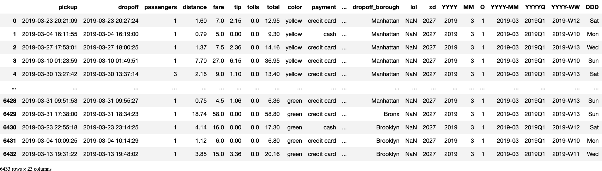
    


    [The most important themes of the draft referendum are:  
    1. Improving the use of health data for research and innovation particularly through  
    the establishment of a National Data Access Point;  
    2. Enhancing the coordination and networking of different stakeholders involved  
    in health data management;  
    3. Expanding the scope of the General Data Protection Regulation (GDPR) to cover all  
    areas of healthcare;  
    4. Providing better access to health data for patients and researchers including through  
    the development of a new law on health data protection;  
    5. Facilitating the exchange of health data between different countries and regions  
    particularly within the European Union (EU);  
    6. Ensuring that data are used in a way that promotes sustainable development and achieves  
    the United Nations Sustainable Development Goals (SDGs).]

