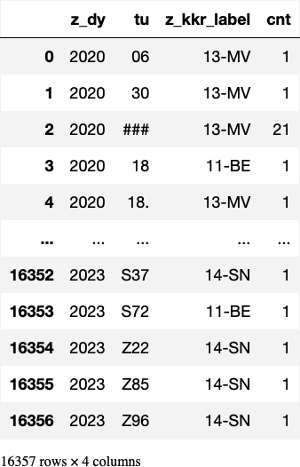
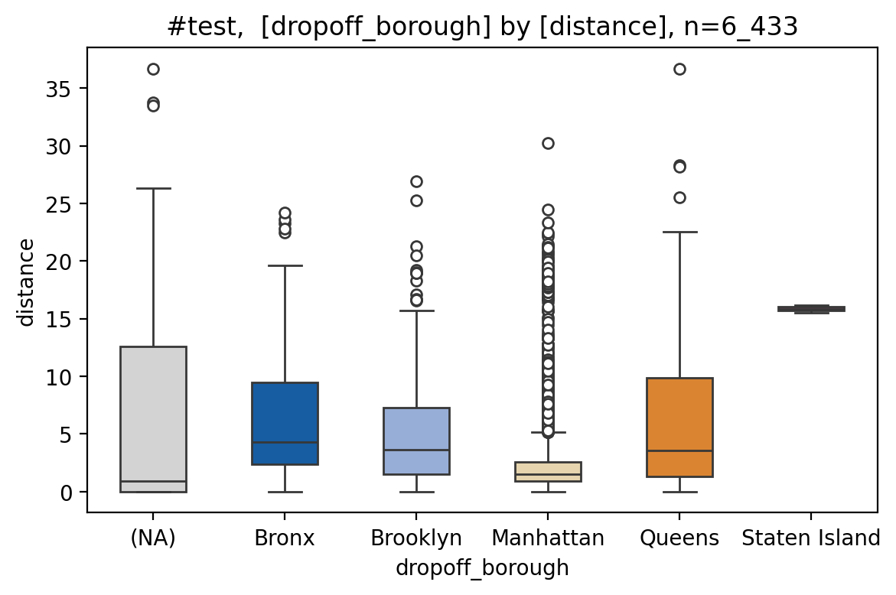
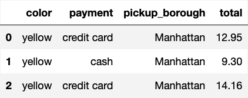
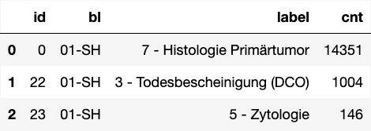
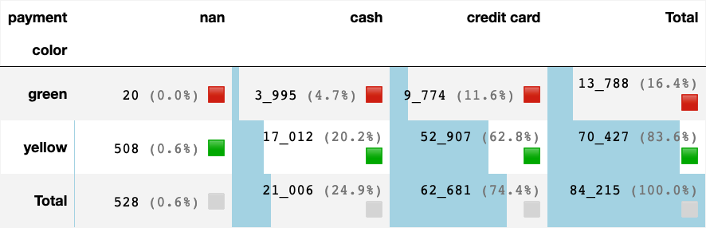
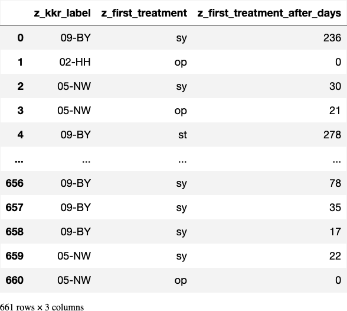
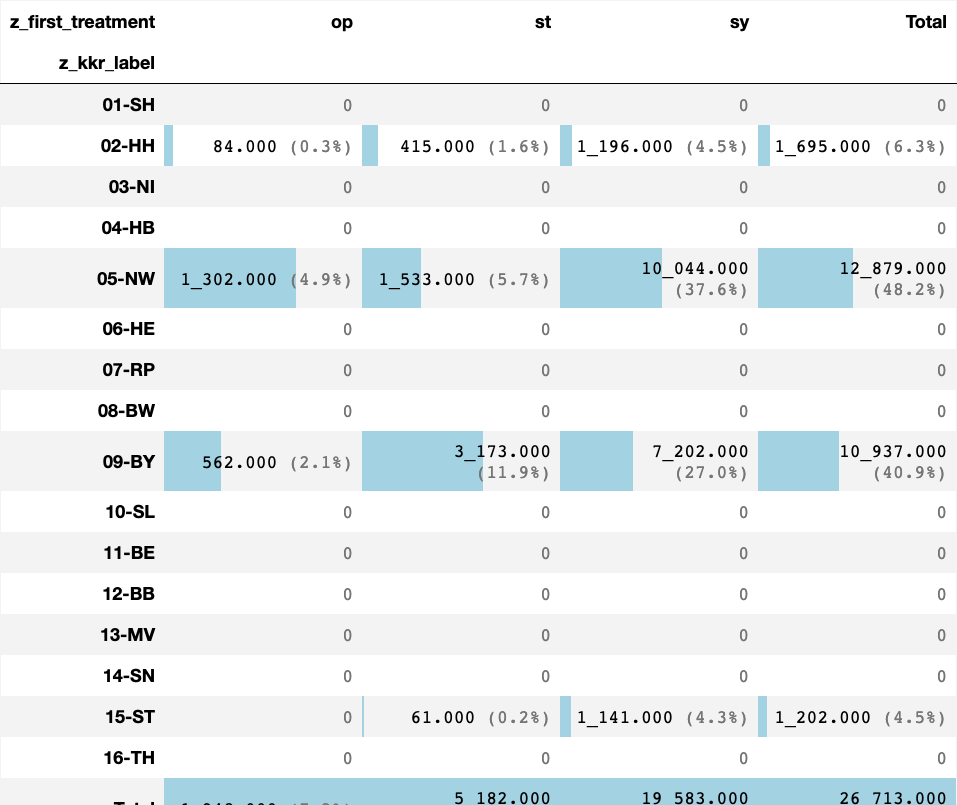
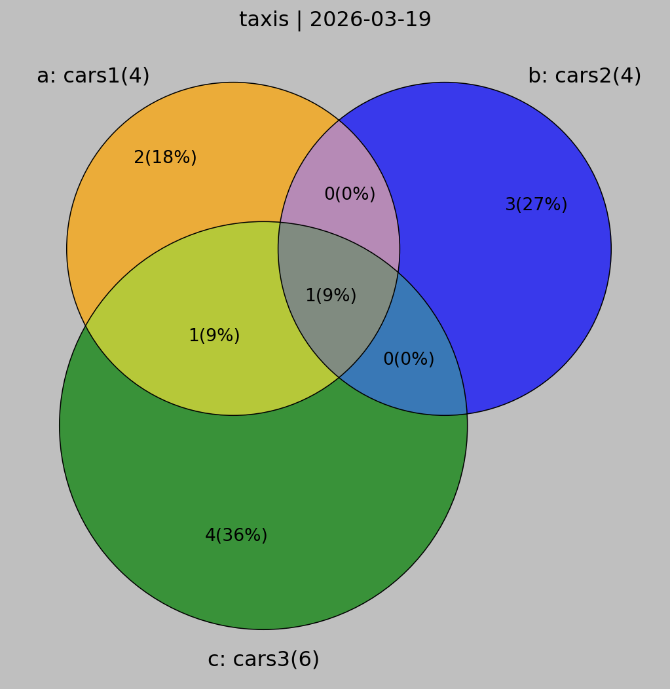

# [test area](#toc0_)

**Table of contents**    
- [test area](#toc1_)    
    - [load](#toc1_1_1_)    
  - [pls](#toc1_2_)    
    - [bars](#toc1_2_1_)    
    - [histo](#toc1_2_2_)    
    - [box](#toc1_2_3_)    
    - [pie](#toc1_2_4_)    
    - [join](#toc1_2_5_)    
    - [sankey](#toc1_2_6_)    
  - [tbl](#toc1_3_)    
    - [print_summary()](#toc1_3_1_)    
    - [describe_df()](#toc1_3_2_)    
    - [descr_db()](#toc1_3_3_)    
  - [show num](#toc1_4_)    
  - [venn](#toc1_5_)    
  - [hlp](#toc1_6_)    

<!-- vscode-jupyter-toc-config
	numbering=false
	anchor=true
	flat=false
	minLevel=1
	maxLevel=6
	/vscode-jupyter-toc-config -->
<!-- THIS CELL WILL BE REPLACED ON TOC UPDATE. DO NOT WRITE YOUR TEXT IN THIS CELL -->

### [load](#toc0_)

    🐍 3.12.9 | 📦 matplotlib_venn: 0.11.10 | 📦 dataframe_image: 0.2.7 | 📦 plotly: 6.2.0 | 📦 kaleido: 1.0.0 | 📦 seaborn: 0.13.2 | 📦 pandas: 2.3.1 | 📦 numpy: 1.26.4 | 📦 duckdb: 1.3.2 | 📦 pandas-plots: 0.20.7 | 📦 connection-helper: 0.13.1

## [pls](#toc0_)

### [bars](#toc0_)

    

    

    

    

    z_dy            int64
    tu             object
    z_kkr_label    object
    cnt             int64
    dtype: object

    

    

### [histo](#toc0_)

    

    

    
    column   | count | missings |  min  | lower |  q25  | median | mean  |  q75  | upper |  max   |  std  |  cv  
    ---------+-------+----------+-------+-------+-------+--------+-------+-------+-------+--------+-------+------
    distance | 6_433 |   0 (0%) | 0.000 | 0.000 | 0.980 |  1.640 | 3.025 | 3.210 | 6.550 | 36.700 | 3.828 | 1.266
    

### [box](#toc0_)

         dropoff_borough  distance
    0          Manhattan      1.60
    1          Manhattan      0.79
    2          Manhattan      1.37
    3          Manhattan      7.70
    4          Manhattan      2.16
    ...              ...       ...
    6428       Manhattan      0.75
    6429           Bronx     18.74
    6430        Brooklyn      4.14
    6431        Brooklyn      1.12
    6432        Brooklyn      3.85
    
    [6433 rows x 2 columns]

    

    

    
    column   | count | missings | min  | lower | q25  | median | mean | q75  | upper |  max  | std  |  cv 
    ---------+-------+----------+------+-------+------+--------+------+------+-------+-------+------+-----
    distance | 6_433 |   0 (0%) | 0.00 |  0.00 | 0.98 |   1.64 | 3.02 | 3.21 |  6.55 | 36.70 | 3.83 | 1.27
    
    
    column        | count |   missings   |  min  | lower |  q25  | median | mean  |  q75  | upper |  max  |  std  |  cv 
    --------------+-------+--------------+-------+-------+-------+--------+-------+-------+-------+-------+-------+-----
    Bronx         | 5_206 |  5_069 (97%) |  0.00 |  0.00 |  2.36 |   4.31 |  6.61 |  9.44 | 19.62 | 24.20 |  5.95 | 0.90
    Brooklyn      | 5_206 |  4_705 (90%) |  0.00 |  0.00 |  1.53 |   3.63 |  5.03 |  7.30 | 15.70 | 26.92 |  4.49 | 0.89
    Manhattan     | 5_206 |       0 (0%) |  0.00 |  0.00 |  0.91 |   1.50 |  2.39 |  2.60 |  5.13 | 30.23 |  2.91 | 1.21
    Queens        | 5_206 |  4_664 (90%) |  0.00 |  0.00 |  1.34 |   3.56 |  5.96 |  9.89 | 22.51 | 36.70 |  5.89 | 0.99
    Staten Island | 5_206 | 5_204 (100%) | 15.51 | 15.51 | 15.68 |  15.86 | 15.86 | 16.03 | 16.20 | 16.20 |  0.49 | 0.03
    nan           | 5_206 |  5_161 (99%) |  0.00 |  0.00 |  0.00 |   0.90 |  7.17 | 12.60 | 26.35 | 36.66 | 10.71 | 1.49
    

    
    column   | count | missings | min  | lower | q25  | median | mean | q75  | upper |  max  | std  |  cv 
    ---------+-------+----------+------+-------+------+--------+------+------+-------+-------+------+-----
    distance | 6_433 |   0 (0%) | 0.00 |  0.00 | 0.98 |   1.64 | 3.02 | 3.21 |  6.55 | 36.70 | 3.83 | 1.27
    
    
    column        | count |   missings   |  min  | lower |  q25  | median | mean  |  q75  | upper |  max  |  std  |  cv 
    --------------+-------+--------------+-------+-------+-------+--------+-------+-------+-------+-------+-------+-----
    Bronx         | 5_206 |  5_069 (97%) |  0.00 |  0.00 |  2.36 |   4.31 |  6.61 |  9.44 | 19.62 | 24.20 |  5.95 | 0.90
    Brooklyn      | 5_206 |  4_705 (90%) |  0.00 |  0.00 |  1.53 |   3.63 |  5.03 |  7.30 | 15.70 | 26.92 |  4.49 | 0.89
    Manhattan     | 5_206 |       0 (0%) |  0.00 |  0.00 |  0.91 |   1.50 |  2.39 |  2.60 |  5.13 | 30.23 |  2.91 | 1.21
    Queens        | 5_206 |  4_664 (90%) |  0.00 |  0.00 |  1.34 |   3.56 |  5.96 |  9.89 | 22.51 | 36.70 |  5.89 | 0.99
    Staten Island | 5_206 | 5_204 (100%) | 15.51 | 15.51 | 15.68 |  15.86 | 15.86 | 16.03 | 16.20 | 16.20 |  0.49 | 0.03
    nan           | 5_206 |  5_161 (99%) |  0.00 |  0.00 |  0.00 |   0.90 |  7.17 | 12.60 | 26.35 | 36.66 | 10.71 | 1.49
    

### [pie](#toc0_)

    

    

### [join](#toc0_)

    

    

### [sankey](#toc0_)

    --- Using demo data (data_demo) ---
       tumor-id diagnosis date treatment
    0         1     2020-01-01        op
    1         1     2021-02-01      syst
    2         1     2022-03-01        op
    3         1     2023-04-01       rad
    4         1     2024-05-01        op
    5         2     2010-01-01      syst
    6         2     2011-02-01        st
    7         2     2012-03-01        op
    8         2     2013-04-01       rad
    9         3     2015-01-01        op
    10        3     2016-02-01       rad
    11        3     2017-03-01      syst
    12        3     2018-04-01        op
    13        4     2005-01-01        st
    14        4     2006-02-01      syst
    15        4     2007-03-01        op
    16        5     2019-01-01        op
    17        5     2020-02-01       rad
    18        6     2021-01-01      syst
    19        6     2022-02-01        op
    20        7                         
    21        7                         
    22        8     2025-01-01        op
    23        9     2025-02-01        op
    24       10     2025-03-01      syst
    25       11     2025-04-01       rad
    26       12     2025-05-01        op
    -----------------------------------

## [tbl](#toc0_)

### [print_summary()](#toc0_)

    
    column     | count | missings |  min  | lower |  q25   | median |  mean  |  q75   | upper  |   max   |  std   |  cv  
    -----------+-------+----------+-------+-------+--------+--------+--------+--------+--------+---------+--------+------
    passengers | 6_433 |   0 (0%) |     0 |     0 |  1.000 |  1.000 |  1.539 |  2.000 |      3 |       6 |  1.204 | 0.782
    distance   | 6_433 |   0 (0%) | 0.000 | 0.000 |  0.980 |  1.640 |  3.025 |  3.210 |  6.550 |  36.700 |  3.828 | 1.266
    fare       | 6_433 |   0 (0%) | 1.000 | 1.000 |  6.500 |  9.500 | 13.091 | 15.000 | 27.540 | 150.000 | 11.552 | 0.882
    tip        | 6_433 |   0 (0%) | 0.000 | 0.000 |  0.000 |  1.700 |  1.979 |  2.800 |  6.960 |  33.200 |  2.449 | 1.237
    tolls      | 6_433 |   0 (0%) | 0.000 | 0.000 |  0.000 |  0.000 |  0.325 |  0.000 |  0.000 |  24.020 |  1.415 | 4.351
    total      | 6_433 |   0 (0%) | 1.300 | 1.300 | 10.800 | 14.160 | 18.518 | 20.300 | 34.550 | 174.820 | 13.816 | 0.746
    

### [describe_df()](#toc0_)

    

    

    🔵 *** df: <unknown> ***  
    🟣 shape: (6_433, 16)
    🟣 duplicates: 0  
    🟠 column stats all (dtype | uniques | missings) [values]  
    - index [0, 1, 2, 3, 4, 5, 6, 7, 8, 9,]  
    - pickup (datetime64[ns] | 6_414 | 0 (0%)) [2019-02-28 23:29:03, 2019-03-01 00:03:29, 2019-03-01 00:08:32, 2019-03-01 00:15:53,  
    2019-03-01 00:29:22, 2019-03-01 00:30:59, 2019-03-01 00:32:49, 2019-03-01 00:53:00,  
    2019-03-01 00:56:50, 2019-03-01 01:25:30,]  
    - dropoff (datetime64[ns] | 6_425 | 0 (0%)) [2019-02-28 23:32:35, 2019-03-01 00:13:32, 2019-03-01 00:29:47, 2019-03-01 00:32:48,  
    2019-03-01 00:37:39, 2019-03-01 00:47:58, 2019-03-01 00:53:18, 2019-03-01 00:58:22,  
    2019-03-01 01:04:01, 2019-03-01 01:29:25,]  
    - passengers (int64 | 7 | 0 (0%)) [0, 1, 2, 3, 4, 5, 6,]  
    - distance (float64 | 1_079 | 0 (0%)) [0.0, 0.01, 0.02, 0.03, 0.04, 0.07, 0.08, 0.09, 0.1, 0.11,]  
    - fare (float64 | 220 | 0 (0%)) [1.0, 2.5, 3.0, 3.5, 4.0, 4.5, 5.0, 5.5, 6.0, 6.5,]  
    - tip (float64 | 489 | 0 (0%)) [0.0, 0.01, 0.02, 0.06, 0.08, 0.09, 0.1, 0.2, 0.25, 0.33,]  
    - tolls (float64 | 16 | 0 (0%)) [0.0, 2.64, 4.75, 5.54, 5.75, 5.76, 6.12, 8.4, 8.5, 9.5,]  
    - total (float64 | 898 | 0 (0%)) [1.3, 3.3, 3.31, 3.8, 4.3, 4.8, 4.81, 5.0, 5.28, 5.3,]  
    - color (object | 2 | 0 (0%)) ['green', 'yellow',]  
    - payment (object | 3 | 44 (1%)) ['<NA>', 'cash', 'credit card',]  
    - pickup_zone (object | 195 | 26 (0%)) ['<NA>', 'Allerton/Pelham Gardens', 'Alphabet City', 'Astoria', 'Auburndale',  
    'Battery Park', 'Battery Park City', 'Bay Ridge', 'Bayside', 'Bedford',]  
    - dropoff_zone (object | 204 | 45 (1%)) ['<NA>', 'Allerton/Pelham Gardens', 'Alphabet City', 'Astoria', 'Auburndale',  
    'Baisley Park', 'Bath Beach', 'Battery Park', 'Battery Park City', 'Bay Ridge',]  
    - pickup_borough (object | 5 | 26 (0%)) ['<NA>', 'Bronx', 'Brooklyn', 'Manhattan', 'Queens',]  
    - dropoff_borough (object | 6 | 45 (1%)) ['<NA>', 'Bronx', 'Brooklyn', 'Manhattan', 'Queens', 'Staten Island',]  
    - lol (float64 | 1 | 6_433 (100%)) [nan,]  
    - xd (int64 | 1 | 0 (0%)) [2027,]  
    🟠 column stats numeric  
    
    column     | count |   missings   |  min  | lower |    q25    |  median   |   mean    |    q75    | upper  |   max   |  std   |  cv  
    -----------+-------+--------------+-------+-------+-----------+-----------+-----------+-----------+--------+---------+--------+------

 

    passengers | 6_433 |       0 (0%) |     0 |     0 |     1.000 |     1.000 |     1.539 |     2.000 |      3 |       6 |  1.204 | 0.782
    distance   | 6_433 |       0 (0%) | 0.000 | 0.000 |     0.980 |     1.640 |     3.025 |     3.210 |  6.550 |  36.700 |  3.828 | 1.266
    fare       | 6_433 |       0 (0%) | 1.000 | 1.000 |     6.500 |     9.500 |    13.091 |    15.000 | 27.540 | 150.000 | 11.552 | 0.882
    tip        | 6_433 |       0 (0%) | 0.000 | 0.000 |     0.000 |     1.700 |     1.979 |     2.800 |  6.960 |  33.200 |  2.449 | 1.237
    tolls      | 6_433 |       0 (0%) | 0.000 | 0.000 |     0.000 |     0.000 |     0.325 |     0.000 |  0.000 |  24.020 |  1.415 | 4.351
    total      | 6_433 |       0 (0%) | 1.300 | 1.300 |    10.800 |    14.160 |    18.518 |    20.300 | 34.550 | 174.820 | 13.816 | 0.746
    lol        | 6_433 | 6_433 (100%) |   N/A |   N/A |       N/A |       N/A |       N/A |       N/A |    N/A |     N/A |    N/A |   N/A
    xd         | 6_433 |       0 (0%) | 2_027 | 2_027 | 2_027.000 | 2_027.000 | 2_027.000 | 2_027.000 |  2_027 |   2_027 |  0.000 |   N/A
    

    

    

### [descr_db()](#toc0_)

    🗄️ delay	1_724, 3
    	("z_kkr_label, z_first_treatment_after_days, z_first_treatment")
    ┌─────────────┬──────────────────────────────┬───────────────────┐
    │ z_kkr_label │ z_first_treatment_after_days │ z_first_treatment │
    │   varchar   │            int32             │      varchar      │
    ├─────────────┼──────────────────────────────┼───────────────────┤
    │ 05-NW       │                           67 │ sy                │
    │ 08-BW       │                           40 │ sy                │
    │ 09-BY       │                            0 │ sy                │
    └─────────────┴──────────────────────────────┴───────────────────┘
    

    

    

    🔵 *** df: taxis ***  
    🟣 shape: (6_433, 4)
    🟣 duplicates: 4_803  
    🟠 column stats all (dtype | uniques | missings) [values]  
    - index [0, 1, 2, 3, 4,]  
    - color (object | 2 | 0 (0%)) ['green', 'yellow',]  
    - payment (object | 3 | 44 (1%)) ['<NA>', 'cash', 'credit card',]  
    - pickup_borough (object | 5 | 26 (0%)) ['<NA>', 'Bronx', 'Brooklyn', 'Manhattan', 'Queens',]  
    - total (float64 | 898 | 0 (0%)) [1.3, 3.3, 3.31, 3.8, 4.3,]  
    🟠 column stats numeric  
    
    column | count | missings |  min  | lower |  q25   | median |  mean  |  q75   | upper  |   max   |  std   |  cv  
    -------+-------+----------+-------+-------+--------+--------+--------+--------+--------+---------+--------+------

 

    total  | 6_433 |   0 (0%) | 1.300 | 1.300 | 10.800 | 14.160 | 18.518 | 20.300 | 34.550 | 174.820 | 13.816 | 0.746
    

    

    

    🗄️ taxis	6_433, 16
    	("pickup, dropoff, passengers, distance, fare, tip, tolls, total, color, payment, pickup_zone, dropoff_zone, pickup_borough, dropoff_borough, lol, xd")
    ┌─────────────────────┬─────────────────────┬────────────┬──────────┬────────┬────────┬────────┬────────┬─────────┬─────────────┬───────────────────────┬───────────────────────┬────────────────┬─────────────────┬────────┬───────┐
    │       pickup        │       dropoff       │ passengers │ distance │  fare  │  tip   │ tolls  │ total  │  color  │   payment   │      pickup_zone      │     dropoff_zone      │ pickup_borough │ dropoff_borough │  lol   │  xd   │
    │    timestamp_ns     │    timestamp_ns     │   int64    │  double  │ double │ double │ double │ double │ varchar │   varchar   │        varchar        │        varchar        │    varchar     │     varchar     │ double │ int64 │
    ├─────────────────────┼─────────────────────┼────────────┼──────────┼────────┼────────┼────────┼────────┼─────────┼─────────────┼───────────────────────┼───────────────────────┼────────────────┼─────────────────┼────────┼───────┤
    │ 2019-03-23 20:21:09 │ 2019-03-23 20:27:24 │          1 │      1.6 │    7.0 │   2.15 │    0.0 │  12.95 │ yellow  │ credit card │ Lenox Hill West       │ UN/Turtle Bay South   │ Manhattan      │ Manhattan       │   NULL │  2027 │
    │ 2019-03-04 16:11:55 │ 2019-03-04 16:19:00 │          1 │     0.79 │    5.0 │    0.0 │    0.0 │    9.3 │ yellow  │ cash        │ Upper West Side South │ Upper West Side South │ Manhattan      │ Manhattan       │   NULL │  2027 │
    │ 2019-03-27 17:53:01 │ 2019-03-27 18:00:25 │          1 │     1.37 │    7.5 │   2.36 │    0.0 │  14.16 │ yellow  │ credit card │ Alphabet City         │ West Village          │ Manhattan      │ Manhattan       │   NULL │  2027 │
    └─────────────────────┴─────────────────────┴────────────┴──────────┴────────┴────────┴────────┴────────┴─────────┴─────────────┴───────────────────────┴───────────────────────┴────────────────┴─────────────────┴────────┴───────┘
    

## [show num](#toc0_)

    

    

    

    

    

    

    

    

    

    

## [venn](#toc0_)

    ab --> cars1 | cars2 --> len: 7

    

    

    abc --> cars1 | cars2 | cars3 --> len: 11
    ab --> cars1 | cars2 --> len: 7
    ac --> cars1 | cars3 --> len: 8
    bc --> cars2 | cars3 --> len: 9

    

    

## [hlp](#toc0_)

    ┌────────────────────────────────────────────────────────────────────────────────────────────────────────────┬─────────┐
    │                                                    ops                                                     │ cnt_ops │
    │                                                  varchar                                                   │  int32  │
    ├────────────────────────────────────────────────────────────────────────────────────────────────────────────┼─────────┤
    │ NULL                                                                                                       │  165429 │
    │ 5-401.11 - Exzision einzelner Lymphknoten und Lymphgefäße: Axillär: Mit Radionuklidmarkierung (Sentinel-…  │  135826 │
    │ 5-573.40 - Transurethrale Inzision, Exzision, Destruktion und Resektion von (erkranktem) Gewebe der Harn…  │   94266 │
    │ 5-987.0 - Anwendung eines OP-Roboters: Komplexer OP-Roboter                                                │   82761 │
    │ 5-870.a1 - Partielle (brusterhaltende) Exzision der Mamma und Destruktion von Mammagewebe: Partielle Res…  │   65040 │
    │ 5-870.a2 - Partielle (brusterhaltende) Exzision der Mamma und Destruktion von Mammagewebe: Partielle Res…  │   52410 │
    │ 5-984 - Mikrochirurgische Technik                                                                          │   47640 │
    │ 5-604.52 - Radikale Prostatovesikulektomie: Laparoskopisch, gefäß- und nervenerhaltend: Mit regionaler L…  │   39369 │
    │ 5-895.14 - Radikale und ausgedehnte Exzision von erkranktem Gewebe an Haut und Unterhaut: Ohne primären …  │   35085 │
    │ 5-573.41 - Transurethrale Inzision, Exzision, Destruktion und Resektion von (erkranktem) Gewebe der Harn…  │   34869 │
    ├────────────────────────────────────────────────────────────────────────────────────────────────────────────┴─────────┤
    │ 10 rows                                                                                                    2 columns │
    └──────────────────────────────────────────────────────────────────────────────────────────────────────────────────────┘
    
    ┌──────────────────────────────────────────────────────────────────────────────────────────────────────┬─────────┐
    │                                                 ops                                                  │ cnt_ops │
    │                                               varchar                                                │  int32  │
    ├──────────────────────────────────────────────────────────────────────────────────────────────────────┼─────────┤
    │ NULL                                                                                                 │  165429 │
    │ 5-401.11 - Exzision einzelner Lymphknoten und Lymphgefäße: Axillär: Mit Radionuklidmarkierung (Senti │  135826 │
    │ 5-573.40 - Transurethrale Inzision, Exzision, Destruktion und Resektion von (erkranktem) Gewebe der  │   94266 │
    │ 5-987.0 - Anwendung eines OP-Roboters: Komplexer OP-Roboter                                          │   82761 │
    │ 5-870.a1 - Partielle (brusterhaltende) Exzision der Mamma und Destruktion von Mammagewebe: Partielle │   65040 │
    │ 5-870.a2 - Partielle (brusterhaltende) Exzision der Mamma und Destruktion von Mammagewebe: Partielle │   52410 │
    │ 5-984 - Mikrochirurgische Technik                                                                    │   47640 │
    │ 5-604.52 - Radikale Prostatovesikulektomie: Laparoskopisch, gefäß- und nervenerhaltend: Mit regional │   39369 │
    │ 5-895.14 - Radikale und ausgedehnte Exzision von erkranktem Gewebe an Haut und Unterhaut: Ohne primä │   35085 │
    │ 5-573.41 - Transurethrale Inzision, Exzision, Destruktion und Resektion von (erkranktem) Gewebe der  │   34869 │
    ├──────────────────────────────────────────────────────────────────────────────────────────────────────┴─────────┤
    │ 10 rows                                                                                              2 columns │
    └────────────────────────────────────────────────────────────────────────────────────────────────────────────────┘
    

    0      2019-03-23 20:21:09
    1      2019-03-04 16:11:55
    2      2019-03-27 17:53:01
    3      2019-03-10 01:23:59
    4      2019-03-30 13:27:42
                   ...        
    6428   2019-03-31 09:51:53
    6429   2019-03-31 17:38:00
    6430   2019-03-23 22:55:18
    6431   2019-03-04 10:09:25
    6432   2019-03-13 19:31:22
    Name: pickup, Length: 6433, dtype: datetime64[ns]

    pat
    ┌──────────────────────────────────────┬─────────┬────────┬─────────┬────────────┬──────────────┬──────────────────────────┬───────────────────┬───────────────────────────────┐
    │               z_pat_id               │  z_sex  │ z_age  │ z_ag05  │ Verstorben │ Geburtsdatum │ Geburtsdatum_Genauigkeit │ Datum_Vitalstatus │ Datum_Vitalstatus_Genauigkeit │
    │               varchar                │ varchar │ double │ varchar │  varchar   │     date     │         varchar          │       date        │            varchar            │
    ├──────────────────────────────────────┼─────────┼────────┼─────────┼────────────┼──────────────┼──────────────────────────┼───────────────────┼───────────────────────────────┤
    │ 450b0462-3c82-411a-ab33-9ed13286a58d │ W       │  83.25 │ a80b84  │ N          │ 1939-12-15   │ T                        │ 2023-06-15        │ T                             │
    └──────────────────────────────────────┴─────────┴────────┴─────────┴────────────┴──────────────┴──────────────────────────┴───────────────────┴───────────────────────────────┘
    
    tod
    ┌────────────────┬─────────┬─────────┬───────────────┐
    │ TodesursacheId │  Code   │ Version │ IsGrundleiden │
    │    varchar     │ varchar │ varchar │    boolean    │
    ├────────────────┴─────────┴─────────┴───────────────┤
    │                       0 rows                       │
    └────────────────────────────────────────────────────┘
    
    tum1
    ┌─────────────┬─────────┬───────────────┬───────────────────────────┬────────────────┬────────────────┬────────────────┬────────────────┬───────────────────┬──────────────────────────────┐
    │ z_kkr_label │ z_icd10 │ Diagnosedatum │ Diagnosedatum_Genauigkeit │ z_tum_op_count │ z_tum_st_count │ z_tum_sy_count │ z_tum_fo_count │ z_first_treatment │ z_first_treatment_after_days │
    │   varchar   │ varchar │     date      │          varchar          │     int16      │     int16      │     int16      │     int16      │      varchar      │            int32             │
    ├─────────────┼─────────┼───────────────┼───────────────────────────┼────────────────┼────────────────┼────────────────┼────────────────┼───────────────────┼──────────────────────────────┤
    │ 15-ST       │ C44.2   │ 2023-03-15    │ T                         │              5 │              0 │              0 │              5 │ op                │                            0 │
    └─────────────┴─────────┴───────────────┴───────────────────────────┴────────────────┴────────────────┴────────────────┴────────────────┴───────────────────┴──────────────────────────────┘
    
    tum2
    ┌────────────────┬──────────┬──────────────────────────┬─────────────────────────┬──────────┬───────────────────────┬──────────────────────────────┬─────────────┬─────────────┐
    │ z_event_order  │ z_events │ Anzahl_Tage_Diagnose_Tod │ z_period_diag_death_day │ DatumPSA │ z_period_diag_psa_day │      z_last_tum_status       │ z_class_hpv │ z_tum_order │
    │    varchar     │ varchar  │          int32           │          int32          │   date   │         int32         │           varchar            │   varchar   │    int8     │
    ├────────────────┼──────────┼──────────────────────────┼─────────────────────────┼──────────┼───────────────────────┼──────────────────────────────┼─────────────┼─────────────┤
    │ fo-op-fo-op-fo │ op|fo    │                     NULL │                    NULL │ NULL     │                  NULL │ V - Vollremission (complete) │ NULL        │           5 │
    └────────────────┴──────────┴──────────────────────────┴─────────────────────────┴──────────┴───────────────────────┴──────────────────────────────┴─────────────┴─────────────┘
    
    op
    ┌──────────────────────────────────────┬───────────┬───────────────────────────────────┬─────────────────────────┬────────────┬──────────────────────┬──────────────────────┬────────────┐
    │                 OPId                 │ Intention │ Lokale_Beurteilung_Residualstatus │ Anzahl_Tage_Diagnose_OP │  Datum_OP  │ Datum_OP_Genauigkeit │ z_period_diag_op_day │ z_op_order │
    │               varchar                │  varchar  │              varchar              │          int32          │    date    │       varchar        │        int32         │   int64    │
    ├──────────────────────────────────────┼───────────┼───────────────────────────────────┼─────────────────────────┼────────────┼──────────────────────┼──────────────────────┼────────────┤
    │ b9336bec-c334-412d-93b5-79b8b23fba90 │ K         │ R1                                │                       0 │ 2023-03-15 │ T                    │                    0 │          1 │
    │ 17ed629d-0f14-4dbe-9d88-610ab6b2a291 │ K         │ R1                                │                       1 │ 2023-03-15 │ T                    │                    1 │          2 │
    │ da08a401-df47-4ae5-bfbc-67790d50bdfc │ K         │ R1                                │                      29 │ 2023-04-15 │ T                    │                   29 │          3 │
    │ a6b2e505-5d59-460c-a271-eafa9e392f18 │ K         │ R1                                │                      50 │ 2023-05-15 │ T                    │                   50 │          4 │
    │ ab1e8069-adf8-46aa-adcc-a4ffb8c00b75 │ K         │ R0                                │                      78 │ 2023-06-15 │ T                    │                   78 │          5 │
    └──────────────────────────────────────┴───────────┴───────────────────────────────────┴─────────────────────────┴────────────┴──────────────────────┴──────────────────────┴────────────┘
    
    ops
    ┌──────────────────────────────────────┬──────────┬─────────┬──────────────────────────────────────┐
    │                OPSId                 │   Code   │ Version │               OP_TypId               │
    │               varchar                │ varchar  │ varchar │               varchar                │
    ├──────────────────────────────────────┼──────────┼─────────┼──────────────────────────────────────┤
    │ 1081731c-9595-41ac-9f31-90c1117fe47c │ 5-181.1  │ 2023    │ da08a401-df47-4ae5-bfbc-67790d50bdfc │
    │ 93f1b8fe-df4f-4ab6-be4d-b0e217776797 │ 5-903.54 │ 2023    │ 17ed629d-0f14-4dbe-9d88-610ab6b2a291 │
    │ cb135ccc-7c90-4658-8a28-48d0e2bd830d │ 5-181.1  │ 2023    │ b9336bec-c334-412d-93b5-79b8b23fba90 │
    │ 52be54a2-a0a2-4ba9-a907-1d59506d9f5e │ 5-182.0  │ 2023    │ ab1e8069-adf8-46aa-adcc-a4ffb8c00b75 │
    │ 6910a319-976a-4749-af8a-85f12864c473 │ 5-925.24 │ 2023    │ ab1e8069-adf8-46aa-adcc-a4ffb8c00b75 │
    │ 48e2ac46-268f-4cd3-9773-372f176a5afd │ 5-182.1  │ 2023    │ a6b2e505-5d59-460c-a271-eafa9e392f18 │
    │ 741c8ace-2bdd-4c40-a5b5-e3fac0a8c60b │ 5-181.4  │ 2023    │ 17ed629d-0f14-4dbe-9d88-610ab6b2a291 │
    │ f58dd5f5-fd6c-481a-9fd7-069e6b0a99b2 │ 5-916.74 │ 2023    │ b9336bec-c334-412d-93b5-79b8b23fba90 │
    └──────────────────────────────────────┴──────────┴─────────┴──────────────────────────────────────┘
    
    st
    ┌─────────┬───────────┬─────────────┐
    │  STId   │ Intention │ Stellung_OP │
    │ varchar │  varchar  │   varchar   │
    ├─────────┴───────────┴─────────────┤
    │              0 rows               │
    └───────────────────────────────────┘
    
    be
    ┌───────────────┬─────────────────────────┬──────────────────────┬──────────────────────────┬──────────────────────────────────────┬─────────┬─────────────────────────┬───────────────┐
    │ BestrahlungId │ Anzahl_Tage_Diagnose_ST │ Anzahl_Tage_ST_Dauer │ Datum_Beginn_Bestrahlung │ Datum_Beginn_Bestrahlung_Genauigkeit │  STId   │ z_period_diag_bestr_day │ z_bestr_order │
    │    varchar    │          int32          │        int32         │           date           │               varchar                │ varchar │          int32          │     int64     │
    ├───────────────┴─────────────────────────┴──────────────────────┴──────────────────────────┴──────────────────────────────────────┴─────────┴─────────────────────────┴───────────────┤
    │                                                                                        0 rows                                                                                        │
    └──────────────────────────────────────────────────────────────────────────────────────────────────────────────────────────────────────────────────────────────────────────────────────┘
    
    app
    ┌───────────────┬────────────────────────────────────────┬──────────────────┬────────────────────────────┬───────────┬─────────────────┬────────────┬────────────────┬────────────────┬─────────────────┬─────────────────┐
    │ BestrahlungId │ TypeOfST_TypBestrahlungApplikationsart │ Seite_Zielgebiet │ Interstitiell_endokavitaer │ Rate_Type │ Metabolisch_Typ │ Radiochemo │ Stereotaktisch │ Atemgetriggert │ CodeVersion2014 │ CodeVersion2021 │
    │    varchar    │                varchar                 │     varchar      │          varchar           │  varchar  │     varchar     │  varchar   │    varchar     │    varchar     │     varchar     │     varchar     │
    ├───────────────┴────────────────────────────────────────┴──────────────────┴────────────────────────────┴───────────┴─────────────────┴────────────┴────────────────┴────────────────┴─────────────────┴─────────────────┤
    │                                                                                                         0 rows                                                                                                          │
    └─────────────────────────────────────────────────────────────────────────────────────────────────────────────────────────────────────────────────────────────────────────────────────────────────────────────────────────┘
    
    syst
    ┌─────────┬───────────┬─────────────┬─────────────┬───────────────────────────┬────────────────────────┬───────────────────┬───────────────────────────────┬────────────────────────┬──────────────┐
    │ SYSTId  │ Intention │ Stellung_OP │ Therapieart │ Anzahl_Tage_Diagnose_SYST │ Anzahl_Tage_SYST_Dauer │ Datum_Beginn_SYST │ Datum_Beginn_SYST_Genauigkeit │ z_period_diag_syst_day │ z_syst_order │
    │ varchar │  varchar  │   varchar   │   varchar   │           int32           │         int32          │       date        │            varchar            │         int32          │    int64     │
    ├─────────┴───────────┴─────────────┴─────────────┴───────────────────────────┴────────────────────────┴───────────────────┴───────────────────────────────┴────────────────────────┴──────────────┤
    │                                                                                              0 rows                                                                                              │
    └──────────────────────────────────────────────────────────────────────────────────────────────────────────────────────────────────────────────────────────────────────────────────────────────────┘
    
    fo
    ┌──────────────────────────────────────┬───────────────────────────────┬─────────────────────────────┬─────────────────────────────────┬────────────────────────────────────┬─────────────────────┬─────────────────────────────────┬────────────┬──────────────────────┐
    │           FolgeereignisId            │ Gesamtbeurteilung_Tumorstatus │ Verlauf_Lokaler_Tumorstatus │ Verlauf_Tumorstatus_Lymphknoten │ Verlauf_Tumorstatus_Fernmetastasen │ Datum_Folgeereignis │ Datum_Folgeereignis_Genauigkeit │ z_fo_order │ z_period_diag_fo_day │
    │               varchar                │            varchar            │           varchar           │             varchar             │              varchar               │        date         │             varchar             │   int64    │        int32         │
    ├──────────────────────────────────────┼───────────────────────────────┼─────────────────────────────┼─────────────────────────────────┼────────────────────────────────────┼─────────────────────┼─────────────────────────────────┼────────────┼──────────────────────┤
    │ 1e58d32d-06a5-4a06-bb2c-1aebe34eebf0 │ T                             │ T                           │ K                               │ K                                  │ 2023-03-15          │ T                               │          1 │                    0 │
    │ fbd74efe-266c-430c-90af-35d0627a6039 │ T                             │ T                           │ K                               │ K                                  │ 2023-03-15          │ T                               │          2 │                    0 │
    │ 04ed157d-787b-419a-b563-b10b51cae6c6 │ X                             │ NULL                        │ NULL                            │ NULL                               │ 2023-04-15          │ T                               │          3 │                   31 │
    │ 13a7ccd4-9133-409d-a7fb-479162ca06ad │ T                             │ T                           │ K                               │ K                                  │ 2023-04-15          │ T                               │          4 │                   31 │
    │ 927c89f6-d53e-4783-bebc-2e1d75dc66e0 │ V                             │ K                           │ K                               │ K                                  │ 2023-06-15          │ T                               │          5 │                   92 │
    └──────────────────────────────────────┴───────────────────────────────┴─────────────────────────────┴─────────────────────────────────┴────────────────────────────────────┴─────────────────────┴─────────────────────────────────┴────────────┴──────────────────────┘
    
    fo_tnm
    ┌──────────────────────────────────────┬──────────────────────────────────────┬─────────┬──────────┬──────────┬──────────┬─────────────────┬─────────┬──────────────┬─────────────────┬─────────┬─────────────────┬─────────┬─────────┬─────────┬─────────┬─────────┬──────────────┐
    │                TNMId                 │           FolgeereignisId            │ Version │ y_Symbol │ r_Symbol │ a_Symbol │ c_p_u_Praefix_T │    T    │ TNM_m_Symbol │ c_p_u_Praefix_N │    N    │ c_p_u_Praefix_M │    M    │    L    │    V    │   Pn    │    S    │ UICC_Stadium │
    │               varchar                │               varchar                │ varchar │ varchar  │ varchar  │ varchar  │     varchar     │ varchar │   varchar    │     varchar     │ varchar │     varchar     │ varchar │ varchar │ varchar │ varchar │ varchar │   varchar    │
    ├──────────────────────────────────────┼──────────────────────────────────────┼─────────┼──────────┼──────────┼──────────┼─────────────────┼─────────┼──────────────┼─────────────────┼─────────┼─────────────────┼─────────┼─────────┼─────────┼─────────┼─────────┼──────────────┤
    │ fbd74efe-266c-430c-90af-35d0627a6039 │ fbd74efe-266c-430c-90af-35d0627a6039 │ NULL    │ NULL     │ NULL     │ NULL     │ NULL            │ NULL    │ NULL         │ NULL            │ NULL    │ NULL            │ NULL    │ NULL    │ NULL    │ NULL    │ NULL    │ NULL         │
    │ 1e58d32d-06a5-4a06-bb2c-1aebe34eebf0 │ 1e58d32d-06a5-4a06-bb2c-1aebe34eebf0 │ NULL    │ NULL     │ NULL     │ NULL     │ NULL            │ NULL    │ NULL         │ NULL            │ NULL    │ NULL            │ NULL    │ NULL    │ NULL    │ NULL    │ NULL    │ NULL         │
    │ 04ed157d-787b-419a-b563-b10b51cae6c6 │ 04ed157d-787b-419a-b563-b10b51cae6c6 │ Item8   │ NULL     │ r        │ NULL     │ p               │ 1       │ NULL         │ NULL            │ NULL    │ NULL            │ NULL    │ L0      │ V0      │ Pn0     │ NULL    │ NULL         │
    │ 927c89f6-d53e-4783-bebc-2e1d75dc66e0 │ 927c89f6-d53e-4783-bebc-2e1d75dc66e0 │ NULL    │ NULL     │ NULL     │ NULL     │ NULL            │ NULL    │ NULL         │ NULL            │ NULL    │ NULL            │ NULL    │ NULL    │ NULL    │ NULL    │ NULL    │ NULL         │
    │ 13a7ccd4-9133-409d-a7fb-479162ca06ad │ 13a7ccd4-9133-409d-a7fb-479162ca06ad │ NULL    │ NULL     │ NULL     │ NULL     │ NULL            │ NULL    │ NULL         │ NULL            │ NULL    │ NULL            │ NULL    │ NULL    │ NULL    │ NULL    │ NULL    │ NULL         │
    └──────────────────────────────────────┴──────────────────────────────────────┴─────────┴──────────┴──────────┴──────────┴─────────────────┴─────────┴──────────────┴─────────────────┴─────────┴─────────────────┴─────────┴─────────┴─────────┴─────────┴─────────┴──────────────┘
    
    fo_fm
    ┌─────────────────┬─────────────────┬──────────────┐
    │ FolgeereignisId │ FernmetastaseId │ Lokalisation │
    │     varchar     │     varchar     │   varchar    │
    ├─────────────────┴─────────────────┴──────────────┤
    │                      0 rows                      │
    └──────────────────────────────────────────────────┘
    
    fo_weitere
    ┌─────────────────────────┬─────────┬─────────┬─────────────────┐
    │ WeitereKlassifikationId │  Name   │ Stadium │ FolgeereignisId │
    │         varchar         │ varchar │ varchar │     varchar     │
    ├─────────────────────────┴─────────┴─────────┴─────────────────┤
    │                            0 rows                             │
    └───────────────────────────────────────────────────────────────┘
    
    diag_fm
    ┌─────────────────┬──────────────┐
    │ FernmetastaseId │ Lokalisation │
    │     varchar     │   varchar    │
    ├─────────────────┴──────────────┤
    │             0 rows             │
    └────────────────────────────────┘
    
    diag_weitere
    ┌─────────────────────────┬─────────┬─────────┐
    │ WeitereKlassifikationId │  Name   │ Stadium │
    │         varchar         │ varchar │ varchar │
    ├─────────────────────────┴─────────┴─────────┤
    │                   0 rows                    │
    └─────────────────────────────────────────────┘
    

    ['total', 'distance']

    ⏳ Adding datetime columns basing off of: dropoff

    

    

    [The most important themes of the draft referendum are:  
    1. Improving the use of health data for research and innovation particularly through  
    the establishment of a National Data Access Point;  
    2. Enhancing the coordination and networking of different stakeholders involved  
    in health data management;  
    3. Expanding the scope of the General Data Protection Regulation (GDPR) to cover all  
    areas of healthcare;  
    4. Providing better access to health data for patients and researchers including through  
    the development of a new law on health data protection;  
    5. Facilitating the exchange of health data between different countries and regions  
    particularly within the European Union (EU);  
    6. Ensuring that data are used in a way that promotes sustainable development and achieves  
    the United Nations Sustainable Development Goals (SDGs).]

