# <a id='toc1_'></a>[test area](#toc0_)

**Table of contents**<a id='toc0_'></a>    
- [test area](#toc1_)    
    - [load](#toc1_1_1_)    
  - [pls](#toc1_2_)    
    - [bars](#toc1_2_1_)    
    - [histo](#toc1_2_2_)    
    - [box](#toc1_2_3_)    
    - [pie](#toc1_2_4_)    
    - [join](#toc1_2_5_)    
    - [sankey](#toc1_2_6_)    
  - [tbl](#toc1_3_)    
    - [print_summary()](#toc1_3_1_)    
    - [describe_df()](#toc1_3_2_)    
    - [descr_db()](#toc1_3_3_)    
  - [show num](#toc1_4_)    
  - [venn](#toc1_5_)    
  - [hlp](#toc1_6_)    

<!-- vscode-jupyter-toc-config
	numbering=false
	anchor=true
	flat=false
	minLevel=1
	maxLevel=6
	/vscode-jupyter-toc-config -->
<!-- THIS CELL WILL BE REPLACED ON TOC UPDATE. DO NOT WRITE YOUR TEXT IN THIS CELL -->

### <a id='toc1_1_1_'></a>[load](#toc0_)


```python
from pathlib import Path
import os
import seaborn as sb
import pandas as pd
import sys
import numpy as np
# from datetime import datetime
# from connection_helper import sql

from pandas_plots import tbl, pls, ven , hlp
import duckdb as ddb

hlp.show_package_version(["matplotlib_venn", "dataframe_image", "plotly", "kaleido", "seaborn"], )
df = sb.load_dataset('taxis')

# if os.getenv("RENDERER") in ('png', 'svg'):
#     os.environ['THEME'] = 'light'
# else:
#     os.environ['THEME'] = 'dark'

hlp.set_theme("dark")

dir_db=Path("C://temp") if hlp.get_os(hlp.OperatingSystem.WINDOWS) else Path(os.path.expanduser("~/tmp"))

file_db_clin = dir_db/'workflow/2025-10-20_data_clin.duckdb'

if not file_db_clin.is_file():
    print(f"File does not exist: {file_db_clin}")
    raise FileNotFoundError

print(hlp.get_os(hlp.OperatingSystem.MAC))
```

    🐍 3.12.9 | 📦 matplotlib_venn: 0.11.10 | 📦 dataframe_image: 0.2.7 | 📦 plotly: 6.2.0 | 📦 kaleido: 1.0.0 | 📦 seaborn: 0.13.2 | 📦 pandas: 2.3.1 | 📦 numpy: 1.26.4 | 📦 duckdb: 1.3.2 | 📦 pandas-plots: 0.20.1 | 📦 connection-helper: 0.13.1
    True


```python
con = ddb.connect(file_db_clin, read_only=True)
```


```python
db_delay = con.sql("""--sql
    select
            first(z_kkr_label) as z_kkr_label,
            first(z_first_treatment_after_days) as z_first_treatment_after_days, 
            first(z_first_treatment) as z_first_treatment
    from Tumor
    where ifnull(z_first_treatment,'') <> ''
    and z_dy = 2023 and z_icd10_3d = 'C81'
    group by z_tum_id
    """)
```

## <a id='toc1_2_'></a>[pls](#toc0_)

### <a id='toc1_2_1_'></a>[bars](#toc0_)


```python
_ = pls.plot_bars(
    db_delay.to_df().iloc[:,:2],
    # height=400,
    # width=1000,
    # use_ci=True,
    # ci_agg='median',
)
_ = pls.plot_bars(
    db_delay.to_df().iloc[:,:2],
    height=600,
    use_ci=True,
    ci_agg='median',
)
```


    
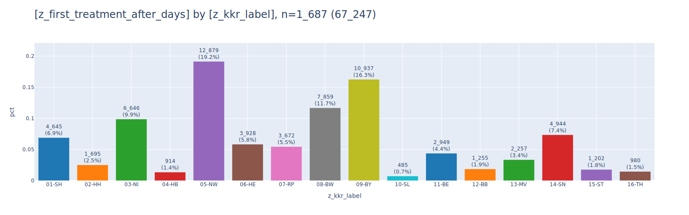
    


    
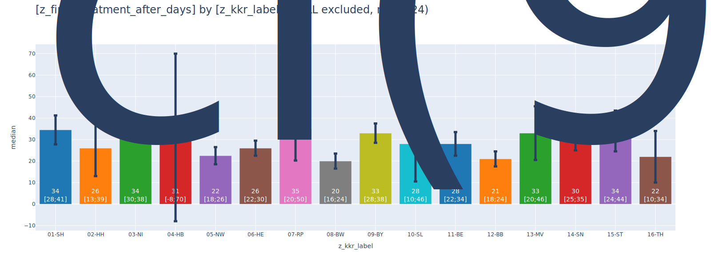
    


```python
_df = db_delay.filter("left(z_kkr_label,2)::int8 in (2,5,9,15)").to_df().iloc[:,[0,2,1]]
display(_df)
pls.plot_stacked_bars(
    _df,
    height=600,
    width=1600,
    orientation="h",
    relative=True,
    show_pct_bar=True,
    kkr_col="z_kkr_label",
    # renderer="png",
    )
```


<div>
<style scoped>
    .dataframe tbody tr th:only-of-type {
        vertical-align: middle;
    }
</style>
<table border="1" class="dataframe">
  <thead>
    <tr style="text-align: right;">
      <th></th>
      <th>z_kkr_label</th>
      <th>z_first_treatment</th>
      <th>z_first_treatment_after_days</th>
    </tr>
  </thead>
  <tbody>
    <tr>
      <th>0</th>
      <td>15-ST</td>
      <td>sy</td>
      <td>22</td>
    </tr>
    <tr>
      <th>1</th>
      <td>09-BY</td>
      <td>sy</td>
      <td>2</td>
    </tr>
    <tr>
      <th>2</th>
      <td>05-NW</td>
      <td>op</td>
      <td>0</td>
    </tr>
    <tr>
      <th>3</th>
      <td>05-NW</td>
      <td>sy</td>
      <td>20</td>
    </tr>
    <tr>
      <th>4</th>
      <td>05-NW</td>
      <td>st</td>
      <td>130</td>
    </tr>
    <tr>
      <th>...</th>
      <td>...</td>
      <td>...</td>
      <td>...</td>
    </tr>
    <tr>
      <th>656</th>
      <td>02-HH</td>
      <td>op</td>
      <td>0</td>
    </tr>
    <tr>
      <th>657</th>
      <td>05-NW</td>
      <td>sy</td>
      <td>28</td>
    </tr>
    <tr>
      <th>658</th>
      <td>09-BY</td>
      <td>sy</td>
      <td>14</td>
    </tr>
    <tr>
      <th>659</th>
      <td>05-NW</td>
      <td>op</td>
      <td>0</td>
    </tr>
    <tr>
      <th>660</th>
      <td>09-BY</td>
      <td>sy</td>
      <td>17</td>
    </tr>
  </tbody>
</table>
<p>661 rows × 3 columns</p>
</div>


    
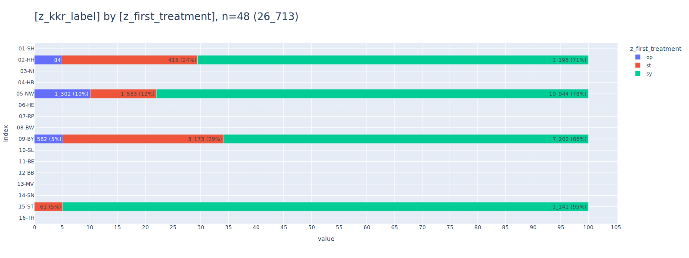
    


```python
df_facets = pd.read_csv("assets/facets.csv", sep=";")#.astype({"z_dy": "Int64"}).astype({"z_dy": str})
display(df_facets[:None])
print(df_facets.dtypes)

_df = df_facets[
    [
        "z_dy",
        "tu",
        "z_kkr_label",
        "cnt",
    ]
]#[:100]
# _df


l=pls.plot_facet_stacked_bars(
    _df,
    top_n_color=5,
    # subplots_per_row=3,
    # top_n_facet=15,
    # top_n_index=3, 
    show_other=True,
    sort_values_color=True,
    # sort_values_facet=True,
    relative=True,
    # show_pct=True,
    annotations=True,
    subplot_size=300,
    subplots_per_row=5,
    # renderer="",
    # show_pct=True,
    )
# l

# ll = pls.plot_facet_stacked_bars(
#     _df,
#     top_n_color=5,
#     # subplots_per_row=8,
#     # top_n_facet=15,
#     # top_n_index=3, 
#     show_other=True,
#     sort_values_color=True,
#     # sort_values_facet=True,
#     relative=True,
#     annotations=True,
#     )
# # ll
```


<div>
<style scoped>
    .dataframe tbody tr th:only-of-type {
        vertical-align: middle;
    }
</style>
<table border="1" class="dataframe">
  <thead>
    <tr style="text-align: right;">
      <th></th>
      <th>z_dy</th>
      <th>tu</th>
      <th>z_kkr_label</th>
      <th>cnt</th>
    </tr>
  </thead>
  <tbody>
    <tr>
      <th>0</th>
      <td>2020</td>
      <td>06</td>
      <td>13-MV</td>
      <td>1</td>
    </tr>
    <tr>
      <th>1</th>
      <td>2020</td>
      <td>30</td>
      <td>13-MV</td>
      <td>1</td>
    </tr>
    <tr>
      <th>2</th>
      <td>2020</td>
      <td>###</td>
      <td>13-MV</td>
      <td>21</td>
    </tr>
    <tr>
      <th>3</th>
      <td>2020</td>
      <td>18</td>
      <td>11-BE</td>
      <td>1</td>
    </tr>
    <tr>
      <th>4</th>
      <td>2020</td>
      <td>18.</td>
      <td>13-MV</td>
      <td>1</td>
    </tr>
    <tr>
      <th>...</th>
      <td>...</td>
      <td>...</td>
      <td>...</td>
      <td>...</td>
    </tr>
    <tr>
      <th>16352</th>
      <td>2023</td>
      <td>S37</td>
      <td>14-SN</td>
      <td>1</td>
    </tr>
    <tr>
      <th>16353</th>
      <td>2023</td>
      <td>S72</td>
      <td>11-BE</td>
      <td>1</td>
    </tr>
    <tr>
      <th>16354</th>
      <td>2023</td>
      <td>Z22</td>
      <td>14-SN</td>
      <td>1</td>
    </tr>
    <tr>
      <th>16355</th>
      <td>2023</td>
      <td>Z85</td>
      <td>14-SN</td>
      <td>1</td>
    </tr>
    <tr>
      <th>16356</th>
      <td>2023</td>
      <td>Z96</td>
      <td>14-SN</td>
      <td>1</td>
    </tr>
  </tbody>
</table>
<p>16357 rows × 4 columns</p>
</div>


    z_dy            int64
    tu             object
    z_kkr_label    object
    cnt             int64
    dtype: object


    
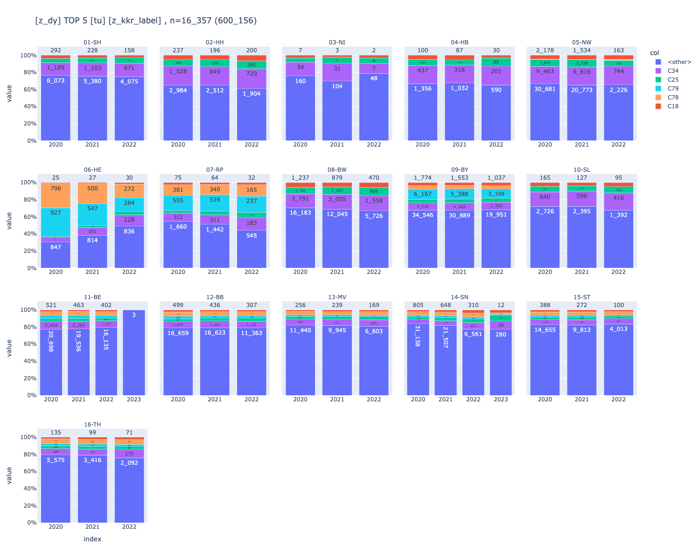
    


### <a id='toc1_2_2_'></a>[histo](#toc0_)


```python
_=pls.plot_histogram_large(
    df.distance,
    # nbins=50,
    height=300,
    summary=True
)
```


    
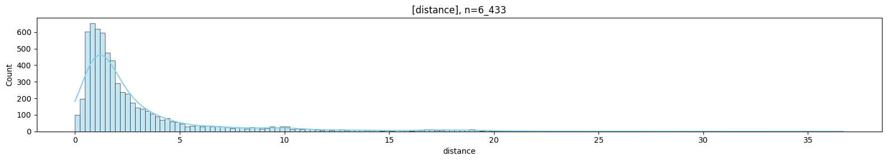
    


    
    column   | count |  min  | lower |  q25  | median | mean  |  q75  | upper |  max   |  std  |  cv   |    sum    
    ---------+-------+-------+-------+-------+--------+-------+-------+-------+--------+-------+-------+-----------
    distance | 6_433 | 0.000 | 0.000 | 0.980 |  1.640 | 3.025 | 3.210 | 6.550 | 36.700 | 3.828 | 1.266 | 19_457.360
    


```python
# _df = df["distance"]
# # _df#.to_frame()
# # _df=df[["fare","distance"]]
# pls.plot_histogram(
#     _df,
#     height=300,
#     width=1000,
#     precision=0,
#     orientation="v",
#     histnorm="",
#     nbins=-1,
#     # barmode="overlay",
#     # renderer="png",
#     # png_path=Path(".local/box5.png"),
#     summary=True,
#     caption="test lol xd-lmao",
# )
```

### <a id='toc1_2_3_'></a>[box](#toc0_)


```python
# _=pls.plot_box(
#     # df["distance"],
#     df[df["dropoff_borough"].isna()].distance,
#     height=200,
#     # violin=True,
#     # use_log=True,
# )
```


```python
_df = df[["dropoff_borough","distance"]]
print(_df)
_=pls.plot_boxes_large(
    _df,
    width=600,
    # violin=True,
    # use_log=True,
)
_=pls.plot_boxes(
    _df,
    width=600,
    # violin=True,
    # use_log=True,
)

```

         dropoff_borough  distance
    0          Manhattan      1.60
    1          Manhattan      0.79
    2          Manhattan      1.37
    3          Manhattan      7.70
    4          Manhattan      2.16
    ...              ...       ...
    6428       Manhattan      0.75
    6429           Bronx     18.74
    6430        Brooklyn      4.14
    6431        Brooklyn      1.12
    6432        Brooklyn      3.85
    
    [6433 rows x 2 columns]


    
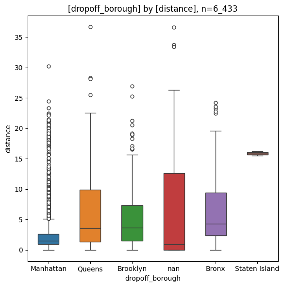
    


    
    column   | count | min  | lower | q25  | median | mean | q75  | upper |  max  | std  |  cv  |    sum   
    ---------+-------+------+-------+------+--------+------+------+-------+-------+------+------+----------
    distance | 6_433 | 0.00 |  0.00 | 0.98 |   1.64 | 3.02 | 3.21 |  6.55 | 36.70 | 3.83 | 1.27 | 19_457.36
    
    
    column        | count |  min  | lower |  q25  | median | mean  |  q75  | upper |  max  |  std  |  cv  |    sum   
    --------------+-------+-------+-------+-------+--------+-------+-------+-------+-------+-------+------+----------
    Bronx         |   137 |  0.00 |  0.00 |  2.36 |   4.31 |  6.61 |  9.44 | 19.62 | 24.20 |  5.95 | 0.90 |    905.88
    Brooklyn      |   501 |  0.00 |  0.00 |  1.53 |   3.63 |  5.03 |  7.30 | 15.70 | 26.92 |  4.49 | 0.89 |  2_519.28
    Manhattan     | 5_206 |  0.00 |  0.00 |  0.91 |   1.50 |  2.39 |  2.60 |  5.13 | 30.23 |  2.91 | 1.21 | 12_447.68
    Queens        |   542 |  0.00 |  0.00 |  1.34 |   3.56 |  5.96 |  9.89 | 22.51 | 36.70 |  5.89 | 0.99 |  3_230.13
    Staten Island |     2 | 15.51 | 15.51 | 15.68 |  15.86 | 15.86 | 16.03 | 16.20 | 16.20 |  0.49 | 0.03 |     31.71
    nan           |    45 |  0.00 |  0.00 |  0.00 |   0.90 |  7.17 | 12.60 | 26.35 | 36.66 | 10.71 | 1.49 |    322.68
    


    
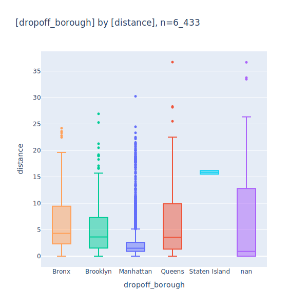
    


    
    column   | count | min  | lower | q25  | median | mean | q75  | upper |  max  | std  |  cv  |    sum   
    ---------+-------+------+-------+------+--------+------+------+-------+-------+------+------+----------
    distance | 6_433 | 0.00 |  0.00 | 0.98 |   1.64 | 3.02 | 3.21 |  6.55 | 36.70 | 3.83 | 1.27 | 19_457.36
    
    
    column        | count |  min  | lower |  q25  | median | mean  |  q75  | upper |  max  |  std  |  cv  |    sum   
    --------------+-------+-------+-------+-------+--------+-------+-------+-------+-------+-------+------+----------
    Bronx         |   137 |  0.00 |  0.00 |  2.36 |   4.31 |  6.61 |  9.44 | 19.62 | 24.20 |  5.95 | 0.90 |    905.88
    Brooklyn      |   501 |  0.00 |  0.00 |  1.53 |   3.63 |  5.03 |  7.30 | 15.70 | 26.92 |  4.49 | 0.89 |  2_519.28
    Manhattan     | 5_206 |  0.00 |  0.00 |  0.91 |   1.50 |  2.39 |  2.60 |  5.13 | 30.23 |  2.91 | 1.21 | 12_447.68
    Queens        |   542 |  0.00 |  0.00 |  1.34 |   3.56 |  5.96 |  9.89 | 22.51 | 36.70 |  5.89 | 0.99 |  3_230.13
    Staten Island |     2 | 15.51 | 15.51 | 15.68 |  15.86 | 15.86 | 16.03 | 16.20 | 16.20 |  0.49 | 0.03 |     31.71
    nan           |    45 |  0.00 |  0.00 |  0.00 |   0.90 |  7.17 | 12.60 | 26.35 | 36.66 | 10.71 | 1.49 |    322.68
    


```python
# pls.plot_box(
#     df.distance,
#     height=400,
#     violin=False,
#     x_min=-2,
#     x_max=50,
#     # summary = False
# )

# _df = df[["dropoff_borough", "distance"]]
# # _df["dropoff_borough"] = _df["dropoff_borough"].astype(str)
# display(_df.dtypes)
# display(_df)
# _=pls.plot_boxes(
#     _df,
#     width=1600,
#     annotations=False,
#     precision=4,
# )
```

### <a id='toc1_2_4_'></a>[pie](#toc0_)


```python
df["payment"]
pls.plot_pie(
    data=df["payment"],
    caption="test lol",
    donut_size=0.3,
    # precision=3,
)
```


    

    


### <a id='toc1_2_5_'></a>[join](#toc0_)


```python
_df = df[["fare", "passengers"]]
# pls.plot_joint(_df, precision=0, size=15, kind="reg", caption="")
# pls.plot_joint(_df, precision=0, size=15, kind="hex", png_path=Path(".local/box6.png"))
pls.plot_joint(_df, precision=0, size=5, kind="kde",)
# pls.plot_joint(_df, precision=0, size=5, kind="hist",)
# pls.plot_joint(_df, precision=0, size=5, kind="kde", png_path=Path(".local/box7.png"))
```


    
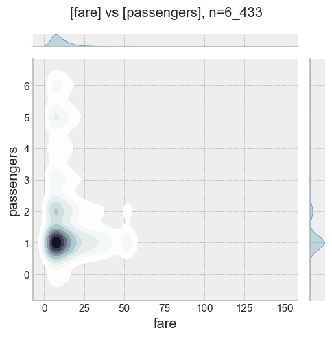
    


### <a id='toc1_2_6_'></a>[sankey](#toc0_)


```python
pls.plot_sankey(
    width=2000,
    font_size=15,
    # renderer="png",
)
```

    --- Using demo data (data_demo) ---
       tumor-id diagnosis date treatment
    0         1     2020-01-01        op
    1         1     2021-02-01      syst
    2         1     2022-03-01        op
    3         1     2023-04-01       rad
    4         1     2024-05-01        op
    5         2     2010-01-01      syst
    6         2     2011-02-01        st
    7         2     2012-03-01        op
    8         2     2013-04-01       rad
    9         3     2015-01-01        op
    10        3     2016-02-01       rad
    11        3     2017-03-01      syst
    12        3     2018-04-01        op
    13        4     2005-01-01        st
    14        4     2006-02-01      syst
    15        4     2007-03-01        op
    16        5     2019-01-01        op
    17        5     2020-02-01       rad
    18        6     2021-01-01      syst
    19        6     2022-02-01        op
    20        7                         
    21        7                         
    22        8     2025-01-01        op
    23        9     2025-02-01        op
    24       10     2025-03-01      syst
    25       11     2025-04-01       rad
    26       12     2025-05-01        op
    -----------------------------------


    
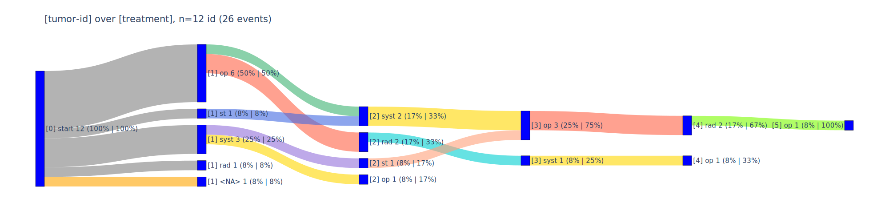
    


## <a id='toc1_3_'></a>[tbl](#toc0_)

### <a id='toc1_3_1_'></a>[print_summary()](#toc0_)


```python
_=tbl.print_summary(df)
```

    
    column     | count |  min  | lower |  q25   | median |  mean  |  q75   | upper  |   max   |  std   |  cv   |     sum    
    -----------+-------+-------+-------+--------+--------+--------+--------+--------+---------+--------+-------+------------
    passengers | 6_433 |     0 |     0 |  1.000 |  1.000 |  1.539 |  2.000 |      3 |       6 |  1.204 | 0.782 |       9_902
    distance   | 6_433 | 0.000 | 0.000 |  0.980 |  1.640 |  3.025 |  3.210 |  6.550 |  36.700 |  3.828 | 1.266 |  19_457.360
    fare       | 6_433 | 1.000 | 1.000 |  6.500 |  9.500 | 13.091 | 15.000 | 27.540 | 150.000 | 11.552 | 0.882 |  84_214.870
    tip        | 6_433 | 0.000 | 0.000 |  0.000 |  1.700 |  1.979 |  2.800 |  6.960 |  33.200 |  2.449 | 1.237 |  12_732.320
    tolls      | 6_433 | 0.000 | 0.000 |  0.000 |  0.000 |  0.325 |  0.000 |  0.000 |  24.020 |  1.415 | 4.351 |   2_092.480
    total      | 6_433 | 1.300 | 1.300 | 10.800 | 14.160 | 18.518 | 20.300 | 34.550 | 174.820 | 13.816 | 0.746 | 119_124.970
    


### <a id='toc1_3_2_'></a>[describe_df()](#toc0_)


```python
df["lol"] = np.nan
df["xd"]=2027
df["lol"] = df["lol"].astype("float64")

display(df)

tbl.describe_df(
    df,
    # "taxis",
    use_columns=False,
    # renderer="svg",
    top_n_uniques=10,
    top_n_chars_in_columns=10,
    top_n_chars_in_index=15,
)
```


<div>
<style scoped>
    .dataframe tbody tr th:only-of-type {
        vertical-align: middle;
    }
</style>
<table border="1" class="dataframe">
  <thead>
    <tr style="text-align: right;">
      <th></th>
      <th>pickup</th>
      <th>dropoff</th>
      <th>passengers</th>
      <th>distance</th>
      <th>fare</th>
      <th>tip</th>
      <th>tolls</th>
      <th>total</th>
      <th>color</th>
      <th>payment</th>
      <th>pickup_zone</th>
      <th>dropoff_zone</th>
      <th>pickup_borough</th>
      <th>dropoff_borough</th>
      <th>lol</th>
      <th>xd</th>
    </tr>
  </thead>
  <tbody>
    <tr>
      <th>0</th>
      <td>2019-03-23 20:21:09</td>
      <td>2019-03-23 20:27:24</td>
      <td>1</td>
      <td>1.60</td>
      <td>7.0</td>
      <td>2.15</td>
      <td>0.0</td>
      <td>12.95</td>
      <td>yellow</td>
      <td>credit card</td>
      <td>Lenox Hill West</td>
      <td>UN/Turtle Bay South</td>
      <td>Manhattan</td>
      <td>Manhattan</td>
      <td>NaN</td>
      <td>2027</td>
    </tr>
    <tr>
      <th>1</th>
      <td>2019-03-04 16:11:55</td>
      <td>2019-03-04 16:19:00</td>
      <td>1</td>
      <td>0.79</td>
      <td>5.0</td>
      <td>0.00</td>
      <td>0.0</td>
      <td>9.30</td>
      <td>yellow</td>
      <td>cash</td>
      <td>Upper West Side South</td>
      <td>Upper West Side South</td>
      <td>Manhattan</td>
      <td>Manhattan</td>
      <td>NaN</td>
      <td>2027</td>
    </tr>
    <tr>
      <th>2</th>
      <td>2019-03-27 17:53:01</td>
      <td>2019-03-27 18:00:25</td>
      <td>1</td>
      <td>1.37</td>
      <td>7.5</td>
      <td>2.36</td>
      <td>0.0</td>
      <td>14.16</td>
      <td>yellow</td>
      <td>credit card</td>
      <td>Alphabet City</td>
      <td>West Village</td>
      <td>Manhattan</td>
      <td>Manhattan</td>
      <td>NaN</td>
      <td>2027</td>
    </tr>
    <tr>
      <th>3</th>
      <td>2019-03-10 01:23:59</td>
      <td>2019-03-10 01:49:51</td>
      <td>1</td>
      <td>7.70</td>
      <td>27.0</td>
      <td>6.15</td>
      <td>0.0</td>
      <td>36.95</td>
      <td>yellow</td>
      <td>credit card</td>
      <td>Hudson Sq</td>
      <td>Yorkville West</td>
      <td>Manhattan</td>
      <td>Manhattan</td>
      <td>NaN</td>
      <td>2027</td>
    </tr>
    <tr>
      <th>4</th>
      <td>2019-03-30 13:27:42</td>
      <td>2019-03-30 13:37:14</td>
      <td>3</td>
      <td>2.16</td>
      <td>9.0</td>
      <td>1.10</td>
      <td>0.0</td>
      <td>13.40</td>
      <td>yellow</td>
      <td>credit card</td>
      <td>Midtown East</td>
      <td>Yorkville West</td>
      <td>Manhattan</td>
      <td>Manhattan</td>
      <td>NaN</td>
      <td>2027</td>
    </tr>
    <tr>
      <th>...</th>
      <td>...</td>
      <td>...</td>
      <td>...</td>
      <td>...</td>
      <td>...</td>
      <td>...</td>
      <td>...</td>
      <td>...</td>
      <td>...</td>
      <td>...</td>
      <td>...</td>
      <td>...</td>
      <td>...</td>
      <td>...</td>
      <td>...</td>
      <td>...</td>
    </tr>
    <tr>
      <th>6428</th>
      <td>2019-03-31 09:51:53</td>
      <td>2019-03-31 09:55:27</td>
      <td>1</td>
      <td>0.75</td>
      <td>4.5</td>
      <td>1.06</td>
      <td>0.0</td>
      <td>6.36</td>
      <td>green</td>
      <td>credit card</td>
      <td>East Harlem North</td>
      <td>Central Harlem North</td>
      <td>Manhattan</td>
      <td>Manhattan</td>
      <td>NaN</td>
      <td>2027</td>
    </tr>
    <tr>
      <th>6429</th>
      <td>2019-03-31 17:38:00</td>
      <td>2019-03-31 18:34:23</td>
      <td>1</td>
      <td>18.74</td>
      <td>58.0</td>
      <td>0.00</td>
      <td>0.0</td>
      <td>58.80</td>
      <td>green</td>
      <td>credit card</td>
      <td>Jamaica</td>
      <td>East Concourse/Concourse Village</td>
      <td>Queens</td>
      <td>Bronx</td>
      <td>NaN</td>
      <td>2027</td>
    </tr>
    <tr>
      <th>6430</th>
      <td>2019-03-23 22:55:18</td>
      <td>2019-03-23 23:14:25</td>
      <td>1</td>
      <td>4.14</td>
      <td>16.0</td>
      <td>0.00</td>
      <td>0.0</td>
      <td>17.30</td>
      <td>green</td>
      <td>cash</td>
      <td>Crown Heights North</td>
      <td>Bushwick North</td>
      <td>Brooklyn</td>
      <td>Brooklyn</td>
      <td>NaN</td>
      <td>2027</td>
    </tr>
    <tr>
      <th>6431</th>
      <td>2019-03-04 10:09:25</td>
      <td>2019-03-04 10:14:29</td>
      <td>1</td>
      <td>1.12</td>
      <td>6.0</td>
      <td>0.00</td>
      <td>0.0</td>
      <td>6.80</td>
      <td>green</td>
      <td>credit card</td>
      <td>East New York</td>
      <td>East Flatbush/Remsen Village</td>
      <td>Brooklyn</td>
      <td>Brooklyn</td>
      <td>NaN</td>
      <td>2027</td>
    </tr>
    <tr>
      <th>6432</th>
      <td>2019-03-13 19:31:22</td>
      <td>2019-03-13 19:48:02</td>
      <td>1</td>
      <td>3.85</td>
      <td>15.0</td>
      <td>3.36</td>
      <td>0.0</td>
      <td>20.16</td>
      <td>green</td>
      <td>credit card</td>
      <td>Boerum Hill</td>
      <td>Windsor Terrace</td>
      <td>Brooklyn</td>
      <td>Brooklyn</td>
      <td>NaN</td>
      <td>2027</td>
    </tr>
  </tbody>
</table>
<p>6433 rows × 16 columns</p>
</div>


    🔵 *** df: <unknown> ***  
    🟣 shape: (6_433, 16)
    🟣 duplicates: 0  
    🟠 column stats numeric  
    
    column     | count |  min  | lower |    q25    |  median   |   mean    |    q75    | upper  |   max   |  std   |  cv   |     sum    
    -----------+-------+-------+-------+-----------+-----------+-----------+-----------+--------+---------+--------+-------+------------
    passengers | 6_433 |     0 |     0 |     1.000 |     1.000 |     1.539 |     2.000 |      3 |       6 |  1.204 | 0.782 |       9_902
    distance   | 6_433 | 0.000 | 0.000 |     0.980 |     1.640 |     3.025 |     3.210 |  6.550 |  36.700 |  3.828 | 1.266 |  19_457.360
    fare       | 6_433 | 1.000 | 1.000 |     6.500 |     9.500 |    13.091 |    15.000 | 27.540 | 150.000 | 11.552 | 0.882 |  84_214.870
    tip        | 6_433 | 0.000 | 0.000 |     0.000 |     1.700 |     1.979 |     2.800 |  6.960 |  33.200 |  2.449 | 1.237 |  12_732.320
    tolls      | 6_433 | 0.000 | 0.000 |     0.000 |     0.000 |     0.325 |     0.000 |  0.000 |  24.020 |  1.415 | 4.351 |   2_092.480
    total      | 6_433 | 1.300 | 1.300 |    10.800 |    14.160 |    18.518 |    20.300 | 34.550 | 174.820 | 13.816 | 0.746 | 119_124.970
    xd         | 6_433 | 2_027 | 2_027 | 2_027.000 | 2_027.000 | 2_027.000 | 2_027.000 |  2_027 |   2_027 |  0.000 |   N/A |  13_039_691
    


<div>
<style scoped>
    .dataframe tbody tr th:only-of-type {
        vertical-align: middle;
    }
</style>
<table border="1" class="dataframe">
  <thead>
    <tr style="text-align: right;">
      <th></th>
      <th>pickup</th>
      <th>dropoff</th>
      <th>passengers</th>
      <th>distance</th>
      <th>fare</th>
      <th>tip</th>
      <th>tolls</th>
      <th>total</th>
      <th>color</th>
      <th>payment</th>
      <th>pickup_zone</th>
      <th>dropoff_zone</th>
      <th>pickup_borough</th>
      <th>dropoff_borough</th>
      <th>lol</th>
      <th>xd</th>
    </tr>
  </thead>
  <tbody>
    <tr>
      <th>0</th>
      <td>2019-03-23 20:21:09</td>
      <td>2019-03-23 20:27:24</td>
      <td>1</td>
      <td>1.60</td>
      <td>7.0</td>
      <td>2.15</td>
      <td>0.0</td>
      <td>12.95</td>
      <td>yellow</td>
      <td>credit card</td>
      <td>Lenox Hill West</td>
      <td>UN/Turtle Bay South</td>
      <td>Manhattan</td>
      <td>Manhattan</td>
      <td>NaN</td>
      <td>2027</td>
    </tr>
    <tr>
      <th>1</th>
      <td>2019-03-04 16:11:55</td>
      <td>2019-03-04 16:19:00</td>
      <td>1</td>
      <td>0.79</td>
      <td>5.0</td>
      <td>0.00</td>
      <td>0.0</td>
      <td>9.30</td>
      <td>yellow</td>
      <td>cash</td>
      <td>Upper West Side South</td>
      <td>Upper West Side South</td>
      <td>Manhattan</td>
      <td>Manhattan</td>
      <td>NaN</td>
      <td>2027</td>
    </tr>
    <tr>
      <th>2</th>
      <td>2019-03-27 17:53:01</td>
      <td>2019-03-27 18:00:25</td>
      <td>1</td>
      <td>1.37</td>
      <td>7.5</td>
      <td>2.36</td>
      <td>0.0</td>
      <td>14.16</td>
      <td>yellow</td>
      <td>credit card</td>
      <td>Alphabet City</td>
      <td>West Village</td>
      <td>Manhattan</td>
      <td>Manhattan</td>
      <td>NaN</td>
      <td>2027</td>
    </tr>
  </tbody>
</table>
</div>


    
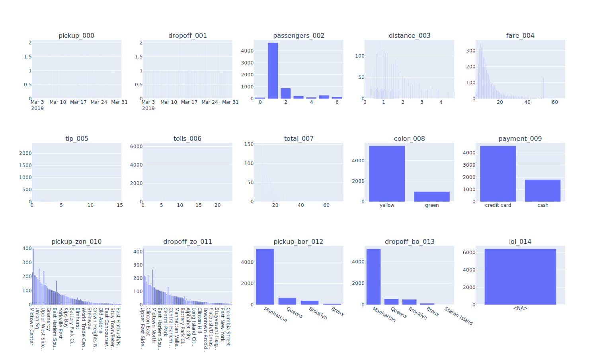
    


### <a id='toc1_3_3_'></a>[descr_db()](#toc0_)


```python
tbl.descr_db(db_delay, caption="delay", width=200)
```

    🗄️ delay	1_724, 3
    	("z_kkr_label, z_first_treatment_after_days, z_first_treatment")
    ┌─────────────┬──────────────────────────────┬───────────────────┐
    │ z_kkr_label │ z_first_treatment_after_days │ z_first_treatment │
    │   varchar   │            int32             │      varchar      │
    ├─────────────┼──────────────────────────────┼───────────────────┤
    │ 03-NI       │                           14 │ sy                │
    │ 05-NW       │                           13 │ op                │
    │ 14-SN       │                           90 │ sy                │
    └─────────────┴──────────────────────────────┴───────────────────┘
    


```python
df_dsich = pd.read_csv("assets/dsich.csv", sep=";")#.astype({"z_dy": "Int64"}).astype({"z_dy": str})
display(df_dsich[:3])
# print(df_dsich.dtypes)
```


<div>
<style scoped>
    .dataframe tbody tr th:only-of-type {
        vertical-align: middle;
    }
</style>
<table border="1" class="dataframe">
  <thead>
    <tr style="text-align: right;">
      <th></th>
      <th>id</th>
      <th>bl</th>
      <th>label</th>
      <th>cnt</th>
    </tr>
  </thead>
  <tbody>
    <tr>
      <th>0</th>
      <td>0</td>
      <td>01-SH</td>
      <td>7 - Histologie Primärtumor</td>
      <td>14351</td>
    </tr>
    <tr>
      <th>1</th>
      <td>22</td>
      <td>01-SH</td>
      <td>3 - Todesbescheinigung (DCO)</td>
      <td>1004</td>
    </tr>
    <tr>
      <th>2</th>
      <td>23</td>
      <td>01-SH</td>
      <td>5 - Zytologie</td>
      <td>146</td>
    </tr>
  </tbody>
</table>
</div>


```python
_df = df_dsich[
    [
        "bl",
        "label",
        "cnt",
    ]
].sort_values("bl")

_ = pls.plot_stacked_bars(
    _df,
    # swap=True,
    orientation="h",
    # show_total=True,
    # normalize=True,
    # relative=True,
    height=600,
    # top_n_color=5,
    # sort_values_index=True,
    sort_values_color=True,
    # top_n_index=3,
    # precision=2,
    # show_other=True,
    # top_n_index=2,
    kkr_col="bl",
)
_
```


    
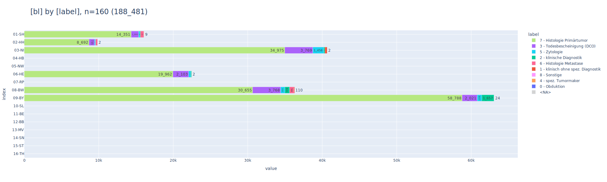
    


```python
_df = df_facets[
    [
        "z_kkr_label",
        "z_dy",
        "cnt",
    ]
]#.astype({"z_dy": str})

_ = pls.plot_stacked_bars(
    _df,
    # swap=True,
    orientation="h",
    # show_total=True,
    # normalize=True,
    # relative=True,
    height=1000,
    top_n_color=10,
    # sort_values_index=True,
    # sort_values_color=True,
    # top_n_index=5,
    # precision=2,
    # show_other=True,
    # top_n_index=2,
    # renderer="png",
)
_
```


    
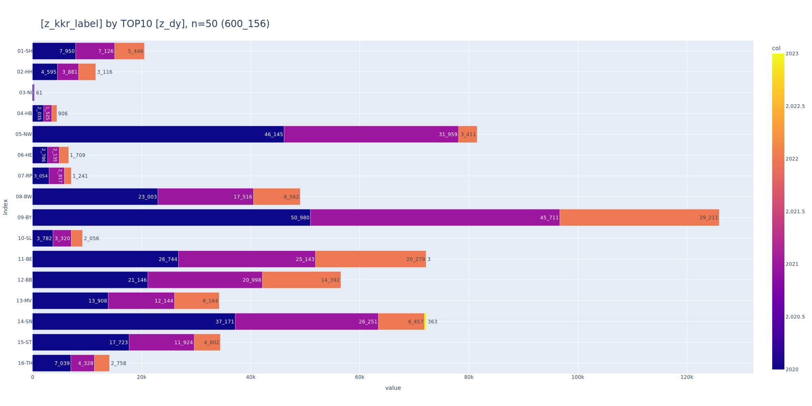
    


```python
_df = df_facets[
    [
        "z_kkr_label",
        "cnt",
    ]
]
_df

_ = pls.plot_bars(
    _df,
    height=600,
    width=1200,
    sort_values=True,
    # renderer="png",
)
```


    
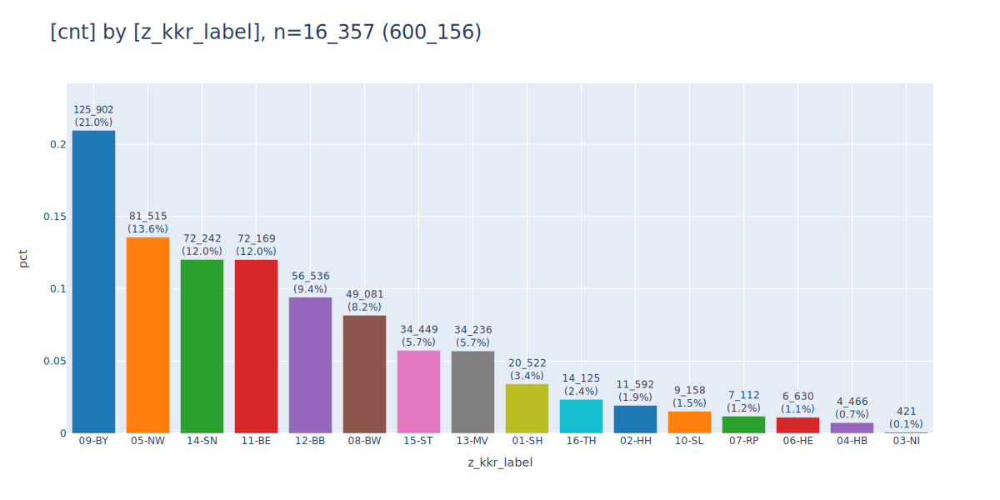
    


```python
_df = df[["color","payment","pickup_borough","total"]]
_df
# _=pls.plot_stacked_bars(_df[["color","payment","total"]],)
tbl.describe_df(_df, "taxis")
```

    🔵 *** df: taxis ***  
    🟣 shape: (6_433, 4)
    🟣 duplicates: 4_803  
    🟠 column stats all (dtype | uniques | missings) [values]  
    - index [0, 1, 2, 3, 4,]  
    - color (object | 2 | 0 (0%)) ['green', 'yellow',]  
    - payment (object | 3 | 44 (1%)) ['<NA>', 'cash', 'credit card',]  
    - pickup_borough (object | 5 | 26 (0%)) ['<NA>', 'Bronx', 'Brooklyn', 'Manhattan', 'Queens',]  
    - total (float64 | 898 | 0 (0%)) [1.3, 3.3, 3.31, 3.8, 4.3,]  
    🟠 column stats numeric  
    
    column | count |  min  | lower |  q25   | median |  mean  |  q75   | upper  |   max   |  std   |  cv   |     sum    
    -------+-------+-------+-------+--------+--------+--------+--------+--------+---------+--------+-------+------------
    total  | 6_433 | 1.300 | 1.300 | 10.800 | 14.160 | 18.518 | 20.300 | 34.550 | 174.820 | 13.816 | 0.746 | 119_124.970
    


<div>
<style scoped>
    .dataframe tbody tr th:only-of-type {
        vertical-align: middle;
    }
</style>
<table border="1" class="dataframe">
  <thead>
    <tr style="text-align: right;">
      <th></th>
      <th>color</th>
      <th>payment</th>
      <th>pickup_borough</th>
      <th>total</th>
    </tr>
  </thead>
  <tbody>
    <tr>
      <th>0</th>
      <td>yellow</td>
      <td>credit card</td>
      <td>Manhattan</td>
      <td>12.95</td>
    </tr>
    <tr>
      <th>1</th>
      <td>yellow</td>
      <td>cash</td>
      <td>Manhattan</td>
      <td>9.30</td>
    </tr>
    <tr>
      <th>2</th>
      <td>yellow</td>
      <td>credit card</td>
      <td>Manhattan</td>
      <td>14.16</td>
    </tr>
  </tbody>
</table>
</div>


    
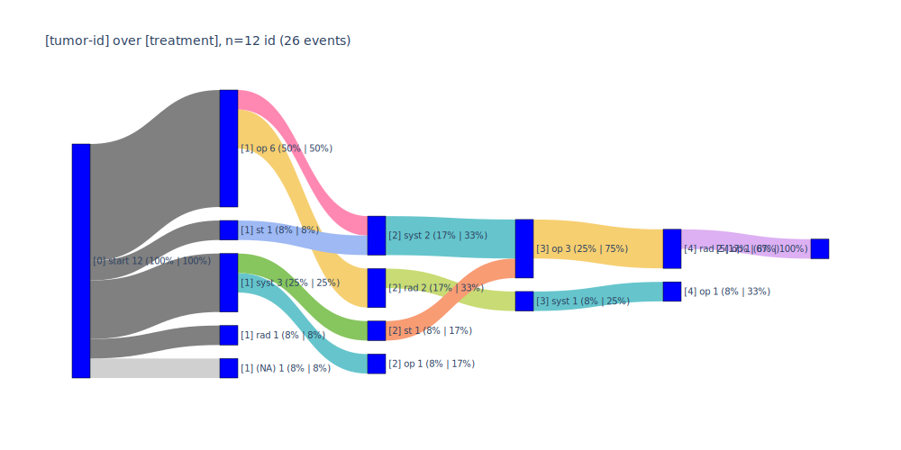
    


```python
db = con.from_df(df)
tbl.descr_db(db, caption="taxis",)
```

    🗄️ taxis	6_433, 16
    	("pickup, dropoff, passengers, distance, fare, tip, tolls, total, color, payment, pickup_zone, dropoff_zone, pickup_borough, dropoff_borough, lol, xd")
    ┌─────────────────────┬─────────────────────┬────────────┬──────────┬────────┬───┬────────────────┬─────────────────┬────────┬───────┐
    │       pickup        │       dropoff       │ passengers │ distance │  fare  │ … │ pickup_borough │ dropoff_borough │  lol   │  xd   │
    │    timestamp_ns     │    timestamp_ns     │   int64    │  double  │ double │   │    varchar     │     varchar     │ double │ int64 │
    ├─────────────────────┼─────────────────────┼────────────┼──────────┼────────┼───┼────────────────┼─────────────────┼────────┼───────┤
    │ 2019-03-23 20:21:09 │ 2019-03-23 20:27:24 │          1 │      1.6 │    7.0 │ … │ Manhattan      │ Manhattan       │   NULL │  2027 │
    │ 2019-03-04 16:11:55 │ 2019-03-04 16:19:00 │          1 │     0.79 │    5.0 │ … │ Manhattan      │ Manhattan       │   NULL │  2027 │
    │ 2019-03-27 17:53:01 │ 2019-03-27 18:00:25 │          1 │     1.37 │    7.5 │ … │ Manhattan      │ Manhattan       │   NULL │  2027 │
    ├─────────────────────┴─────────────────────┴────────────┴──────────┴────────┴───┴────────────────┴─────────────────┴────────┴───────┤
    │ 3 rows                                                                                                        16 columns (9 shown) │
    └────────────────────────────────────────────────────────────────────────────────────────────────────────────────────────────────────┘
    


## <a id='toc1_4_'></a>[show num](#toc0_)


```python
from pathlib import Path

_df=df.pivot_table(index="color", columns="payment", values="fare", aggfunc="sum", dropna=False)
tbl.show_num_df(
    _df,
    total_mode="sum",
    total_axis="y",
    data_bar_axis="",
    pct_axis="xy",
    precision=0,
    heatmap_axis="xy",
    # kpi_mode="max_min_x",
    total_exclude=True,
    # kpi_mode="min_max_xy",
    kpi_mode="rag_abs",
    kpi_rag_list=(100, 1000),
    # swap=True,
    font_size_td=12,
    font_size_th=14,
    # png_path=Path("test.png"),
)
```


<style type="text/css">
#T_0e6c2 th {
  text-align: right;
  font-size: 14pt;
}
#T_0e6c2 td {
  text-align: right;
  font-size: 12pt;
}
#T_0e6c2_row0_col0 {
  font-family: Courier;
  background-color: #e8f1fa;
  color: #000000;
}
#T_0e6c2_row0_col1 {
  font-family: Courier;
  background-color: #d3e3f3;
  color: #000000;
}
#T_0e6c2_row0_col2 {
  font-family: Courier;
  background-color: #f7fbff;
  color: #000000;
}
#T_0e6c2_row0_col3, #T_0e6c2_row1_col3 {
  font-family: Courier;
}
#T_0e6c2_row1_col0 {
  font-family: Courier;
  background-color: #afd1e7;
  color: #000000;
}
#T_0e6c2_row1_col1 {
  font-family: Courier;
  background-color: #08306b;
  color: #f1f1f1;
}
#T_0e6c2_row1_col2 {
  font-family: Courier;
  background-color: #f5fafe;
  color: #000000;
}
</style>
<table id="T_0e6c2">
  <thead>
    <tr>
      <th class="index_name level0" >payment</th>
      <th id="T_0e6c2_level0_col0" class="col_heading level0 col0" >cash</th>
      <th id="T_0e6c2_level0_col1" class="col_heading level0 col1" >credit card</th>
      <th id="T_0e6c2_level0_col2" class="col_heading level0 col2" >nan</th>
      <th id="T_0e6c2_level0_col3" class="col_heading level0 col3" >Total</th>
    </tr>
    <tr>
      <th class="index_name level0" >color</th>
      <th class="blank col0" >&nbsp;</th>
      <th class="blank col1" >&nbsp;</th>
      <th class="blank col2" >&nbsp;</th>
      <th class="blank col3" >&nbsp;</th>
    </tr>
  </thead>
  <tbody>
    <tr>
      <th id="T_0e6c2_level0_row0" class="row_heading level0 row0" >green</th>
      <td id="T_0e6c2_row0_col0" class="data row0 col0" >3_995 <span style="color: grey">(4.7%) 🟥</span></td>
      <td id="T_0e6c2_row0_col1" class="data row0 col1" >9_774 <span style="color: grey">(11.6%) 🟥</span></td>
      <td id="T_0e6c2_row0_col2" class="data row0 col2" >20 <span style="color: grey">(0.0%) 🟩</span></td>
      <td id="T_0e6c2_row0_col3" class="data row0 col3" >13_788 <span style="color: grey">(16.4%) 🟥</span></td>
    </tr>
    <tr>
      <th id="T_0e6c2_level0_row1" class="row_heading level0 row1" >yellow</th>
      <td id="T_0e6c2_row1_col0" class="data row1 col0" >17_012 <span style="color: grey">(20.2%) 🟥</span></td>
      <td id="T_0e6c2_row1_col1" class="data row1 col1" >52_907 <span style="color: grey">(62.8%) 🟥</span></td>
      <td id="T_0e6c2_row1_col2" class="data row1 col2" >508 <span style="color: grey">(0.6%) 🟨</span></td>
      <td id="T_0e6c2_row1_col3" class="data row1 col3" >70_427 <span style="color: grey">(83.6%) 🟥</span></td>
    </tr>
  </tbody>
</table>


```python
_df=df[["color", "payment", "fare"]]
tbl.pivot_df(
    _df,
    total_mode="sum",
    data_bar_axis="xy",
    pct_axis="xy",
    precision=0,
    heatmap_axis="",
    kpi_mode="max_min_x"
    # kpi_mode="min_max_xy",
    # kpi_mode="rag_abs",
    # kpi_rag_list=(100, 1000),
)
```


<style type="text/css">
#T_121b0 th {
  text-align: right;
}
#T_121b0 td {
  text-align: right;
}
#T_121b0_row0_col0 {
  width: 10em;
  background: linear-gradient(90deg, lightblue 0.0%, transparent 0.0%);
  font-family: Courier;
}
#T_121b0_row0_col1 {
  width: 10em;
  background: linear-gradient(90deg, lightblue 4.7%, transparent 4.7%);
  font-family: Courier;
}
#T_121b0_row0_col2 {
  width: 10em;
  background: linear-gradient(90deg, lightblue 11.6%, transparent 11.6%);
  font-family: Courier;
}
#T_121b0_row0_col3 {
  width: 10em;
  background: linear-gradient(90deg, lightblue 16.4%, transparent 16.4%);
  font-family: Courier;
}
#T_121b0_row1_col0, #T_121b0_row2_col0 {
  width: 10em;
  background: linear-gradient(90deg, lightblue 0.6%, transparent 0.6%);
  font-family: Courier;
}
#T_121b0_row1_col1 {
  width: 10em;
  background: linear-gradient(90deg, lightblue 20.2%, transparent 20.2%);
  font-family: Courier;
}
#T_121b0_row1_col2 {
  width: 10em;
  background: linear-gradient(90deg, lightblue 62.8%, transparent 62.8%);
  font-family: Courier;
}
#T_121b0_row1_col3 {
  width: 10em;
  background: linear-gradient(90deg, lightblue 83.6%, transparent 83.6%);
  font-family: Courier;
}
#T_121b0_row2_col1 {
  width: 10em;
  background: linear-gradient(90deg, lightblue 24.9%, transparent 24.9%);
  font-family: Courier;
}
#T_121b0_row2_col2 {
  width: 10em;
  background: linear-gradient(90deg, lightblue 74.4%, transparent 74.4%);
  font-family: Courier;
}
#T_121b0_row2_col3 {
  width: 10em;
  background: linear-gradient(90deg, lightblue 100.0%, transparent 100.0%);
  font-family: Courier;
}
</style>
<table id="T_121b0">
  <thead>
    <tr>
      <th class="index_name level0" >payment</th>
      <th id="T_121b0_level0_col0" class="col_heading level0 col0" >nan</th>
      <th id="T_121b0_level0_col1" class="col_heading level0 col1" >cash</th>
      <th id="T_121b0_level0_col2" class="col_heading level0 col2" >credit card</th>
      <th id="T_121b0_level0_col3" class="col_heading level0 col3" >Total</th>
    </tr>
    <tr>
      <th class="index_name level0" >color</th>
      <th class="blank col0" >&nbsp;</th>
      <th class="blank col1" >&nbsp;</th>
      <th class="blank col2" >&nbsp;</th>
      <th class="blank col3" >&nbsp;</th>
    </tr>
  </thead>
  <tbody>
    <tr>
      <th id="T_121b0_level0_row0" class="row_heading level0 row0" >green</th>
      <td id="T_121b0_row0_col0" class="data row0 col0" >20 <span style="color: grey">(0.0%) 🟥</span></td>
      <td id="T_121b0_row0_col1" class="data row0 col1" >3_995 <span style="color: grey">(4.7%) 🟥</span></td>
      <td id="T_121b0_row0_col2" class="data row0 col2" >9_774 <span style="color: grey">(11.6%) 🟥</span></td>
      <td id="T_121b0_row0_col3" class="data row0 col3" >13_788 <span style="color: grey">(16.4%) 🟥</span></td>
    </tr>
    <tr>
      <th id="T_121b0_level0_row1" class="row_heading level0 row1" >yellow</th>
      <td id="T_121b0_row1_col0" class="data row1 col0" >508 <span style="color: grey">(0.6%) 🟩</span></td>
      <td id="T_121b0_row1_col1" class="data row1 col1" >17_012 <span style="color: grey">(20.2%) 🟩</span></td>
      <td id="T_121b0_row1_col2" class="data row1 col2" >52_907 <span style="color: grey">(62.8%) 🟩</span></td>
      <td id="T_121b0_row1_col3" class="data row1 col3" >70_427 <span style="color: grey">(83.6%) 🟩</span></td>
    </tr>
    <tr>
      <th id="T_121b0_level0_row2" class="row_heading level0 row2" >Total</th>
      <td id="T_121b0_row2_col0" class="data row2 col0" >528 <span style="color: grey">(0.6%) ⬜</span></td>
      <td id="T_121b0_row2_col1" class="data row2 col1" >21_006 <span style="color: grey">(24.9%) ⬜</span></td>
      <td id="T_121b0_row2_col2" class="data row2 col2" >62_681 <span style="color: grey">(74.4%) ⬜</span></td>
      <td id="T_121b0_row2_col3" class="data row2 col3" >84_215 <span style="color: grey">(100.0%) ⬜</span></td>
    </tr>
  </tbody>
</table>


```python
_df = df[["distance", "fare", "tip", "tolls"]][:5]
tbl.show_num_df(
    _df,
    data_bar_axis="x",
    pct_axis="xy",
    precision=3,
    total_mode="sum",
)
# _df['distance'].mean()
```


<style type="text/css">
#T_01774 th {
  text-align: right;
}
#T_01774 td {
  text-align: right;
}
#T_01774_row0_col0 {
  width: 10em;
  background: linear-gradient(90deg, lightblue 11.7%, transparent 11.7%);
  font-family: Courier;
}
#T_01774_row0_col1 {
  width: 10em;
  background: linear-gradient(90deg, lightblue 12.6%, transparent 12.6%);
  font-family: Courier;
}
#T_01774_row0_col2 {
  width: 10em;
  background: linear-gradient(90deg, lightblue 18.3%, transparent 18.3%);
  font-family: Courier;
}
#T_01774_row0_col3, #T_01774_row1_col2, #T_01774_row1_col3, #T_01774_row2_col3, #T_01774_row3_col3, #T_01774_row4_col3, #T_01774_row5_col3 {
  width: 10em;
  font-family: Courier;
}
#T_01774_row0_col4 {
  width: 10em;
  background: linear-gradient(90deg, lightblue 13.3%, transparent 13.3%);
  font-family: Courier;
}
#T_01774_row1_col0 {
  width: 10em;
  background: linear-gradient(90deg, lightblue 5.8%, transparent 5.8%);
  font-family: Courier;
}
#T_01774_row1_col1 {
  width: 10em;
  background: linear-gradient(90deg, lightblue 9.0%, transparent 9.0%);
  font-family: Courier;
}
#T_01774_row1_col4 {
  width: 10em;
  background: linear-gradient(90deg, lightblue 7.2%, transparent 7.2%);
  font-family: Courier;
}
#T_01774_row2_col0 {
  width: 10em;
  background: linear-gradient(90deg, lightblue 10.1%, transparent 10.1%);
  font-family: Courier;
}
#T_01774_row2_col1 {
  width: 10em;
  background: linear-gradient(90deg, lightblue 13.5%, transparent 13.5%);
  font-family: Courier;
}
#T_01774_row2_col2 {
  width: 10em;
  background: linear-gradient(90deg, lightblue 20.1%, transparent 20.1%);
  font-family: Courier;
}
#T_01774_row2_col4 {
  width: 10em;
  background: linear-gradient(90deg, lightblue 13.9%, transparent 13.9%);
  font-family: Courier;
}
#T_01774_row3_col0 {
  width: 10em;
  background: linear-gradient(90deg, lightblue 56.5%, transparent 56.5%);
  font-family: Courier;
}
#T_01774_row3_col1 {
  width: 10em;
  background: linear-gradient(90deg, lightblue 48.6%, transparent 48.6%);
  font-family: Courier;
}
#T_01774_row3_col2 {
  width: 10em;
  background: linear-gradient(90deg, lightblue 52.3%, transparent 52.3%);
  font-family: Courier;
}
#T_01774_row3_col4 {
  width: 10em;
  background: linear-gradient(90deg, lightblue 50.5%, transparent 50.5%);
  font-family: Courier;
}
#T_01774_row4_col0 {
  width: 10em;
  background: linear-gradient(90deg, lightblue 15.9%, transparent 15.9%);
  font-family: Courier;
}
#T_01774_row4_col1 {
  width: 10em;
  background: linear-gradient(90deg, lightblue 16.2%, transparent 16.2%);
  font-family: Courier;
}
#T_01774_row4_col2 {
  width: 10em;
  background: linear-gradient(90deg, lightblue 9.4%, transparent 9.4%);
  font-family: Courier;
}
#T_01774_row4_col4 {
  width: 10em;
  background: linear-gradient(90deg, lightblue 15.2%, transparent 15.2%);
  font-family: Courier;
}
#T_01774_row5_col0, #T_01774_row5_col1, #T_01774_row5_col2, #T_01774_row5_col4 {
  width: 10em;
  background: linear-gradient(90deg, lightblue 100.0%, transparent 100.0%);
  font-family: Courier;
}
</style>
<table id="T_01774">
  <thead>
    <tr>
      <th class="blank level0" >&nbsp;</th>
      <th id="T_01774_level0_col0" class="col_heading level0 col0" >distance</th>
      <th id="T_01774_level0_col1" class="col_heading level0 col1" >fare</th>
      <th id="T_01774_level0_col2" class="col_heading level0 col2" >tip</th>
      <th id="T_01774_level0_col3" class="col_heading level0 col3" >tolls</th>
      <th id="T_01774_level0_col4" class="col_heading level0 col4" >Total</th>
    </tr>
  </thead>
  <tbody>
    <tr>
      <th id="T_01774_level0_row0" class="row_heading level0 row0" >0</th>
      <td id="T_01774_row0_col0" class="data row0 col0" >1.600 <span style="color: grey">(2.0%) </span></td>
      <td id="T_01774_row0_col1" class="data row0 col1" >7.000 <span style="color: grey">(8.7%) </span></td>
      <td id="T_01774_row0_col2" class="data row0 col2" >2.150 <span style="color: grey">(2.7%) </span></td>
      <td id="T_01774_row0_col3" class="data row0 col3" ><span style="color: grey">0 </span></td>
      <td id="T_01774_row0_col4" class="data row0 col4" >10.750 <span style="color: grey">(13.3%) </span></td>
    </tr>
    <tr>
      <th id="T_01774_level0_row1" class="row_heading level0 row1" >1</th>
      <td id="T_01774_row1_col0" class="data row1 col0" >0.790 <span style="color: grey">(1.0%) </span></td>
      <td id="T_01774_row1_col1" class="data row1 col1" >5.000 <span style="color: grey">(6.2%) </span></td>
      <td id="T_01774_row1_col2" class="data row1 col2" ><span style="color: grey">0 </span></td>
      <td id="T_01774_row1_col3" class="data row1 col3" ><span style="color: grey">0 </span></td>
      <td id="T_01774_row1_col4" class="data row1 col4" >5.790 <span style="color: grey">(7.2%) </span></td>
    </tr>
    <tr>
      <th id="T_01774_level0_row2" class="row_heading level0 row2" >2</th>
      <td id="T_01774_row2_col0" class="data row2 col0" >1.370 <span style="color: grey">(1.7%) </span></td>
      <td id="T_01774_row2_col1" class="data row2 col1" >7.500 <span style="color: grey">(9.3%) </span></td>
      <td id="T_01774_row2_col2" class="data row2 col2" >2.360 <span style="color: grey">(2.9%) </span></td>
      <td id="T_01774_row2_col3" class="data row2 col3" ><span style="color: grey">0 </span></td>
      <td id="T_01774_row2_col4" class="data row2 col4" >11.230 <span style="color: grey">(13.9%) </span></td>
    </tr>
    <tr>
      <th id="T_01774_level0_row3" class="row_heading level0 row3" >3</th>
      <td id="T_01774_row3_col0" class="data row3 col0" >7.700 <span style="color: grey">(9.5%) </span></td>
      <td id="T_01774_row3_col1" class="data row3 col1" >27.000 <span style="color: grey">(33.4%) </span></td>
      <td id="T_01774_row3_col2" class="data row3 col2" >6.150 <span style="color: grey">(7.6%) </span></td>
      <td id="T_01774_row3_col3" class="data row3 col3" ><span style="color: grey">0 </span></td>
      <td id="T_01774_row3_col4" class="data row3 col4" >40.850 <span style="color: grey">(50.5%) </span></td>
    </tr>
    <tr>
      <th id="T_01774_level0_row4" class="row_heading level0 row4" >4</th>
      <td id="T_01774_row4_col0" class="data row4 col0" >2.160 <span style="color: grey">(2.7%) </span></td>
      <td id="T_01774_row4_col1" class="data row4 col1" >9.000 <span style="color: grey">(11.1%) </span></td>
      <td id="T_01774_row4_col2" class="data row4 col2" >1.100 <span style="color: grey">(1.4%) </span></td>
      <td id="T_01774_row4_col3" class="data row4 col3" ><span style="color: grey">0 </span></td>
      <td id="T_01774_row4_col4" class="data row4 col4" >12.260 <span style="color: grey">(15.2%) </span></td>
    </tr>
    <tr>
      <th id="T_01774_level0_row5" class="row_heading level0 row5" >Total</th>
      <td id="T_01774_row5_col0" class="data row5 col0" >13.620 <span style="color: grey">(16.8%) </span></td>
      <td id="T_01774_row5_col1" class="data row5 col1" >55.500 <span style="color: grey">(68.6%) </span></td>
      <td id="T_01774_row5_col2" class="data row5 col2" >11.760 <span style="color: grey">(14.5%) </span></td>
      <td id="T_01774_row5_col3" class="data row5 col3" ><span style="color: grey">0 </span></td>
      <td id="T_01774_row5_col4" class="data row5 col4" >80.880 <span style="color: grey">(100.0%) </span></td>
    </tr>
  </tbody>
</table>


## <a id='toc1_5_'></a>[venn](#toc0_)


```python
set_a = {'ford','ferrari','mercedes', 'bmw'}
set_b = {'opel','bmw','bentley','audi'}
_df, _details = ven.show_venn2(
    title="taxis",
    a_set=set_a,
    a_label="cars1",
    b_set=set_b,
    b_label="cars2",
    verbose=0,
    size=8,
)
```

    ab --> cars1 | cars2 --> len: 7


    
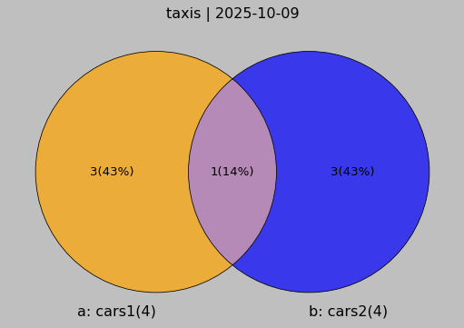
    


```python
set_a = {'ford','ferrari','mercedes', 'bmw'}
set_b = {'opel','bmw','bentley','audi'}
set_c = {'ferrari','bmw','chrysler','renault','peugeot','fiat'}
_df, _details = ven.show_venn3(
    title="taxis",
    a_set=set_a,
    a_label="cars1",
    b_set=set_b,
    b_label="cars2",
    c_set=set_c,
    c_label="cars3",
    verbose=0,
    size=8,
)
```

    abc --> cars1 | cars2 | cars3 --> len: 11
    ab --> cars1 | cars2 --> len: 7
    ac --> cars1 | cars3 --> len: 8
    bc --> cars2 | cars3 --> len: 9


    

    


## <a id='toc1_6_'></a>[hlp](#toc0_)


```python
db_ops_kkr = con.sql("""--sql
    select
            z_kkr_label,
            ops.Code as ops_code,
            count(distinct OPSId) as cnt_ops,
            dim_ops.name as ops_name,
    from Tumor tum
    left join OP op on tum.z_tum_id = op.z_tum_id
    left join OPS ops on op.OPId = ops.OP_TypId
    left join dim_ops on dim_ops.code = ops.Code
    group by ops_code, z_kkr_label, ops_name
    """)
# tbl.descr_db(db_ops_kkr, "ops_kk")

# print(db_ops_kkr.aggregate("ops_code || ' - ' || ops_name as ops, sum(cnt_ops)::int as cnt_ops").order("cnt_ops desc").limit(10).to_df())
db_ops_kkr.aggregate("ops_code || ' - ' || ops_name as ops, sum(cnt_ops)::int as cnt_ops").order("cnt_ops desc").limit(10).show(max_width=120)
db_ops_kkr.aggregate("left(ops_code || ' - ' || ops_name,100) as ops, sum(cnt_ops)::int as cnt_ops").order("cnt_ops desc").limit(10).show()
```

    ┌────────────────────────────────────────────────────────────────────────────────────────────────────────────┬─────────┐
    │                                                    ops                                                     │ cnt_ops │
    │                                                  varchar                                                   │  int32  │
    ├────────────────────────────────────────────────────────────────────────────────────────────────────────────┼─────────┤
    │ NULL                                                                                                       │  165429 │
    │ 5-401.11 - Exzision einzelner Lymphknoten und Lymphgefäße: Axillär: Mit Radionuklidmarkierung (Sentinel-…  │  135826 │
    │ 5-573.40 - Transurethrale Inzision, Exzision, Destruktion und Resektion von (erkranktem) Gewebe der Harn…  │   94266 │
    │ 5-987.0 - Anwendung eines OP-Roboters: Komplexer OP-Roboter                                                │   82761 │
    │ 5-870.a1 - Partielle (brusterhaltende) Exzision der Mamma und Destruktion von Mammagewebe: Partielle Res…  │   65040 │
    │ 5-870.a2 - Partielle (brusterhaltende) Exzision der Mamma und Destruktion von Mammagewebe: Partielle Res…  │   52410 │
    │ 5-984 - Mikrochirurgische Technik                                                                          │   47640 │
    │ 5-604.52 - Radikale Prostatovesikulektomie: Laparoskopisch, gefäß- und nervenerhaltend: Mit regionaler L…  │   39369 │
    │ 5-895.14 - Radikale und ausgedehnte Exzision von erkranktem Gewebe an Haut und Unterhaut: Ohne primären …  │   35085 │
    │ 5-573.41 - Transurethrale Inzision, Exzision, Destruktion und Resektion von (erkranktem) Gewebe der Harn…  │   34869 │
    ├────────────────────────────────────────────────────────────────────────────────────────────────────────────┴─────────┤
    │ 10 rows                                                                                                    2 columns │
    └──────────────────────────────────────────────────────────────────────────────────────────────────────────────────────┘
    


    ┌──────────────────────────────────────────────────────────────────────────────────────────────────────┬─────────┐
    │                                                 ops                                                  │ cnt_ops │
    │                                               varchar                                                │  int32  │
    ├──────────────────────────────────────────────────────────────────────────────────────────────────────┼─────────┤
    │ NULL                                                                                                 │  165429 │
    │ 5-401.11 - Exzision einzelner Lymphknoten und Lymphgefäße: Axillär: Mit Radionuklidmarkierung (Senti │  135826 │
    │ 5-573.40 - Transurethrale Inzision, Exzision, Destruktion und Resektion von (erkranktem) Gewebe der  │   94266 │
    │ 5-987.0 - Anwendung eines OP-Roboters: Komplexer OP-Roboter                                          │   82761 │
    │ 5-870.a1 - Partielle (brusterhaltende) Exzision der Mamma und Destruktion von Mammagewebe: Partielle │   65040 │
    │ 5-870.a2 - Partielle (brusterhaltende) Exzision der Mamma und Destruktion von Mammagewebe: Partielle │   52410 │
    │ 5-984 - Mikrochirurgische Technik                                                                    │   47640 │
    │ 5-604.52 - Radikale Prostatovesikulektomie: Laparoskopisch, gefäß- und nervenerhaltend: Mit regional │   39369 │
    │ 5-895.14 - Radikale und ausgedehnte Exzision von erkranktem Gewebe an Haut und Unterhaut: Ohne primä │   35085 │
    │ 5-573.41 - Transurethrale Inzision, Exzision, Destruktion und Resektion von (erkranktem) Gewebe der  │   34869 │
    ├──────────────────────────────────────────────────────────────────────────────────────────────────────┴─────────┤
    │ 10 rows                                                                                              2 columns │
    └────────────────────────────────────────────────────────────────────────────────────────────────────────────────┘
    


```python
df.pickup.to_series()
```


    0      2019-03-23 20:21:09
    1      2019-03-04 16:11:55
    2      2019-03-27 17:53:01
    3      2019-03-10 01:23:59
    4      2019-03-30 13:27:42
                   ...        
    6428   2019-03-31 09:51:53
    6429   2019-03-31 17:38:00
    6430   2019-03-23 22:55:18
    6431   2019-03-04 10:09:25
    6432   2019-03-13 19:31:22
    Name: pickup, Length: 6433, dtype: datetime64[ns]


```python
hlp.get_tum_details("df6bc655-e0ca-47f1-900c-ff2c749b3c7d", con)
```


<br>


    pat
    ┌──────────────────────┬─────────┬────────┬─────────┬───┬──────────────┬──────────────────────┬──────────────────┬──────────────────────┐
    │       z_pat_id       │  z_sex  │ z_age  │ z_ag05  │ … │ Geburtsdatum │ Geburtsdatum_Genau…  │ DatumVitalStatus │ DatumVitalStatus_G…  │
    │       varchar        │ varchar │ double │ varchar │   │     date     │       varchar        │       date       │       varchar        │
    ├──────────────────────┼─────────┼────────┼─────────┼───┼──────────────┼──────────────────────┼──────────────────┼──────────────────────┤
    │ 450b0462-3c82-411a…  │ W       │  83.25 │ a80b84  │ … │ 1939-12-15   │ T                    │ 2023-06-15       │ T                    │
    ├──────────────────────┴─────────┴────────┴─────────┴───┴──────────────┴──────────────────────┴──────────────────┴──────────────────────┤
    │ 1 rows                                                                                                            9 columns (8 shown) │
    └───────────────────────────────────────────────────────────────────────────────────────────────────────────────────────────────────────┘
    
    tod
    ┌────────────────┬─────────┬─────────┬───────────────┐
    │ TodesursacheId │  Code   │ Version │ IsGrundleiden │
    │    varchar     │ varchar │ varchar │    boolean    │
    ├────────────────┴─────────┴─────────┴───────────────┤
    │                       0 rows                       │
    └────────────────────────────────────────────────────┘
    
    tum1
    ┌─────────────┬─────────┬───────────────┬──────────────────────┬───┬────────────────┬────────────────┬───────────────────┬──────────────────────┐
    │ z_kkr_label │ z_icd10 │ Diagnosedatum │ Diagnosedatum_Gena…  │ … │ z_tum_sy_count │ z_tum_fo_count │ z_first_treatment │ z_first_treatment_…  │
    │   varchar   │ varchar │     date      │       varchar        │   │     int16      │     int16      │      varchar      │        int32         │
    ├─────────────┼─────────┼───────────────┼──────────────────────┼───┼────────────────┼────────────────┼───────────────────┼──────────────────────┤
    │ 15-ST       │ C44.2   │ 2023-03-15    │ T                    │ … │              0 │              5 │ op                │                    0 │
    ├─────────────┴─────────┴───────────────┴──────────────────────┴───┴────────────────┴────────────────┴───────────────────┴──────────────────────┤
    │ 1 rows                                                                                                                   10 columns (8 shown) │
    └───────────────────────────────────────────────────────────────────────────────────────────────────────────────────────────────────────────────┘
    
    tum2
    ┌────────────────┬──────────┬──────────────────────┬───┬──────────────────────┬──────────────────────┬─────────────┬─────────────┐
    │ z_event_order  │ z_events │ Anzahl_Tage_Diagno…  │ … │ z_period_diag_psa_…  │  z_last_tum_status   │ z_class_hpv │ z_tum_order │
    │    varchar     │ varchar  │        int32         │   │        int64         │       varchar        │   varchar   │    int8     │
    ├────────────────┼──────────┼──────────────────────┼───┼──────────────────────┼──────────────────────┼─────────────┼─────────────┤
    │ fo-op-fo-op-fo │ op|fo    │                 NULL │ … │                 NULL │ V - Vollremission …  │ NULL        │           4 │
    ├────────────────┴──────────┴──────────────────────┴───┴──────────────────────┴──────────────────────┴─────────────┴─────────────┤
    │ 1 rows                                                                                                     9 columns (7 shown) │
    └────────────────────────────────────────────────────────────────────────────────────────────────────────────────────────────────┘
    
    op
    ┌──────────────────────┬───────────┬──────────────────────┬──────────────────────┬───┬──────────────────────┬──────────────────────┬────────────┐
    │         OPId         │ Intention │ Lokale_Beurteilung…  │ Anzahl_Tage_Diagno…  │ … │ Datum_OP_Genauigkeit │ z_period_diag_op_day │ z_op_order │
    │       varchar        │  varchar  │       varchar        │        int32         │   │       varchar        │        int32         │   int64    │
    ├──────────────────────┼───────────┼──────────────────────┼──────────────────────┼───┼──────────────────────┼──────────────────────┼────────────┤
    │ b9336bec-c334-412d…  │ K         │ R1                   │                    0 │ … │ T                    │                    0 │          1 │
    │ 17ed629d-0f14-4dbe…  │ K         │ R1                   │                    1 │ … │ T                    │                    1 │          2 │
    │ da08a401-df47-4ae5…  │ K         │ R1                   │                   29 │ … │ T                    │                   29 │          3 │
    │ a6b2e505-5d59-460c…  │ K         │ R1                   │                   50 │ … │ T                    │                   50 │          4 │
    │ ab1e8069-adf8-46aa…  │ K         │ R0                   │                   78 │ … │ T                    │                   78 │          5 │
    ├──────────────────────┴───────────┴──────────────────────┴──────────────────────┴───┴──────────────────────┴──────────────────────┴────────────┤
    │ 5 rows                                                                                                                    8 columns (7 shown) │
    └───────────────────────────────────────────────────────────────────────────────────────────────────────────────────────────────────────────────┘
    
    ops


    ┌──────────────────────────────────────┬──────────┬─────────┬──────────────────────────────────────┐
    │                OPSId                 │   Code   │ Version │               OP_TypId               │
    │               varchar                │ varchar  │ varchar │               varchar                │
    ├──────────────────────────────────────┼──────────┼─────────┼──────────────────────────────────────┤
    │ 1081731c-9595-41ac-9f31-90c1117fe47c │ 5-181.1  │ 2023    │ da08a401-df47-4ae5-bfbc-67790d50bdfc │
    │ 48e2ac46-268f-4cd3-9773-372f176a5afd │ 5-182.1  │ 2023    │ a6b2e505-5d59-460c-a271-eafa9e392f18 │
    │ 6910a319-976a-4749-af8a-85f12864c473 │ 5-925.24 │ 2023    │ ab1e8069-adf8-46aa-adcc-a4ffb8c00b75 │
    │ cb135ccc-7c90-4658-8a28-48d0e2bd830d │ 5-181.1  │ 2023    │ b9336bec-c334-412d-93b5-79b8b23fba90 │
    │ 52be54a2-a0a2-4ba9-a907-1d59506d9f5e │ 5-182.0  │ 2023    │ ab1e8069-adf8-46aa-adcc-a4ffb8c00b75 │
    │ 741c8ace-2bdd-4c40-a5b5-e3fac0a8c60b │ 5-181.4  │ 2023    │ 17ed629d-0f14-4dbe-9d88-610ab6b2a291 │
    │ 93f1b8fe-df4f-4ab6-be4d-b0e217776797 │ 5-903.54 │ 2023    │ 17ed629d-0f14-4dbe-9d88-610ab6b2a291 │
    │ f58dd5f5-fd6c-481a-9fd7-069e6b0a99b2 │ 5-916.74 │ 2023    │ b9336bec-c334-412d-93b5-79b8b23fba90 │
    └──────────────────────────────────────┴──────────┴─────────┴──────────────────────────────────────┘
    
    st
    ┌─────────┬───────────┬─────────────┐
    │  STId   │ Intention │ Stellung_OP │
    │ varchar │  varchar  │   varchar   │
    ├─────────┴───────────┴─────────────┤
    │              0 rows               │
    └───────────────────────────────────┘
    
    be
    ┌───────────────┬──────────────────────┬──────────────────────┬──────────────────────┬───┬─────────┬──────────────────────┬───────────────┐
    │ BestrahlungId │ Anzahl_Tage_Diagno…  │ Anzahl_Tage_ST_Dauer │ Datum_Beginn_Bestr…  │ … │  STId   │ z_period_diag_best…  │ z_bestr_order │
    │    varchar    │        int32         │        int32         │         date         │   │ varchar │        int32         │     int64     │
    ├───────────────┴──────────────────────┴──────────────────────┴──────────────────────┴───┴─────────┴──────────────────────┴───────────────┤
    │                                                                 0 rows                                                                  │
    └─────────────────────────────────────────────────────────────────────────────────────────────────────────────────────────────────────────┘
    
    app
    ┌───────────────┬──────────────────────┬──────────────────┬───┬────────────────┬────────────────┬─────────────────┬─────────────────┐
    │ BestrahlungId │ TypeOfST_TypBestra…  │ Seite_Zielgebiet │ … │ Stereotaktisch │ Atemgetriggert │ CodeVersion2014 │ CodeVersion2021 │
    │    varchar    │       varchar        │     varchar      │   │    varchar     │    varchar     │     varchar     │     varchar     │
    ├───────────────┴──────────────────────┴──────────────────┴───┴────────────────┴────────────────┴─────────────────┴─────────────────┤
    │                                                              0 rows                                                               │
    └───────────────────────────────────────────────────────────────────────────────────────────────────────────────────────────────────┘
    
    syst
    ┌─────────┬───────────┬─────────────┬─────────────┬───┬───────────────────┬──────────────────────┬──────────────────────┬──────────────┐
    │ SYSTId  │ Intention │ Stellung_OP │ Therapieart │ … │ Datum_Beginn_SYST │ Datum_Beginn_SYST_…  │ z_period_diag_syst…  │ z_syst_order │
    │ varchar │  varchar  │   varchar   │   varchar   │   │       date        │       varchar        │        int32         │    int64     │
    ├─────────┴───────────┴─────────────┴─────────────┴───┴───────────────────┴──────────────────────┴──────────────────────┴──────────────┤
    │                                                                0 rows                                                                │
    └──────────────────────────────────────────────────────────────────────────────────────────────────────────────────────────────────────┘
    
    fo
    ┌──────────────────────┬──────────────────────┬──────────────────────┬───┬──────────────────────┬────────────┬──────────────────────┐
    │   FolgeereignisId    │ Gesamtbeurteilung_…  │ Verlauf_Lokaler_Tu…  │ … │ Datum_Folgeereigni…  │ z_fo_order │ z_period_diag_fo_day │
    │       varchar        │       varchar        │       varchar        │   │       varchar        │   int64    │        int32         │
    ├──────────────────────┼──────────────────────┼──────────────────────┼───┼──────────────────────┼────────────┼──────────────────────┤
    │ 1e58d32d-06a5-4a06…  │ T                    │ T                    │ … │ T                    │          1 │                    0 │
    │ fbd74efe-266c-430c…  │ T                    │ T                    │ … │ T                    │          2 │                    0 │
    │ 13a7ccd4-9133-409d…  │ T                    │ T                    │ … │ T                    │          3 │                   31 │
    │ 04ed157d-787b-419a…  │ X                    │ NULL                 │ … │ T                    │          4 │                   31 │
    │ 927c89f6-d53e-4783…  │ V                    │ K                    │ … │ T                    │          5 │                   92 │
    ├──────────────────────┴──────────────────────┴──────────────────────┴───┴──────────────────────┴────────────┴──────────────────────┤
    │ 5 rows                                                                                                        9 columns (6 shown) │
    └───────────────────────────────────────────────────────────────────────────────────────────────────────────────────────────────────┘
    
    fo_tnm


    ┌──────────────────────┬──────────────────────┬─────────┬──────────┬──────────┬───┬─────────┬─────────┬─────────┬─────────┬──────────────┐
    │        TNMId         │   FolgeereignisId    │ Version │ y_Symbol │ r_Symbol │ … │    L    │    V    │   Pn    │    S    │ UICC_Stadium │
    │       varchar        │       varchar        │ varchar │ varchar  │ varchar  │   │ varchar │ varchar │ varchar │ varchar │   varchar    │
    ├──────────────────────┼──────────────────────┼─────────┼──────────┼──────────┼───┼─────────┼─────────┼─────────┼─────────┼──────────────┤
    │ fbd74efe-266c-430c…  │ fbd74efe-266c-430c…  │ NULL    │ NULL     │ NULL     │ … │ NULL    │ NULL    │ NULL    │ NULL    │ NULL         │
    │ 927c89f6-d53e-4783…  │ 927c89f6-d53e-4783…  │ NULL    │ NULL     │ NULL     │ … │ NULL    │ NULL    │ NULL    │ NULL    │ NULL         │
    │ 13a7ccd4-9133-409d…  │ 13a7ccd4-9133-409d…  │ NULL    │ NULL     │ NULL     │ … │ NULL    │ NULL    │ NULL    │ NULL    │ NULL         │
    │ 04ed157d-787b-419a…  │ 04ed157d-787b-419a…  │ Item8   │ NULL     │ r        │ … │ L0      │ V0      │ Pn0     │ NULL    │ NULL         │
    │ 1e58d32d-06a5-4a06…  │ 1e58d32d-06a5-4a06…  │ NULL    │ NULL     │ NULL     │ … │ NULL    │ NULL    │ NULL    │ NULL    │ NULL         │
    ├──────────────────────┴──────────────────────┴─────────┴──────────┴──────────┴───┴─────────┴─────────┴─────────┴─────────┴──────────────┤
    │ 5 rows                                                                                                           18 columns (10 shown) │
    └────────────────────────────────────────────────────────────────────────────────────────────────────────────────────────────────────────┘
    
    fo_fm
    ┌─────────────────┬─────────────────┬──────────────┐
    │ FolgeereignisId │ FernmetastaseId │ Lokalisation │
    │     varchar     │     varchar     │   varchar    │
    ├─────────────────┴─────────────────┴──────────────┤
    │                      0 rows                      │
    └──────────────────────────────────────────────────┘
    
    fo_weitere
    ┌─────────────────────────┬─────────┬─────────┬─────────────────┐
    │ WeitereKlassifikationId │  Name   │ Stadium │ FolgeereignisId │
    │         varchar         │ varchar │ varchar │     varchar     │
    ├─────────────────────────┴─────────┴─────────┴─────────────────┤
    │                            0 rows                             │
    └───────────────────────────────────────────────────────────────┘
    
    diag_fm
    ┌─────────────────┬──────────────┐
    │ FernmetastaseId │ Lokalisation │
    │     varchar     │   varchar    │
    ├─────────────────┴──────────────┤
    │             0 rows             │
    └────────────────────────────────┘
    
    diag_weitere
    ┌─────────────────────────┬─────────┬─────────┐
    │ WeitereKlassifikationId │  Name   │ Stadium │
    │         varchar         │ varchar │ varchar │
    ├─────────────────────────┴─────────┴─────────┤
    │                   0 rows                    │
    └─────────────────────────────────────────────┘
    


```python
hlp.add_measures_to_pyg_config(".local/pygwalker_spec_.json", strict=False)
```


```python
from pandas_plots import hlp
url="https://github.com/robert-koch-institut/Bundesweiter_klinischer_Krebsregisterdatensatz-Datenschema_und_Klassifikationen"
# url="http://google.com"

# hlp.create_barcode_from_url(
#     url=url,
#     output_path=".local/zfkd-repo.png",
#     show_image=True,
# )
```


```python
hlp.find_cols(df, [
    "Tot",
    "DIS",
    ])

```


    ['total', 'distance']


```python
# df
# from pandas_plots import hlp
hlp.add_datetime_columns(df,"dropoff")
# df
```

    ⏳ Adding datetime columns basing off of: dropoff


<div>
<style scoped>
    .dataframe tbody tr th:only-of-type {
        vertical-align: middle;
    }
</style>
<table border="1" class="dataframe">
  <thead>
    <tr style="text-align: right;">
      <th></th>
      <th>pickup</th>
      <th>dropoff</th>
      <th>passengers</th>
      <th>distance</th>
      <th>fare</th>
      <th>tip</th>
      <th>tolls</th>
      <th>total</th>
      <th>color</th>
      <th>payment</th>
      <th>...</th>
      <th>dropoff_borough</th>
      <th>lol</th>
      <th>xd</th>
      <th>YYYY</th>
      <th>MM</th>
      <th>Q</th>
      <th>YYYY-MM</th>
      <th>YYYYQ</th>
      <th>YYYY-WW</th>
      <th>DDD</th>
    </tr>
  </thead>
  <tbody>
    <tr>
      <th>0</th>
      <td>2019-03-23 20:21:09</td>
      <td>2019-03-23 20:27:24</td>
      <td>1</td>
      <td>1.60</td>
      <td>7.0</td>
      <td>2.15</td>
      <td>0.0</td>
      <td>12.95</td>
      <td>yellow</td>
      <td>credit card</td>
      <td>...</td>
      <td>Manhattan</td>
      <td>NaN</td>
      <td>2027</td>
      <td>2019</td>
      <td>3</td>
      <td>1</td>
      <td>2019-03</td>
      <td>2019Q1</td>
      <td>2019-W12</td>
      <td>Sat</td>
    </tr>
    <tr>
      <th>1</th>
      <td>2019-03-04 16:11:55</td>
      <td>2019-03-04 16:19:00</td>
      <td>1</td>
      <td>0.79</td>
      <td>5.0</td>
      <td>0.00</td>
      <td>0.0</td>
      <td>9.30</td>
      <td>yellow</td>
      <td>cash</td>
      <td>...</td>
      <td>Manhattan</td>
      <td>NaN</td>
      <td>2027</td>
      <td>2019</td>
      <td>3</td>
      <td>1</td>
      <td>2019-03</td>
      <td>2019Q1</td>
      <td>2019-W10</td>
      <td>Mon</td>
    </tr>
    <tr>
      <th>2</th>
      <td>2019-03-27 17:53:01</td>
      <td>2019-03-27 18:00:25</td>
      <td>1</td>
      <td>1.37</td>
      <td>7.5</td>
      <td>2.36</td>
      <td>0.0</td>
      <td>14.16</td>
      <td>yellow</td>
      <td>credit card</td>
      <td>...</td>
      <td>Manhattan</td>
      <td>NaN</td>
      <td>2027</td>
      <td>2019</td>
      <td>3</td>
      <td>1</td>
      <td>2019-03</td>
      <td>2019Q1</td>
      <td>2019-W13</td>
      <td>Wed</td>
    </tr>
    <tr>
      <th>3</th>
      <td>2019-03-10 01:23:59</td>
      <td>2019-03-10 01:49:51</td>
      <td>1</td>
      <td>7.70</td>
      <td>27.0</td>
      <td>6.15</td>
      <td>0.0</td>
      <td>36.95</td>
      <td>yellow</td>
      <td>credit card</td>
      <td>...</td>
      <td>Manhattan</td>
      <td>NaN</td>
      <td>2027</td>
      <td>2019</td>
      <td>3</td>
      <td>1</td>
      <td>2019-03</td>
      <td>2019Q1</td>
      <td>2019-W10</td>
      <td>Sun</td>
    </tr>
    <tr>
      <th>4</th>
      <td>2019-03-30 13:27:42</td>
      <td>2019-03-30 13:37:14</td>
      <td>3</td>
      <td>2.16</td>
      <td>9.0</td>
      <td>1.10</td>
      <td>0.0</td>
      <td>13.40</td>
      <td>yellow</td>
      <td>credit card</td>
      <td>...</td>
      <td>Manhattan</td>
      <td>NaN</td>
      <td>2027</td>
      <td>2019</td>
      <td>3</td>
      <td>1</td>
      <td>2019-03</td>
      <td>2019Q1</td>
      <td>2019-W13</td>
      <td>Sat</td>
    </tr>
    <tr>
      <th>...</th>
      <td>...</td>
      <td>...</td>
      <td>...</td>
      <td>...</td>
      <td>...</td>
      <td>...</td>
      <td>...</td>
      <td>...</td>
      <td>...</td>
      <td>...</td>
      <td>...</td>
      <td>...</td>
      <td>...</td>
      <td>...</td>
      <td>...</td>
      <td>...</td>
      <td>...</td>
      <td>...</td>
      <td>...</td>
      <td>...</td>
      <td>...</td>
    </tr>
    <tr>
      <th>6428</th>
      <td>2019-03-31 09:51:53</td>
      <td>2019-03-31 09:55:27</td>
      <td>1</td>
      <td>0.75</td>
      <td>4.5</td>
      <td>1.06</td>
      <td>0.0</td>
      <td>6.36</td>
      <td>green</td>
      <td>credit card</td>
      <td>...</td>
      <td>Manhattan</td>
      <td>NaN</td>
      <td>2027</td>
      <td>2019</td>
      <td>3</td>
      <td>1</td>
      <td>2019-03</td>
      <td>2019Q1</td>
      <td>2019-W13</td>
      <td>Sun</td>
    </tr>
    <tr>
      <th>6429</th>
      <td>2019-03-31 17:38:00</td>
      <td>2019-03-31 18:34:23</td>
      <td>1</td>
      <td>18.74</td>
      <td>58.0</td>
      <td>0.00</td>
      <td>0.0</td>
      <td>58.80</td>
      <td>green</td>
      <td>credit card</td>
      <td>...</td>
      <td>Bronx</td>
      <td>NaN</td>
      <td>2027</td>
      <td>2019</td>
      <td>3</td>
      <td>1</td>
      <td>2019-03</td>
      <td>2019Q1</td>
      <td>2019-W13</td>
      <td>Sun</td>
    </tr>
    <tr>
      <th>6430</th>
      <td>2019-03-23 22:55:18</td>
      <td>2019-03-23 23:14:25</td>
      <td>1</td>
      <td>4.14</td>
      <td>16.0</td>
      <td>0.00</td>
      <td>0.0</td>
      <td>17.30</td>
      <td>green</td>
      <td>cash</td>
      <td>...</td>
      <td>Brooklyn</td>
      <td>NaN</td>
      <td>2027</td>
      <td>2019</td>
      <td>3</td>
      <td>1</td>
      <td>2019-03</td>
      <td>2019Q1</td>
      <td>2019-W12</td>
      <td>Sat</td>
    </tr>
    <tr>
      <th>6431</th>
      <td>2019-03-04 10:09:25</td>
      <td>2019-03-04 10:14:29</td>
      <td>1</td>
      <td>1.12</td>
      <td>6.0</td>
      <td>0.00</td>
      <td>0.0</td>
      <td>6.80</td>
      <td>green</td>
      <td>credit card</td>
      <td>...</td>
      <td>Brooklyn</td>
      <td>NaN</td>
      <td>2027</td>
      <td>2019</td>
      <td>3</td>
      <td>1</td>
      <td>2019-03</td>
      <td>2019Q1</td>
      <td>2019-W10</td>
      <td>Mon</td>
    </tr>
    <tr>
      <th>6432</th>
      <td>2019-03-13 19:31:22</td>
      <td>2019-03-13 19:48:02</td>
      <td>1</td>
      <td>3.85</td>
      <td>15.0</td>
      <td>3.36</td>
      <td>0.0</td>
      <td>20.16</td>
      <td>green</td>
      <td>credit card</td>
      <td>...</td>
      <td>Brooklyn</td>
      <td>NaN</td>
      <td>2027</td>
      <td>2019</td>
      <td>3</td>
      <td>1</td>
      <td>2019-03</td>
      <td>2019Q1</td>
      <td>2019-W11</td>
      <td>Wed</td>
    </tr>
  </tbody>
</table>
<p>6433 rows × 23 columns</p>
</div>


```python
lol="""
The most important themes of the draft referendum are:
1. Improving the use of health data for research and innovation, particularly through the establishment of a National Data Access Point;
2. Enhancing the coordination and networking of different stakeholders involved in health data management;
3. Expanding the scope of the General Data Protection Regulation (GDPR) to cover all areas of healthcare;
4. Providing better access to health data for patients and researchers, including through the development of a new law on health data protection;
5. Facilitating the exchange of health data between different countries and regions, particularly within the European Union (EU);
6. Ensuring that data are used in a way that promotes sustainable development and achieves the United Nations' Sustainable Development Goals (SDGs)."""

print(
hlp.wrap_text(
    text=lol,
    # max_items_in_line=40,
    use_sep=True,
    use_apo=True,
)
)
```

    [The most important themes of the draft referendum are:  
    1. Improving the use of health data for research and innovation particularly through  
    the establishment of a National Data Access Point;  
    2. Enhancing the coordination and networking of different stakeholders involved  
    in health data management;  
    3. Expanding the scope of the General Data Protection Regulation (GDPR) to cover all  
    areas of healthcare;  
    4. Providing better access to health data for patients and researchers including through  
    the development of a new law on health data protection;  
    5. Facilitating the exchange of health data between different countries and regions  
    particularly within the European Union (EU);  
    6. Ensuring that data are used in a way that promotes sustainable development and achieves  
    the United Nations Sustainable Development Goals (SDGs).]

